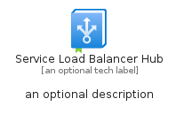
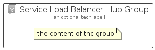

# ServiceLoadBalancerHub


```text
azure-11/Item/Networking/ServiceLoadBalancerHub
```

```text
include('azure-11/Item/Networking/ServiceLoadBalancerHub')
```


| Illustration | ServiceLoadBalancerHub | ServiceLoadBalancerHubCard | ServiceLoadBalancerHubGroup |
| :---: | :---: | :---: | :---: |
|  |  |  |  |


## Sprites
The item provides the following sriptes:

- `<$ServiceLoadBalancerHubXs>`
- `<$ServiceLoadBalancerHubSm>`
- `<$ServiceLoadBalancerHubMd>`
- `<$ServiceLoadBalancerHubLg>`


## ServiceLoadBalancerHub

### Load remotely
```plantuml
@startuml
' configures the library
!global $LIB_BASE_LOCATION="https://raw.githubusercontent.com/tmorin/plantuml-libs/master/distribution"

' loads the library's bootstrap
!include $LIB_BASE_LOCATION/bootstrap.puml

' loads the package bootstrap
include('azure-11/bootstrap')

' loads the Item which embeds the element ServiceLoadBalancerHub
include('azure-11/Item/Networking/ServiceLoadBalancerHub')

' renders the element
ServiceLoadBalancerHub('ServiceLoadBalancerHub', 'Service Load Balancer Hub', 'an optional tech label', 'an optional description')
@enduml
```

### Load locally
```plantuml
@startuml
' configures the library
!global $INCLUSION_MODE="local"
!global $LIB_BASE_LOCATION="../../.."

' loads the library's bootstrap
!include $LIB_BASE_LOCATION/bootstrap.puml

' loads the package bootstrap
include('azure-11/bootstrap')

' loads the Item which embeds the element ServiceLoadBalancerHub
include('azure-11/Item/Networking/ServiceLoadBalancerHub')

' renders the element
ServiceLoadBalancerHub('ServiceLoadBalancerHub', 'Service Load Balancer Hub', 'an optional tech label', 'an optional description')
@enduml
```

## ServiceLoadBalancerHubCard

### Load remotely
```plantuml
@startuml
' configures the library
!global $LIB_BASE_LOCATION="https://raw.githubusercontent.com/tmorin/plantuml-libs/master/distribution"

' loads the library's bootstrap
!include $LIB_BASE_LOCATION/bootstrap.puml

' loads the package bootstrap
include('azure-11/bootstrap')

' loads the Item which embeds the element ServiceLoadBalancerHubCard
include('azure-11/Item/Networking/ServiceLoadBalancerHub')

' renders the element
ServiceLoadBalancerHubCard('ServiceLoadBalancerHubCard', 'Service Load Balancer Hub Card', 'an optional description')
@enduml
```

### Load locally
```plantuml
@startuml
' configures the library
!global $INCLUSION_MODE="local"
!global $LIB_BASE_LOCATION="../../.."

' loads the library's bootstrap
!include $LIB_BASE_LOCATION/bootstrap.puml

' loads the package bootstrap
include('azure-11/bootstrap')

' loads the Item which embeds the element ServiceLoadBalancerHubCard
include('azure-11/Item/Networking/ServiceLoadBalancerHub')

' renders the element
ServiceLoadBalancerHubCard('ServiceLoadBalancerHubCard', 'Service Load Balancer Hub Card', 'an optional description')
@enduml
```

## ServiceLoadBalancerHubGroup

### Load remotely
```plantuml
@startuml
' configures the library
!global $LIB_BASE_LOCATION="https://raw.githubusercontent.com/tmorin/plantuml-libs/master/distribution"

' loads the library's bootstrap
!include $LIB_BASE_LOCATION/bootstrap.puml

' loads the package bootstrap
include('azure-11/bootstrap')

' loads the Item which embeds the element ServiceLoadBalancerHubGroup
include('azure-11/Item/Networking/ServiceLoadBalancerHub')

' renders the element
ServiceLoadBalancerHubGroup('ServiceLoadBalancerHubGroup', 'Service Load Balancer Hub Group', 'an optional tech label') {
    note as note
        the content of the group
    end note
}
@enduml
```

### Load locally
```plantuml
@startuml
' configures the library
!global $INCLUSION_MODE="local"
!global $LIB_BASE_LOCATION="../../.."

' loads the library's bootstrap
!include $LIB_BASE_LOCATION/bootstrap.puml

' loads the package bootstrap
include('azure-11/bootstrap')

' loads the Item which embeds the element ServiceLoadBalancerHubGroup
include('azure-11/Item/Networking/ServiceLoadBalancerHub')

' renders the element
ServiceLoadBalancerHubGroup('ServiceLoadBalancerHubGroup', 'Service Load Balancer Hub Group', 'an optional tech label') {
    note as note
        the content of the group
    end note
}
@enduml
```

