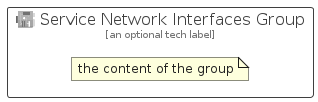

# ServiceNetworkInterfaces


```text
azure-11/Item/Networking/ServiceNetworkInterfaces
```

```text
include('azure-11/Item/Networking/ServiceNetworkInterfaces')
```


| Illustration | ServiceNetworkInterfaces | ServiceNetworkInterfacesCard | ServiceNetworkInterfacesGroup |
| :---: | :---: | :---: | :---: |
|  |  |  |  |


## ServiceNetworkInterfaces

### Load remotely
```plantuml
@startuml
' configures the library
!global $LIB_BASE_LOCATION="https://raw.githubusercontent.com/tmorin/plantuml-libs/master/distribution"

' loads the library's bootstrap
!include $LIB_BASE_LOCATION/bootstrap.puml

' loads the package bootstrap
include('azure-11/bootstrap')

' loads the Item which embeds the element ServiceNetworkInterfaces
include('azure-11/Item/Networking/ServiceNetworkInterfaces')

' renders the element
ServiceNetworkInterfaces('ServiceNetworkInterfaces', 'Service Network Interfaces', 'an optional tech label', 'an optional description')
@enduml
```

### Load locally
```plantuml
@startuml
' configures the library
!global $INCLUSION_MODE="local"
!global $LIB_BASE_LOCATION="../../.."

' loads the library's bootstrap
!include $LIB_BASE_LOCATION/bootstrap.puml

' loads the package bootstrap
include('azure-11/bootstrap')

' loads the Item which embeds the element ServiceNetworkInterfaces
include('azure-11/Item/Networking/ServiceNetworkInterfaces')

' renders the element
ServiceNetworkInterfaces('ServiceNetworkInterfaces', 'Service Network Interfaces', 'an optional tech label', 'an optional description')
@enduml
```

## ServiceNetworkInterfacesCard

### Load remotely
```plantuml
@startuml
' configures the library
!global $LIB_BASE_LOCATION="https://raw.githubusercontent.com/tmorin/plantuml-libs/master/distribution"

' loads the library's bootstrap
!include $LIB_BASE_LOCATION/bootstrap.puml

' loads the package bootstrap
include('azure-11/bootstrap')

' loads the Item which embeds the element ServiceNetworkInterfacesCard
include('azure-11/Item/Networking/ServiceNetworkInterfaces')

' renders the element
ServiceNetworkInterfacesCard('ServiceNetworkInterfacesCard', 'Service Network Interfaces Card', 'an optional description')
@enduml
```

### Load locally
```plantuml
@startuml
' configures the library
!global $INCLUSION_MODE="local"
!global $LIB_BASE_LOCATION="../../.."

' loads the library's bootstrap
!include $LIB_BASE_LOCATION/bootstrap.puml

' loads the package bootstrap
include('azure-11/bootstrap')

' loads the Item which embeds the element ServiceNetworkInterfacesCard
include('azure-11/Item/Networking/ServiceNetworkInterfaces')

' renders the element
ServiceNetworkInterfacesCard('ServiceNetworkInterfacesCard', 'Service Network Interfaces Card', 'an optional description')
@enduml
```

## ServiceNetworkInterfacesGroup

### Load remotely
```plantuml
@startuml
' configures the library
!global $LIB_BASE_LOCATION="https://raw.githubusercontent.com/tmorin/plantuml-libs/master/distribution"

' loads the library's bootstrap
!include $LIB_BASE_LOCATION/bootstrap.puml

' loads the package bootstrap
include('azure-11/bootstrap')

' loads the Item which embeds the element ServiceNetworkInterfacesGroup
include('azure-11/Item/Networking/ServiceNetworkInterfaces')

' renders the element
ServiceNetworkInterfacesGroup('ServiceNetworkInterfacesGroup', 'Service Network Interfaces Group', 'an optional tech label') {
    note as note
        the content of the group
    end note
}
@enduml
```

### Load locally
```plantuml
@startuml
' configures the library
!global $INCLUSION_MODE="local"
!global $LIB_BASE_LOCATION="../../.."

' loads the library's bootstrap
!include $LIB_BASE_LOCATION/bootstrap.puml

' loads the package bootstrap
include('azure-11/bootstrap')

' loads the Item which embeds the element ServiceNetworkInterfacesGroup
include('azure-11/Item/Networking/ServiceNetworkInterfaces')

' renders the element
ServiceNetworkInterfacesGroup('ServiceNetworkInterfacesGroup', 'Service Network Interfaces Group', 'an optional tech label') {
    note as note
        the content of the group
    end note
}
@enduml
```

