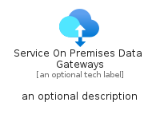

# ServiceOnPremisesDataGateways


```text
azure-11/Item/Networking/ServiceOnPremisesDataGateways
```

```text
include('azure-11/Item/Networking/ServiceOnPremisesDataGateways')
```


| Illustration | ServiceOnPremisesDataGateways | ServiceOnPremisesDataGatewaysCard | ServiceOnPremisesDataGatewaysGroup |
| :---: | :---: | :---: | :---: |
|  |  |  |  |


## ServiceOnPremisesDataGateways

### Load remotely
```plantuml
@startuml
' configures the library
!global $LIB_BASE_LOCATION="https://raw.githubusercontent.com/tmorin/plantuml-libs/master/distribution"

' loads the library's bootstrap
!include $LIB_BASE_LOCATION/bootstrap.puml

' loads the package bootstrap
include('azure-11/bootstrap')

' loads the Item which embeds the element ServiceOnPremisesDataGateways
include('azure-11/Item/Networking/ServiceOnPremisesDataGateways')

' renders the element
ServiceOnPremisesDataGateways('ServiceOnPremisesDataGateways', 'Service On Premises Data Gateways', 'an optional tech label', 'an optional description')
@enduml
```

### Load locally
```plantuml
@startuml
' configures the library
!global $INCLUSION_MODE="local"
!global $LIB_BASE_LOCATION="../../.."

' loads the library's bootstrap
!include $LIB_BASE_LOCATION/bootstrap.puml

' loads the package bootstrap
include('azure-11/bootstrap')

' loads the Item which embeds the element ServiceOnPremisesDataGateways
include('azure-11/Item/Networking/ServiceOnPremisesDataGateways')

' renders the element
ServiceOnPremisesDataGateways('ServiceOnPremisesDataGateways', 'Service On Premises Data Gateways', 'an optional tech label', 'an optional description')
@enduml
```

## ServiceOnPremisesDataGatewaysCard

### Load remotely
```plantuml
@startuml
' configures the library
!global $LIB_BASE_LOCATION="https://raw.githubusercontent.com/tmorin/plantuml-libs/master/distribution"

' loads the library's bootstrap
!include $LIB_BASE_LOCATION/bootstrap.puml

' loads the package bootstrap
include('azure-11/bootstrap')

' loads the Item which embeds the element ServiceOnPremisesDataGatewaysCard
include('azure-11/Item/Networking/ServiceOnPremisesDataGateways')

' renders the element
ServiceOnPremisesDataGatewaysCard('ServiceOnPremisesDataGatewaysCard', 'Service On Premises Data Gateways Card', 'an optional description')
@enduml
```

### Load locally
```plantuml
@startuml
' configures the library
!global $INCLUSION_MODE="local"
!global $LIB_BASE_LOCATION="../../.."

' loads the library's bootstrap
!include $LIB_BASE_LOCATION/bootstrap.puml

' loads the package bootstrap
include('azure-11/bootstrap')

' loads the Item which embeds the element ServiceOnPremisesDataGatewaysCard
include('azure-11/Item/Networking/ServiceOnPremisesDataGateways')

' renders the element
ServiceOnPremisesDataGatewaysCard('ServiceOnPremisesDataGatewaysCard', 'Service On Premises Data Gateways Card', 'an optional description')
@enduml
```

## ServiceOnPremisesDataGatewaysGroup

### Load remotely
```plantuml
@startuml
' configures the library
!global $LIB_BASE_LOCATION="https://raw.githubusercontent.com/tmorin/plantuml-libs/master/distribution"

' loads the library's bootstrap
!include $LIB_BASE_LOCATION/bootstrap.puml

' loads the package bootstrap
include('azure-11/bootstrap')

' loads the Item which embeds the element ServiceOnPremisesDataGatewaysGroup
include('azure-11/Item/Networking/ServiceOnPremisesDataGateways')

' renders the element
ServiceOnPremisesDataGatewaysGroup('ServiceOnPremisesDataGatewaysGroup', 'Service On Premises Data Gateways Group', 'an optional tech label') {
    note as note
        the content of the group
    end note
}
@enduml
```

### Load locally
```plantuml
@startuml
' configures the library
!global $INCLUSION_MODE="local"
!global $LIB_BASE_LOCATION="../../.."

' loads the library's bootstrap
!include $LIB_BASE_LOCATION/bootstrap.puml

' loads the package bootstrap
include('azure-11/bootstrap')

' loads the Item which embeds the element ServiceOnPremisesDataGatewaysGroup
include('azure-11/Item/Networking/ServiceOnPremisesDataGateways')

' renders the element
ServiceOnPremisesDataGatewaysGroup('ServiceOnPremisesDataGatewaysGroup', 'Service On Premises Data Gateways Group', 'an optional tech label') {
    note as note
        the content of the group
    end note
}
@enduml
```

