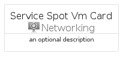

# ServiceSpotVm


```text
azure-11/Item/Networking/ServiceSpotVm
```

```text
include('azure-11/Item/Networking/ServiceSpotVm')
```


| Illustration | ServiceSpotVm | ServiceSpotVmCard | ServiceSpotVmGroup |
| :---: | :---: | :---: | :---: |
|  |  |  |  |


## Sprites
The item provides the following sriptes:

- `<$ServiceSpotVmXs>`
- `<$ServiceSpotVmSm>`
- `<$ServiceSpotVmMd>`
- `<$ServiceSpotVmLg>`


## ServiceSpotVm

### Load remotely
```plantuml
@startuml
' configures the library
!global $LIB_BASE_LOCATION="https://raw.githubusercontent.com/tmorin/plantuml-libs/master/distribution"

' loads the library's bootstrap
!include $LIB_BASE_LOCATION/bootstrap.puml

' loads the package bootstrap
include('azure-11/bootstrap')

' loads the Item which embeds the element ServiceSpotVm
include('azure-11/Item/Networking/ServiceSpotVm')

' renders the element
ServiceSpotVm('ServiceSpotVm', 'Service Spot Vm', 'an optional tech label', 'an optional description')
@enduml
```

### Load locally
```plantuml
@startuml
' configures the library
!global $INCLUSION_MODE="local"
!global $LIB_BASE_LOCATION="../../.."

' loads the library's bootstrap
!include $LIB_BASE_LOCATION/bootstrap.puml

' loads the package bootstrap
include('azure-11/bootstrap')

' loads the Item which embeds the element ServiceSpotVm
include('azure-11/Item/Networking/ServiceSpotVm')

' renders the element
ServiceSpotVm('ServiceSpotVm', 'Service Spot Vm', 'an optional tech label', 'an optional description')
@enduml
```

## ServiceSpotVmCard

### Load remotely
```plantuml
@startuml
' configures the library
!global $LIB_BASE_LOCATION="https://raw.githubusercontent.com/tmorin/plantuml-libs/master/distribution"

' loads the library's bootstrap
!include $LIB_BASE_LOCATION/bootstrap.puml

' loads the package bootstrap
include('azure-11/bootstrap')

' loads the Item which embeds the element ServiceSpotVmCard
include('azure-11/Item/Networking/ServiceSpotVm')

' renders the element
ServiceSpotVmCard('ServiceSpotVmCard', 'Service Spot Vm Card', 'an optional description')
@enduml
```

### Load locally
```plantuml
@startuml
' configures the library
!global $INCLUSION_MODE="local"
!global $LIB_BASE_LOCATION="../../.."

' loads the library's bootstrap
!include $LIB_BASE_LOCATION/bootstrap.puml

' loads the package bootstrap
include('azure-11/bootstrap')

' loads the Item which embeds the element ServiceSpotVmCard
include('azure-11/Item/Networking/ServiceSpotVm')

' renders the element
ServiceSpotVmCard('ServiceSpotVmCard', 'Service Spot Vm Card', 'an optional description')
@enduml
```

## ServiceSpotVmGroup

### Load remotely
```plantuml
@startuml
' configures the library
!global $LIB_BASE_LOCATION="https://raw.githubusercontent.com/tmorin/plantuml-libs/master/distribution"

' loads the library's bootstrap
!include $LIB_BASE_LOCATION/bootstrap.puml

' loads the package bootstrap
include('azure-11/bootstrap')

' loads the Item which embeds the element ServiceSpotVmGroup
include('azure-11/Item/Networking/ServiceSpotVm')

' renders the element
ServiceSpotVmGroup('ServiceSpotVmGroup', 'Service Spot Vm Group', 'an optional tech label') {
    note as note
        the content of the group
    end note
}
@enduml
```

### Load locally
```plantuml
@startuml
' configures the library
!global $INCLUSION_MODE="local"
!global $LIB_BASE_LOCATION="../../.."

' loads the library's bootstrap
!include $LIB_BASE_LOCATION/bootstrap.puml

' loads the package bootstrap
include('azure-11/bootstrap')

' loads the Item which embeds the element ServiceSpotVmGroup
include('azure-11/Item/Networking/ServiceSpotVm')

' renders the element
ServiceSpotVmGroup('ServiceSpotVmGroup', 'Service Spot Vm Group', 'an optional tech label') {
    note as note
        the content of the group
    end note
}
@enduml
```

