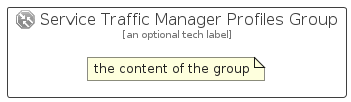

# ServiceTrafficManagerProfiles


```text
azure-11/Item/Networking/ServiceTrafficManagerProfiles
```

```text
include('azure-11/Item/Networking/ServiceTrafficManagerProfiles')
```


| Illustration | ServiceTrafficManagerProfiles | ServiceTrafficManagerProfilesCard | ServiceTrafficManagerProfilesGroup |
| :---: | :---: | :---: | :---: |
|  |  |  |  |


## ServiceTrafficManagerProfiles

### Load remotely
```plantuml
@startuml
' configures the library
!global $LIB_BASE_LOCATION="https://raw.githubusercontent.com/tmorin/plantuml-libs/master/distribution"

' loads the library's bootstrap
!include $LIB_BASE_LOCATION/bootstrap.puml

' loads the package bootstrap
include('azure-11/bootstrap')

' loads the Item which embeds the element ServiceTrafficManagerProfiles
include('azure-11/Item/Networking/ServiceTrafficManagerProfiles')

' renders the element
ServiceTrafficManagerProfiles('ServiceTrafficManagerProfiles', 'Service Traffic Manager Profiles', 'an optional tech label', 'an optional description')
@enduml
```

### Load locally
```plantuml
@startuml
' configures the library
!global $INCLUSION_MODE="local"
!global $LIB_BASE_LOCATION="../../.."

' loads the library's bootstrap
!include $LIB_BASE_LOCATION/bootstrap.puml

' loads the package bootstrap
include('azure-11/bootstrap')

' loads the Item which embeds the element ServiceTrafficManagerProfiles
include('azure-11/Item/Networking/ServiceTrafficManagerProfiles')

' renders the element
ServiceTrafficManagerProfiles('ServiceTrafficManagerProfiles', 'Service Traffic Manager Profiles', 'an optional tech label', 'an optional description')
@enduml
```

## ServiceTrafficManagerProfilesCard

### Load remotely
```plantuml
@startuml
' configures the library
!global $LIB_BASE_LOCATION="https://raw.githubusercontent.com/tmorin/plantuml-libs/master/distribution"

' loads the library's bootstrap
!include $LIB_BASE_LOCATION/bootstrap.puml

' loads the package bootstrap
include('azure-11/bootstrap')

' loads the Item which embeds the element ServiceTrafficManagerProfilesCard
include('azure-11/Item/Networking/ServiceTrafficManagerProfiles')

' renders the element
ServiceTrafficManagerProfilesCard('ServiceTrafficManagerProfilesCard', 'Service Traffic Manager Profiles Card', 'an optional description')
@enduml
```

### Load locally
```plantuml
@startuml
' configures the library
!global $INCLUSION_MODE="local"
!global $LIB_BASE_LOCATION="../../.."

' loads the library's bootstrap
!include $LIB_BASE_LOCATION/bootstrap.puml

' loads the package bootstrap
include('azure-11/bootstrap')

' loads the Item which embeds the element ServiceTrafficManagerProfilesCard
include('azure-11/Item/Networking/ServiceTrafficManagerProfiles')

' renders the element
ServiceTrafficManagerProfilesCard('ServiceTrafficManagerProfilesCard', 'Service Traffic Manager Profiles Card', 'an optional description')
@enduml
```

## ServiceTrafficManagerProfilesGroup

### Load remotely
```plantuml
@startuml
' configures the library
!global $LIB_BASE_LOCATION="https://raw.githubusercontent.com/tmorin/plantuml-libs/master/distribution"

' loads the library's bootstrap
!include $LIB_BASE_LOCATION/bootstrap.puml

' loads the package bootstrap
include('azure-11/bootstrap')

' loads the Item which embeds the element ServiceTrafficManagerProfilesGroup
include('azure-11/Item/Networking/ServiceTrafficManagerProfiles')

' renders the element
ServiceTrafficManagerProfilesGroup('ServiceTrafficManagerProfilesGroup', 'Service Traffic Manager Profiles Group', 'an optional tech label') {
    note as note
        the content of the group
    end note
}
@enduml
```

### Load locally
```plantuml
@startuml
' configures the library
!global $INCLUSION_MODE="local"
!global $LIB_BASE_LOCATION="../../.."

' loads the library's bootstrap
!include $LIB_BASE_LOCATION/bootstrap.puml

' loads the package bootstrap
include('azure-11/bootstrap')

' loads the Item which embeds the element ServiceTrafficManagerProfilesGroup
include('azure-11/Item/Networking/ServiceTrafficManagerProfiles')

' renders the element
ServiceTrafficManagerProfilesGroup('ServiceTrafficManagerProfilesGroup', 'Service Traffic Manager Profiles Group', 'an optional tech label') {
    note as note
        the content of the group
    end note
}
@enduml
```

