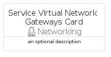
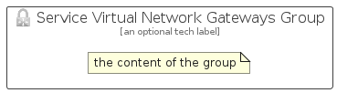

# ServiceVirtualNetworkGateways


```text
azure-11/Item/Networking/ServiceVirtualNetworkGateways
```

```text
include('azure-11/Item/Networking/ServiceVirtualNetworkGateways')
```


| Illustration | ServiceVirtualNetworkGateways | ServiceVirtualNetworkGatewaysCard | ServiceVirtualNetworkGatewaysGroup |
| :---: | :---: | :---: | :---: |
|  |  |  |  |


## Sprites
The item provides the following sriptes:

- `<$ServiceVirtualNetworkGatewaysXs>`
- `<$ServiceVirtualNetworkGatewaysSm>`
- `<$ServiceVirtualNetworkGatewaysMd>`
- `<$ServiceVirtualNetworkGatewaysLg>`


## ServiceVirtualNetworkGateways

### Load remotely
```plantuml
@startuml
' configures the library
!global $LIB_BASE_LOCATION="https://raw.githubusercontent.com/tmorin/plantuml-libs/master/distribution"

' loads the library's bootstrap
!include $LIB_BASE_LOCATION/bootstrap.puml

' loads the package bootstrap
include('azure-11/bootstrap')

' loads the Item which embeds the element ServiceVirtualNetworkGateways
include('azure-11/Item/Networking/ServiceVirtualNetworkGateways')

' renders the element
ServiceVirtualNetworkGateways('ServiceVirtualNetworkGateways', 'Service Virtual Network Gateways', 'an optional tech label', 'an optional description')
@enduml
```

### Load locally
```plantuml
@startuml
' configures the library
!global $INCLUSION_MODE="local"
!global $LIB_BASE_LOCATION="../../.."

' loads the library's bootstrap
!include $LIB_BASE_LOCATION/bootstrap.puml

' loads the package bootstrap
include('azure-11/bootstrap')

' loads the Item which embeds the element ServiceVirtualNetworkGateways
include('azure-11/Item/Networking/ServiceVirtualNetworkGateways')

' renders the element
ServiceVirtualNetworkGateways('ServiceVirtualNetworkGateways', 'Service Virtual Network Gateways', 'an optional tech label', 'an optional description')
@enduml
```

## ServiceVirtualNetworkGatewaysCard

### Load remotely
```plantuml
@startuml
' configures the library
!global $LIB_BASE_LOCATION="https://raw.githubusercontent.com/tmorin/plantuml-libs/master/distribution"

' loads the library's bootstrap
!include $LIB_BASE_LOCATION/bootstrap.puml

' loads the package bootstrap
include('azure-11/bootstrap')

' loads the Item which embeds the element ServiceVirtualNetworkGatewaysCard
include('azure-11/Item/Networking/ServiceVirtualNetworkGateways')

' renders the element
ServiceVirtualNetworkGatewaysCard('ServiceVirtualNetworkGatewaysCard', 'Service Virtual Network Gateways Card', 'an optional description')
@enduml
```

### Load locally
```plantuml
@startuml
' configures the library
!global $INCLUSION_MODE="local"
!global $LIB_BASE_LOCATION="../../.."

' loads the library's bootstrap
!include $LIB_BASE_LOCATION/bootstrap.puml

' loads the package bootstrap
include('azure-11/bootstrap')

' loads the Item which embeds the element ServiceVirtualNetworkGatewaysCard
include('azure-11/Item/Networking/ServiceVirtualNetworkGateways')

' renders the element
ServiceVirtualNetworkGatewaysCard('ServiceVirtualNetworkGatewaysCard', 'Service Virtual Network Gateways Card', 'an optional description')
@enduml
```

## ServiceVirtualNetworkGatewaysGroup

### Load remotely
```plantuml
@startuml
' configures the library
!global $LIB_BASE_LOCATION="https://raw.githubusercontent.com/tmorin/plantuml-libs/master/distribution"

' loads the library's bootstrap
!include $LIB_BASE_LOCATION/bootstrap.puml

' loads the package bootstrap
include('azure-11/bootstrap')

' loads the Item which embeds the element ServiceVirtualNetworkGatewaysGroup
include('azure-11/Item/Networking/ServiceVirtualNetworkGateways')

' renders the element
ServiceVirtualNetworkGatewaysGroup('ServiceVirtualNetworkGatewaysGroup', 'Service Virtual Network Gateways Group', 'an optional tech label') {
    note as note
        the content of the group
    end note
}
@enduml
```

### Load locally
```plantuml
@startuml
' configures the library
!global $INCLUSION_MODE="local"
!global $LIB_BASE_LOCATION="../../.."

' loads the library's bootstrap
!include $LIB_BASE_LOCATION/bootstrap.puml

' loads the package bootstrap
include('azure-11/bootstrap')

' loads the Item which embeds the element ServiceVirtualNetworkGatewaysGroup
include('azure-11/Item/Networking/ServiceVirtualNetworkGateways')

' renders the element
ServiceVirtualNetworkGatewaysGroup('ServiceVirtualNetworkGatewaysGroup', 'Service Virtual Network Gateways Group', 'an optional tech label') {
    note as note
        the content of the group
    end note
}
@enduml
```

