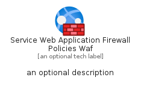
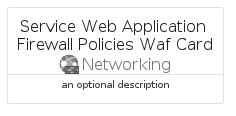

# ServiceWebApplicationFirewallPoliciesWaf


```text
azure-11/Item/Networking/ServiceWebApplicationFirewallPoliciesWaf
```

```text
include('azure-11/Item/Networking/ServiceWebApplicationFirewallPoliciesWaf')
```


| Illustration | ServiceWebApplicationFirewallPoliciesWaf | ServiceWebApplicationFirewallPoliciesWafCard | ServiceWebApplicationFirewallPoliciesWafGroup |
| :---: | :---: | :---: | :---: |
|  |  |  |  |


## Sprites
The item provides the following sriptes:

- `<$ServiceWebApplicationFirewallPoliciesWafXs>`
- `<$ServiceWebApplicationFirewallPoliciesWafSm>`
- `<$ServiceWebApplicationFirewallPoliciesWafMd>`
- `<$ServiceWebApplicationFirewallPoliciesWafLg>`


## ServiceWebApplicationFirewallPoliciesWaf

### Load remotely
```plantuml
@startuml
' configures the library
!global $LIB_BASE_LOCATION="https://raw.githubusercontent.com/tmorin/plantuml-libs/master/distribution"

' loads the library's bootstrap
!include $LIB_BASE_LOCATION/bootstrap.puml

' loads the package bootstrap
include('azure-11/bootstrap')

' loads the Item which embeds the element ServiceWebApplicationFirewallPoliciesWaf
include('azure-11/Item/Networking/ServiceWebApplicationFirewallPoliciesWaf')

' renders the element
ServiceWebApplicationFirewallPoliciesWaf('ServiceWebApplicationFirewallPoliciesWaf', 'Service Web Application Firewall Policies Waf', 'an optional tech label', 'an optional description')
@enduml
```

### Load locally
```plantuml
@startuml
' configures the library
!global $INCLUSION_MODE="local"
!global $LIB_BASE_LOCATION="../../.."

' loads the library's bootstrap
!include $LIB_BASE_LOCATION/bootstrap.puml

' loads the package bootstrap
include('azure-11/bootstrap')

' loads the Item which embeds the element ServiceWebApplicationFirewallPoliciesWaf
include('azure-11/Item/Networking/ServiceWebApplicationFirewallPoliciesWaf')

' renders the element
ServiceWebApplicationFirewallPoliciesWaf('ServiceWebApplicationFirewallPoliciesWaf', 'Service Web Application Firewall Policies Waf', 'an optional tech label', 'an optional description')
@enduml
```

## ServiceWebApplicationFirewallPoliciesWafCard

### Load remotely
```plantuml
@startuml
' configures the library
!global $LIB_BASE_LOCATION="https://raw.githubusercontent.com/tmorin/plantuml-libs/master/distribution"

' loads the library's bootstrap
!include $LIB_BASE_LOCATION/bootstrap.puml

' loads the package bootstrap
include('azure-11/bootstrap')

' loads the Item which embeds the element ServiceWebApplicationFirewallPoliciesWafCard
include('azure-11/Item/Networking/ServiceWebApplicationFirewallPoliciesWaf')

' renders the element
ServiceWebApplicationFirewallPoliciesWafCard('ServiceWebApplicationFirewallPoliciesWafCard', 'Service Web Application Firewall Policies Waf Card', 'an optional description')
@enduml
```

### Load locally
```plantuml
@startuml
' configures the library
!global $INCLUSION_MODE="local"
!global $LIB_BASE_LOCATION="../../.."

' loads the library's bootstrap
!include $LIB_BASE_LOCATION/bootstrap.puml

' loads the package bootstrap
include('azure-11/bootstrap')

' loads the Item which embeds the element ServiceWebApplicationFirewallPoliciesWafCard
include('azure-11/Item/Networking/ServiceWebApplicationFirewallPoliciesWaf')

' renders the element
ServiceWebApplicationFirewallPoliciesWafCard('ServiceWebApplicationFirewallPoliciesWafCard', 'Service Web Application Firewall Policies Waf Card', 'an optional description')
@enduml
```

## ServiceWebApplicationFirewallPoliciesWafGroup

### Load remotely
```plantuml
@startuml
' configures the library
!global $LIB_BASE_LOCATION="https://raw.githubusercontent.com/tmorin/plantuml-libs/master/distribution"

' loads the library's bootstrap
!include $LIB_BASE_LOCATION/bootstrap.puml

' loads the package bootstrap
include('azure-11/bootstrap')

' loads the Item which embeds the element ServiceWebApplicationFirewallPoliciesWafGroup
include('azure-11/Item/Networking/ServiceWebApplicationFirewallPoliciesWaf')

' renders the element
ServiceWebApplicationFirewallPoliciesWafGroup('ServiceWebApplicationFirewallPoliciesWafGroup', 'Service Web Application Firewall Policies Waf Group', 'an optional tech label') {
    note as note
        the content of the group
    end note
}
@enduml
```

### Load locally
```plantuml
@startuml
' configures the library
!global $INCLUSION_MODE="local"
!global $LIB_BASE_LOCATION="../../.."

' loads the library's bootstrap
!include $LIB_BASE_LOCATION/bootstrap.puml

' loads the package bootstrap
include('azure-11/bootstrap')

' loads the Item which embeds the element ServiceWebApplicationFirewallPoliciesWafGroup
include('azure-11/Item/Networking/ServiceWebApplicationFirewallPoliciesWaf')

' renders the element
ServiceWebApplicationFirewallPoliciesWafGroup('ServiceWebApplicationFirewallPoliciesWafGroup', 'Service Web Application Firewall Policies Waf Group', 'an optional tech label') {
    note as note
        the content of the group
    end note
}
@enduml
```

