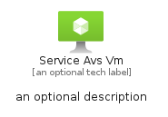

# ServiceAvsVm


```text
azure-11/Item/NewIcons/ServiceAvsVm
```

```text
include('azure-11/Item/NewIcons/ServiceAvsVm')
```


| Illustration | ServiceAvsVm | ServiceAvsVmCard | ServiceAvsVmGroup |
| :---: | :---: | :---: | :---: |
|  |  |  |  |


## ServiceAvsVm

### Load remotely
```plantuml
@startuml
' configures the library
!global $LIB_BASE_LOCATION="https://raw.githubusercontent.com/tmorin/plantuml-libs/master/distribution"

' loads the library's bootstrap
!include $LIB_BASE_LOCATION/bootstrap.puml

' loads the package bootstrap
include('azure-11/bootstrap')

' loads the Item which embeds the element ServiceAvsVm
include('azure-11/Item/NewIcons/ServiceAvsVm')

' renders the element
ServiceAvsVm('ServiceAvsVm', 'Service Avs Vm', 'an optional tech label', 'an optional description')
@enduml
```

### Load locally
```plantuml
@startuml
' configures the library
!global $INCLUSION_MODE="local"
!global $LIB_BASE_LOCATION="../../.."

' loads the library's bootstrap
!include $LIB_BASE_LOCATION/bootstrap.puml

' loads the package bootstrap
include('azure-11/bootstrap')

' loads the Item which embeds the element ServiceAvsVm
include('azure-11/Item/NewIcons/ServiceAvsVm')

' renders the element
ServiceAvsVm('ServiceAvsVm', 'Service Avs Vm', 'an optional tech label', 'an optional description')
@enduml
```

## ServiceAvsVmCard

### Load remotely
```plantuml
@startuml
' configures the library
!global $LIB_BASE_LOCATION="https://raw.githubusercontent.com/tmorin/plantuml-libs/master/distribution"

' loads the library's bootstrap
!include $LIB_BASE_LOCATION/bootstrap.puml

' loads the package bootstrap
include('azure-11/bootstrap')

' loads the Item which embeds the element ServiceAvsVmCard
include('azure-11/Item/NewIcons/ServiceAvsVm')

' renders the element
ServiceAvsVmCard('ServiceAvsVmCard', 'Service Avs Vm Card', 'an optional description')
@enduml
```

### Load locally
```plantuml
@startuml
' configures the library
!global $INCLUSION_MODE="local"
!global $LIB_BASE_LOCATION="../../.."

' loads the library's bootstrap
!include $LIB_BASE_LOCATION/bootstrap.puml

' loads the package bootstrap
include('azure-11/bootstrap')

' loads the Item which embeds the element ServiceAvsVmCard
include('azure-11/Item/NewIcons/ServiceAvsVm')

' renders the element
ServiceAvsVmCard('ServiceAvsVmCard', 'Service Avs Vm Card', 'an optional description')
@enduml
```

## ServiceAvsVmGroup

### Load remotely
```plantuml
@startuml
' configures the library
!global $LIB_BASE_LOCATION="https://raw.githubusercontent.com/tmorin/plantuml-libs/master/distribution"

' loads the library's bootstrap
!include $LIB_BASE_LOCATION/bootstrap.puml

' loads the package bootstrap
include('azure-11/bootstrap')

' loads the Item which embeds the element ServiceAvsVmGroup
include('azure-11/Item/NewIcons/ServiceAvsVm')

' renders the element
ServiceAvsVmGroup('ServiceAvsVmGroup', 'Service Avs Vm Group', 'an optional tech label') {
    note as note
        the content of the group
    end note
}
@enduml
```

### Load locally
```plantuml
@startuml
' configures the library
!global $INCLUSION_MODE="local"
!global $LIB_BASE_LOCATION="../../.."

' loads the library's bootstrap
!include $LIB_BASE_LOCATION/bootstrap.puml

' loads the package bootstrap
include('azure-11/bootstrap')

' loads the Item which embeds the element ServiceAvsVmGroup
include('azure-11/Item/NewIcons/ServiceAvsVm')

' renders the element
ServiceAvsVmGroup('ServiceAvsVmGroup', 'Service Avs Vm Group', 'an optional tech label') {
    note as note
        the content of the group
    end note
}
@enduml
```

