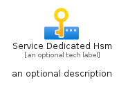
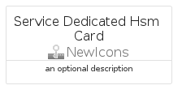
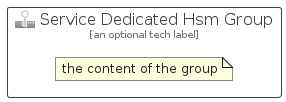

# ServiceDedicatedHsm


```text
azure-11/Item/NewIcons/ServiceDedicatedHsm
```

```text
include('azure-11/Item/NewIcons/ServiceDedicatedHsm')
```


| Illustration | ServiceDedicatedHsm | ServiceDedicatedHsmCard | ServiceDedicatedHsmGroup |
| :---: | :---: | :---: | :---: |
|  |  |  |  |


## Sprites
The item provides the following sriptes:

- `<$ServiceDedicatedHsmXs>`
- `<$ServiceDedicatedHsmSm>`
- `<$ServiceDedicatedHsmMd>`
- `<$ServiceDedicatedHsmLg>`


## ServiceDedicatedHsm

### Load remotely
```plantuml
@startuml
' configures the library
!global $LIB_BASE_LOCATION="https://raw.githubusercontent.com/tmorin/plantuml-libs/master/distribution"

' loads the library's bootstrap
!include $LIB_BASE_LOCATION/bootstrap.puml

' loads the package bootstrap
include('azure-11/bootstrap')

' loads the Item which embeds the element ServiceDedicatedHsm
include('azure-11/Item/NewIcons/ServiceDedicatedHsm')

' renders the element
ServiceDedicatedHsm('ServiceDedicatedHsm', 'Service Dedicated Hsm', 'an optional tech label', 'an optional description')
@enduml
```

### Load locally
```plantuml
@startuml
' configures the library
!global $INCLUSION_MODE="local"
!global $LIB_BASE_LOCATION="../../.."

' loads the library's bootstrap
!include $LIB_BASE_LOCATION/bootstrap.puml

' loads the package bootstrap
include('azure-11/bootstrap')

' loads the Item which embeds the element ServiceDedicatedHsm
include('azure-11/Item/NewIcons/ServiceDedicatedHsm')

' renders the element
ServiceDedicatedHsm('ServiceDedicatedHsm', 'Service Dedicated Hsm', 'an optional tech label', 'an optional description')
@enduml
```

## ServiceDedicatedHsmCard

### Load remotely
```plantuml
@startuml
' configures the library
!global $LIB_BASE_LOCATION="https://raw.githubusercontent.com/tmorin/plantuml-libs/master/distribution"

' loads the library's bootstrap
!include $LIB_BASE_LOCATION/bootstrap.puml

' loads the package bootstrap
include('azure-11/bootstrap')

' loads the Item which embeds the element ServiceDedicatedHsmCard
include('azure-11/Item/NewIcons/ServiceDedicatedHsm')

' renders the element
ServiceDedicatedHsmCard('ServiceDedicatedHsmCard', 'Service Dedicated Hsm Card', 'an optional description')
@enduml
```

### Load locally
```plantuml
@startuml
' configures the library
!global $INCLUSION_MODE="local"
!global $LIB_BASE_LOCATION="../../.."

' loads the library's bootstrap
!include $LIB_BASE_LOCATION/bootstrap.puml

' loads the package bootstrap
include('azure-11/bootstrap')

' loads the Item which embeds the element ServiceDedicatedHsmCard
include('azure-11/Item/NewIcons/ServiceDedicatedHsm')

' renders the element
ServiceDedicatedHsmCard('ServiceDedicatedHsmCard', 'Service Dedicated Hsm Card', 'an optional description')
@enduml
```

## ServiceDedicatedHsmGroup

### Load remotely
```plantuml
@startuml
' configures the library
!global $LIB_BASE_LOCATION="https://raw.githubusercontent.com/tmorin/plantuml-libs/master/distribution"

' loads the library's bootstrap
!include $LIB_BASE_LOCATION/bootstrap.puml

' loads the package bootstrap
include('azure-11/bootstrap')

' loads the Item which embeds the element ServiceDedicatedHsmGroup
include('azure-11/Item/NewIcons/ServiceDedicatedHsm')

' renders the element
ServiceDedicatedHsmGroup('ServiceDedicatedHsmGroup', 'Service Dedicated Hsm Group', 'an optional tech label') {
    note as note
        the content of the group
    end note
}
@enduml
```

### Load locally
```plantuml
@startuml
' configures the library
!global $INCLUSION_MODE="local"
!global $LIB_BASE_LOCATION="../../.."

' loads the library's bootstrap
!include $LIB_BASE_LOCATION/bootstrap.puml

' loads the package bootstrap
include('azure-11/bootstrap')

' loads the Item which embeds the element ServiceDedicatedHsmGroup
include('azure-11/Item/NewIcons/ServiceDedicatedHsm')

' renders the element
ServiceDedicatedHsmGroup('ServiceDedicatedHsmGroup', 'Service Dedicated Hsm Group', 'an optional tech label') {
    note as note
        the content of the group
    end note
}
@enduml
```

