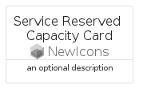

# ServiceReservedCapacity


```text
azure-11/Item/NewIcons/ServiceReservedCapacity
```

```text
include('azure-11/Item/NewIcons/ServiceReservedCapacity')
```


| Illustration | ServiceReservedCapacity | ServiceReservedCapacityCard | ServiceReservedCapacityGroup |
| :---: | :---: | :---: | :---: |
|  |  |  |  |


## ServiceReservedCapacity

### Load remotely
```plantuml
@startuml
' configures the library
!global $LIB_BASE_LOCATION="https://raw.githubusercontent.com/tmorin/plantuml-libs/master/distribution"

' loads the library's bootstrap
!include $LIB_BASE_LOCATION/bootstrap.puml

' loads the package bootstrap
include('azure-11/bootstrap')

' loads the Item which embeds the element ServiceReservedCapacity
include('azure-11/Item/NewIcons/ServiceReservedCapacity')

' renders the element
ServiceReservedCapacity('ServiceReservedCapacity', 'Service Reserved Capacity', 'an optional tech label', 'an optional description')
@enduml
```

### Load locally
```plantuml
@startuml
' configures the library
!global $INCLUSION_MODE="local"
!global $LIB_BASE_LOCATION="../../.."

' loads the library's bootstrap
!include $LIB_BASE_LOCATION/bootstrap.puml

' loads the package bootstrap
include('azure-11/bootstrap')

' loads the Item which embeds the element ServiceReservedCapacity
include('azure-11/Item/NewIcons/ServiceReservedCapacity')

' renders the element
ServiceReservedCapacity('ServiceReservedCapacity', 'Service Reserved Capacity', 'an optional tech label', 'an optional description')
@enduml
```

## ServiceReservedCapacityCard

### Load remotely
```plantuml
@startuml
' configures the library
!global $LIB_BASE_LOCATION="https://raw.githubusercontent.com/tmorin/plantuml-libs/master/distribution"

' loads the library's bootstrap
!include $LIB_BASE_LOCATION/bootstrap.puml

' loads the package bootstrap
include('azure-11/bootstrap')

' loads the Item which embeds the element ServiceReservedCapacityCard
include('azure-11/Item/NewIcons/ServiceReservedCapacity')

' renders the element
ServiceReservedCapacityCard('ServiceReservedCapacityCard', 'Service Reserved Capacity Card', 'an optional description')
@enduml
```

### Load locally
```plantuml
@startuml
' configures the library
!global $INCLUSION_MODE="local"
!global $LIB_BASE_LOCATION="../../.."

' loads the library's bootstrap
!include $LIB_BASE_LOCATION/bootstrap.puml

' loads the package bootstrap
include('azure-11/bootstrap')

' loads the Item which embeds the element ServiceReservedCapacityCard
include('azure-11/Item/NewIcons/ServiceReservedCapacity')

' renders the element
ServiceReservedCapacityCard('ServiceReservedCapacityCard', 'Service Reserved Capacity Card', 'an optional description')
@enduml
```

## ServiceReservedCapacityGroup

### Load remotely
```plantuml
@startuml
' configures the library
!global $LIB_BASE_LOCATION="https://raw.githubusercontent.com/tmorin/plantuml-libs/master/distribution"

' loads the library's bootstrap
!include $LIB_BASE_LOCATION/bootstrap.puml

' loads the package bootstrap
include('azure-11/bootstrap')

' loads the Item which embeds the element ServiceReservedCapacityGroup
include('azure-11/Item/NewIcons/ServiceReservedCapacity')

' renders the element
ServiceReservedCapacityGroup('ServiceReservedCapacityGroup', 'Service Reserved Capacity Group', 'an optional tech label') {
    note as note
        the content of the group
    end note
}
@enduml
```

### Load locally
```plantuml
@startuml
' configures the library
!global $INCLUSION_MODE="local"
!global $LIB_BASE_LOCATION="../../.."

' loads the library's bootstrap
!include $LIB_BASE_LOCATION/bootstrap.puml

' loads the package bootstrap
include('azure-11/bootstrap')

' loads the Item which embeds the element ServiceReservedCapacityGroup
include('azure-11/Item/NewIcons/ServiceReservedCapacity')

' renders the element
ServiceReservedCapacityGroup('ServiceReservedCapacityGroup', 'Service Reserved Capacity Group', 'an optional tech label') {
    note as note
        the content of the group
    end note
}
@enduml
```

