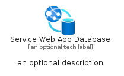
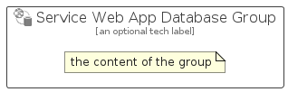

# ServiceWebAppDatabase


```text
azure-11/Item/NewIcons/ServiceWebAppDatabase
```

```text
include('azure-11/Item/NewIcons/ServiceWebAppDatabase')
```


| Illustration | ServiceWebAppDatabase | ServiceWebAppDatabaseCard | ServiceWebAppDatabaseGroup |
| :---: | :---: | :---: | :---: |
|  |  |  |  |


## ServiceWebAppDatabase

### Load remotely
```plantuml
@startuml
' configures the library
!global $LIB_BASE_LOCATION="https://raw.githubusercontent.com/tmorin/plantuml-libs/master/distribution"

' loads the library's bootstrap
!include $LIB_BASE_LOCATION/bootstrap.puml

' loads the package bootstrap
include('azure-11/bootstrap')

' loads the Item which embeds the element ServiceWebAppDatabase
include('azure-11/Item/NewIcons/ServiceWebAppDatabase')

' renders the element
ServiceWebAppDatabase('ServiceWebAppDatabase', 'Service Web App Database', 'an optional tech label', 'an optional description')
@enduml
```

### Load locally
```plantuml
@startuml
' configures the library
!global $INCLUSION_MODE="local"
!global $LIB_BASE_LOCATION="../../.."

' loads the library's bootstrap
!include $LIB_BASE_LOCATION/bootstrap.puml

' loads the package bootstrap
include('azure-11/bootstrap')

' loads the Item which embeds the element ServiceWebAppDatabase
include('azure-11/Item/NewIcons/ServiceWebAppDatabase')

' renders the element
ServiceWebAppDatabase('ServiceWebAppDatabase', 'Service Web App Database', 'an optional tech label', 'an optional description')
@enduml
```

## ServiceWebAppDatabaseCard

### Load remotely
```plantuml
@startuml
' configures the library
!global $LIB_BASE_LOCATION="https://raw.githubusercontent.com/tmorin/plantuml-libs/master/distribution"

' loads the library's bootstrap
!include $LIB_BASE_LOCATION/bootstrap.puml

' loads the package bootstrap
include('azure-11/bootstrap')

' loads the Item which embeds the element ServiceWebAppDatabaseCard
include('azure-11/Item/NewIcons/ServiceWebAppDatabase')

' renders the element
ServiceWebAppDatabaseCard('ServiceWebAppDatabaseCard', 'Service Web App Database Card', 'an optional description')
@enduml
```

### Load locally
```plantuml
@startuml
' configures the library
!global $INCLUSION_MODE="local"
!global $LIB_BASE_LOCATION="../../.."

' loads the library's bootstrap
!include $LIB_BASE_LOCATION/bootstrap.puml

' loads the package bootstrap
include('azure-11/bootstrap')

' loads the Item which embeds the element ServiceWebAppDatabaseCard
include('azure-11/Item/NewIcons/ServiceWebAppDatabase')

' renders the element
ServiceWebAppDatabaseCard('ServiceWebAppDatabaseCard', 'Service Web App Database Card', 'an optional description')
@enduml
```

## ServiceWebAppDatabaseGroup

### Load remotely
```plantuml
@startuml
' configures the library
!global $LIB_BASE_LOCATION="https://raw.githubusercontent.com/tmorin/plantuml-libs/master/distribution"

' loads the library's bootstrap
!include $LIB_BASE_LOCATION/bootstrap.puml

' loads the package bootstrap
include('azure-11/bootstrap')

' loads the Item which embeds the element ServiceWebAppDatabaseGroup
include('azure-11/Item/NewIcons/ServiceWebAppDatabase')

' renders the element
ServiceWebAppDatabaseGroup('ServiceWebAppDatabaseGroup', 'Service Web App Database Group', 'an optional tech label') {
    note as note
        the content of the group
    end note
}
@enduml
```

### Load locally
```plantuml
@startuml
' configures the library
!global $INCLUSION_MODE="local"
!global $LIB_BASE_LOCATION="../../.."

' loads the library's bootstrap
!include $LIB_BASE_LOCATION/bootstrap.puml

' loads the package bootstrap
include('azure-11/bootstrap')

' loads the Item which embeds the element ServiceWebAppDatabaseGroup
include('azure-11/Item/NewIcons/ServiceWebAppDatabase')

' renders the element
ServiceWebAppDatabaseGroup('ServiceWebAppDatabaseGroup', 'Service Web App Database Group', 'an optional tech label') {
    note as note
        the content of the group
    end note
}
@enduml
```

