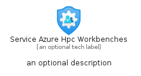
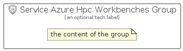

# ServiceAzureHpcWorkbenches


```text
azure-11/Item/Other/ServiceAzureHpcWorkbenches
```

```text
include('azure-11/Item/Other/ServiceAzureHpcWorkbenches')
```


| Illustration | ServiceAzureHpcWorkbenches | ServiceAzureHpcWorkbenchesCard | ServiceAzureHpcWorkbenchesGroup |
| :---: | :---: | :---: | :---: |
|  |  |  |  |


## Sprites
The item provides the following sriptes:

- `<$ServiceAzureHpcWorkbenchesXs>`
- `<$ServiceAzureHpcWorkbenchesSm>`
- `<$ServiceAzureHpcWorkbenchesMd>`
- `<$ServiceAzureHpcWorkbenchesLg>`


## ServiceAzureHpcWorkbenches

### Load remotely
```plantuml
@startuml
' configures the library
!global $LIB_BASE_LOCATION="https://raw.githubusercontent.com/tmorin/plantuml-libs/master/distribution"

' loads the library's bootstrap
!include $LIB_BASE_LOCATION/bootstrap.puml

' loads the package bootstrap
include('azure-11/bootstrap')

' loads the Item which embeds the element ServiceAzureHpcWorkbenches
include('azure-11/Item/Other/ServiceAzureHpcWorkbenches')

' renders the element
ServiceAzureHpcWorkbenches('ServiceAzureHpcWorkbenches', 'Service Azure Hpc Workbenches', 'an optional tech label', 'an optional description')
@enduml
```

### Load locally
```plantuml
@startuml
' configures the library
!global $INCLUSION_MODE="local"
!global $LIB_BASE_LOCATION="../../.."

' loads the library's bootstrap
!include $LIB_BASE_LOCATION/bootstrap.puml

' loads the package bootstrap
include('azure-11/bootstrap')

' loads the Item which embeds the element ServiceAzureHpcWorkbenches
include('azure-11/Item/Other/ServiceAzureHpcWorkbenches')

' renders the element
ServiceAzureHpcWorkbenches('ServiceAzureHpcWorkbenches', 'Service Azure Hpc Workbenches', 'an optional tech label', 'an optional description')
@enduml
```

## ServiceAzureHpcWorkbenchesCard

### Load remotely
```plantuml
@startuml
' configures the library
!global $LIB_BASE_LOCATION="https://raw.githubusercontent.com/tmorin/plantuml-libs/master/distribution"

' loads the library's bootstrap
!include $LIB_BASE_LOCATION/bootstrap.puml

' loads the package bootstrap
include('azure-11/bootstrap')

' loads the Item which embeds the element ServiceAzureHpcWorkbenchesCard
include('azure-11/Item/Other/ServiceAzureHpcWorkbenches')

' renders the element
ServiceAzureHpcWorkbenchesCard('ServiceAzureHpcWorkbenchesCard', 'Service Azure Hpc Workbenches Card', 'an optional description')
@enduml
```

### Load locally
```plantuml
@startuml
' configures the library
!global $INCLUSION_MODE="local"
!global $LIB_BASE_LOCATION="../../.."

' loads the library's bootstrap
!include $LIB_BASE_LOCATION/bootstrap.puml

' loads the package bootstrap
include('azure-11/bootstrap')

' loads the Item which embeds the element ServiceAzureHpcWorkbenchesCard
include('azure-11/Item/Other/ServiceAzureHpcWorkbenches')

' renders the element
ServiceAzureHpcWorkbenchesCard('ServiceAzureHpcWorkbenchesCard', 'Service Azure Hpc Workbenches Card', 'an optional description')
@enduml
```

## ServiceAzureHpcWorkbenchesGroup

### Load remotely
```plantuml
@startuml
' configures the library
!global $LIB_BASE_LOCATION="https://raw.githubusercontent.com/tmorin/plantuml-libs/master/distribution"

' loads the library's bootstrap
!include $LIB_BASE_LOCATION/bootstrap.puml

' loads the package bootstrap
include('azure-11/bootstrap')

' loads the Item which embeds the element ServiceAzureHpcWorkbenchesGroup
include('azure-11/Item/Other/ServiceAzureHpcWorkbenches')

' renders the element
ServiceAzureHpcWorkbenchesGroup('ServiceAzureHpcWorkbenchesGroup', 'Service Azure Hpc Workbenches Group', 'an optional tech label') {
    note as note
        the content of the group
    end note
}
@enduml
```

### Load locally
```plantuml
@startuml
' configures the library
!global $INCLUSION_MODE="local"
!global $LIB_BASE_LOCATION="../../.."

' loads the library's bootstrap
!include $LIB_BASE_LOCATION/bootstrap.puml

' loads the package bootstrap
include('azure-11/bootstrap')

' loads the Item which embeds the element ServiceAzureHpcWorkbenchesGroup
include('azure-11/Item/Other/ServiceAzureHpcWorkbenches')

' renders the element
ServiceAzureHpcWorkbenchesGroup('ServiceAzureHpcWorkbenchesGroup', 'Service Azure Hpc Workbenches Group', 'an optional tech label') {
    note as note
        the content of the group
    end note
}
@enduml
```

