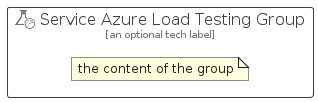

# ServiceAzureLoadTesting


```text
azure-11/Item/Other/ServiceAzureLoadTesting
```

```text
include('azure-11/Item/Other/ServiceAzureLoadTesting')
```


| Illustration | ServiceAzureLoadTesting | ServiceAzureLoadTestingCard | ServiceAzureLoadTestingGroup |
| :---: | :---: | :---: | :---: |
|  |  |  |  |


## Sprites
The item provides the following sriptes:

- `<$ServiceAzureLoadTestingXs>`
- `<$ServiceAzureLoadTestingSm>`
- `<$ServiceAzureLoadTestingMd>`
- `<$ServiceAzureLoadTestingLg>`


## ServiceAzureLoadTesting

### Load remotely
```plantuml
@startuml
' configures the library
!global $LIB_BASE_LOCATION="https://raw.githubusercontent.com/tmorin/plantuml-libs/master/distribution"

' loads the library's bootstrap
!include $LIB_BASE_LOCATION/bootstrap.puml

' loads the package bootstrap
include('azure-11/bootstrap')

' loads the Item which embeds the element ServiceAzureLoadTesting
include('azure-11/Item/Other/ServiceAzureLoadTesting')

' renders the element
ServiceAzureLoadTesting('ServiceAzureLoadTesting', 'Service Azure Load Testing', 'an optional tech label', 'an optional description')
@enduml
```

### Load locally
```plantuml
@startuml
' configures the library
!global $INCLUSION_MODE="local"
!global $LIB_BASE_LOCATION="../../.."

' loads the library's bootstrap
!include $LIB_BASE_LOCATION/bootstrap.puml

' loads the package bootstrap
include('azure-11/bootstrap')

' loads the Item which embeds the element ServiceAzureLoadTesting
include('azure-11/Item/Other/ServiceAzureLoadTesting')

' renders the element
ServiceAzureLoadTesting('ServiceAzureLoadTesting', 'Service Azure Load Testing', 'an optional tech label', 'an optional description')
@enduml
```

## ServiceAzureLoadTestingCard

### Load remotely
```plantuml
@startuml
' configures the library
!global $LIB_BASE_LOCATION="https://raw.githubusercontent.com/tmorin/plantuml-libs/master/distribution"

' loads the library's bootstrap
!include $LIB_BASE_LOCATION/bootstrap.puml

' loads the package bootstrap
include('azure-11/bootstrap')

' loads the Item which embeds the element ServiceAzureLoadTestingCard
include('azure-11/Item/Other/ServiceAzureLoadTesting')

' renders the element
ServiceAzureLoadTestingCard('ServiceAzureLoadTestingCard', 'Service Azure Load Testing Card', 'an optional description')
@enduml
```

### Load locally
```plantuml
@startuml
' configures the library
!global $INCLUSION_MODE="local"
!global $LIB_BASE_LOCATION="../../.."

' loads the library's bootstrap
!include $LIB_BASE_LOCATION/bootstrap.puml

' loads the package bootstrap
include('azure-11/bootstrap')

' loads the Item which embeds the element ServiceAzureLoadTestingCard
include('azure-11/Item/Other/ServiceAzureLoadTesting')

' renders the element
ServiceAzureLoadTestingCard('ServiceAzureLoadTestingCard', 'Service Azure Load Testing Card', 'an optional description')
@enduml
```

## ServiceAzureLoadTestingGroup

### Load remotely
```plantuml
@startuml
' configures the library
!global $LIB_BASE_LOCATION="https://raw.githubusercontent.com/tmorin/plantuml-libs/master/distribution"

' loads the library's bootstrap
!include $LIB_BASE_LOCATION/bootstrap.puml

' loads the package bootstrap
include('azure-11/bootstrap')

' loads the Item which embeds the element ServiceAzureLoadTestingGroup
include('azure-11/Item/Other/ServiceAzureLoadTesting')

' renders the element
ServiceAzureLoadTestingGroup('ServiceAzureLoadTestingGroup', 'Service Azure Load Testing Group', 'an optional tech label') {
    note as note
        the content of the group
    end note
}
@enduml
```

### Load locally
```plantuml
@startuml
' configures the library
!global $INCLUSION_MODE="local"
!global $LIB_BASE_LOCATION="../../.."

' loads the library's bootstrap
!include $LIB_BASE_LOCATION/bootstrap.puml

' loads the package bootstrap
include('azure-11/bootstrap')

' loads the Item which embeds the element ServiceAzureLoadTestingGroup
include('azure-11/Item/Other/ServiceAzureLoadTesting')

' renders the element
ServiceAzureLoadTestingGroup('ServiceAzureLoadTestingGroup', 'Service Azure Load Testing Group', 'an optional tech label') {
    note as note
        the content of the group
    end note
}
@enduml
```

