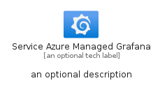
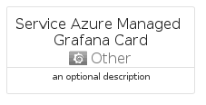
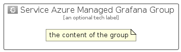

# ServiceAzureManagedGrafana


```text
azure-11/Item/Other/ServiceAzureManagedGrafana
```

```text
include('azure-11/Item/Other/ServiceAzureManagedGrafana')
```


| Illustration | ServiceAzureManagedGrafana | ServiceAzureManagedGrafanaCard | ServiceAzureManagedGrafanaGroup |
| :---: | :---: | :---: | :---: |
|  |  |  |  |


## ServiceAzureManagedGrafana

### Load remotely
```plantuml
@startuml
' configures the library
!global $LIB_BASE_LOCATION="https://raw.githubusercontent.com/tmorin/plantuml-libs/master/distribution"

' loads the library's bootstrap
!include $LIB_BASE_LOCATION/bootstrap.puml

' loads the package bootstrap
include('azure-11/bootstrap')

' loads the Item which embeds the element ServiceAzureManagedGrafana
include('azure-11/Item/Other/ServiceAzureManagedGrafana')

' renders the element
ServiceAzureManagedGrafana('ServiceAzureManagedGrafana', 'Service Azure Managed Grafana', 'an optional tech label', 'an optional description')
@enduml
```

### Load locally
```plantuml
@startuml
' configures the library
!global $INCLUSION_MODE="local"
!global $LIB_BASE_LOCATION="../../.."

' loads the library's bootstrap
!include $LIB_BASE_LOCATION/bootstrap.puml

' loads the package bootstrap
include('azure-11/bootstrap')

' loads the Item which embeds the element ServiceAzureManagedGrafana
include('azure-11/Item/Other/ServiceAzureManagedGrafana')

' renders the element
ServiceAzureManagedGrafana('ServiceAzureManagedGrafana', 'Service Azure Managed Grafana', 'an optional tech label', 'an optional description')
@enduml
```

## ServiceAzureManagedGrafanaCard

### Load remotely
```plantuml
@startuml
' configures the library
!global $LIB_BASE_LOCATION="https://raw.githubusercontent.com/tmorin/plantuml-libs/master/distribution"

' loads the library's bootstrap
!include $LIB_BASE_LOCATION/bootstrap.puml

' loads the package bootstrap
include('azure-11/bootstrap')

' loads the Item which embeds the element ServiceAzureManagedGrafanaCard
include('azure-11/Item/Other/ServiceAzureManagedGrafana')

' renders the element
ServiceAzureManagedGrafanaCard('ServiceAzureManagedGrafanaCard', 'Service Azure Managed Grafana Card', 'an optional description')
@enduml
```

### Load locally
```plantuml
@startuml
' configures the library
!global $INCLUSION_MODE="local"
!global $LIB_BASE_LOCATION="../../.."

' loads the library's bootstrap
!include $LIB_BASE_LOCATION/bootstrap.puml

' loads the package bootstrap
include('azure-11/bootstrap')

' loads the Item which embeds the element ServiceAzureManagedGrafanaCard
include('azure-11/Item/Other/ServiceAzureManagedGrafana')

' renders the element
ServiceAzureManagedGrafanaCard('ServiceAzureManagedGrafanaCard', 'Service Azure Managed Grafana Card', 'an optional description')
@enduml
```

## ServiceAzureManagedGrafanaGroup

### Load remotely
```plantuml
@startuml
' configures the library
!global $LIB_BASE_LOCATION="https://raw.githubusercontent.com/tmorin/plantuml-libs/master/distribution"

' loads the library's bootstrap
!include $LIB_BASE_LOCATION/bootstrap.puml

' loads the package bootstrap
include('azure-11/bootstrap')

' loads the Item which embeds the element ServiceAzureManagedGrafanaGroup
include('azure-11/Item/Other/ServiceAzureManagedGrafana')

' renders the element
ServiceAzureManagedGrafanaGroup('ServiceAzureManagedGrafanaGroup', 'Service Azure Managed Grafana Group', 'an optional tech label') {
    note as note
        the content of the group
    end note
}
@enduml
```

### Load locally
```plantuml
@startuml
' configures the library
!global $INCLUSION_MODE="local"
!global $LIB_BASE_LOCATION="../../.."

' loads the library's bootstrap
!include $LIB_BASE_LOCATION/bootstrap.puml

' loads the package bootstrap
include('azure-11/bootstrap')

' loads the Item which embeds the element ServiceAzureManagedGrafanaGroup
include('azure-11/Item/Other/ServiceAzureManagedGrafana')

' renders the element
ServiceAzureManagedGrafanaGroup('ServiceAzureManagedGrafanaGroup', 'Service Azure Managed Grafana Group', 'an optional tech label') {
    note as note
        the content of the group
    end note
}
@enduml
```

