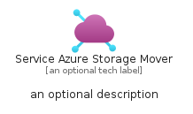
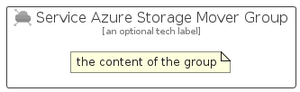

# ServiceAzureStorageMover


```text
azure-11/Item/Other/ServiceAzureStorageMover
```

```text
include('azure-11/Item/Other/ServiceAzureStorageMover')
```


| Illustration | ServiceAzureStorageMover | ServiceAzureStorageMoverCard | ServiceAzureStorageMoverGroup |
| :---: | :---: | :---: | :---: |
|  |  |  |  |


## ServiceAzureStorageMover

### Load remotely
```plantuml
@startuml
' configures the library
!global $LIB_BASE_LOCATION="https://raw.githubusercontent.com/tmorin/plantuml-libs/master/distribution"

' loads the library's bootstrap
!include $LIB_BASE_LOCATION/bootstrap.puml

' loads the package bootstrap
include('azure-11/bootstrap')

' loads the Item which embeds the element ServiceAzureStorageMover
include('azure-11/Item/Other/ServiceAzureStorageMover')

' renders the element
ServiceAzureStorageMover('ServiceAzureStorageMover', 'Service Azure Storage Mover', 'an optional tech label', 'an optional description')
@enduml
```

### Load locally
```plantuml
@startuml
' configures the library
!global $INCLUSION_MODE="local"
!global $LIB_BASE_LOCATION="../../.."

' loads the library's bootstrap
!include $LIB_BASE_LOCATION/bootstrap.puml

' loads the package bootstrap
include('azure-11/bootstrap')

' loads the Item which embeds the element ServiceAzureStorageMover
include('azure-11/Item/Other/ServiceAzureStorageMover')

' renders the element
ServiceAzureStorageMover('ServiceAzureStorageMover', 'Service Azure Storage Mover', 'an optional tech label', 'an optional description')
@enduml
```

## ServiceAzureStorageMoverCard

### Load remotely
```plantuml
@startuml
' configures the library
!global $LIB_BASE_LOCATION="https://raw.githubusercontent.com/tmorin/plantuml-libs/master/distribution"

' loads the library's bootstrap
!include $LIB_BASE_LOCATION/bootstrap.puml

' loads the package bootstrap
include('azure-11/bootstrap')

' loads the Item which embeds the element ServiceAzureStorageMoverCard
include('azure-11/Item/Other/ServiceAzureStorageMover')

' renders the element
ServiceAzureStorageMoverCard('ServiceAzureStorageMoverCard', 'Service Azure Storage Mover Card', 'an optional description')
@enduml
```

### Load locally
```plantuml
@startuml
' configures the library
!global $INCLUSION_MODE="local"
!global $LIB_BASE_LOCATION="../../.."

' loads the library's bootstrap
!include $LIB_BASE_LOCATION/bootstrap.puml

' loads the package bootstrap
include('azure-11/bootstrap')

' loads the Item which embeds the element ServiceAzureStorageMoverCard
include('azure-11/Item/Other/ServiceAzureStorageMover')

' renders the element
ServiceAzureStorageMoverCard('ServiceAzureStorageMoverCard', 'Service Azure Storage Mover Card', 'an optional description')
@enduml
```

## ServiceAzureStorageMoverGroup

### Load remotely
```plantuml
@startuml
' configures the library
!global $LIB_BASE_LOCATION="https://raw.githubusercontent.com/tmorin/plantuml-libs/master/distribution"

' loads the library's bootstrap
!include $LIB_BASE_LOCATION/bootstrap.puml

' loads the package bootstrap
include('azure-11/bootstrap')

' loads the Item which embeds the element ServiceAzureStorageMoverGroup
include('azure-11/Item/Other/ServiceAzureStorageMover')

' renders the element
ServiceAzureStorageMoverGroup('ServiceAzureStorageMoverGroup', 'Service Azure Storage Mover Group', 'an optional tech label') {
    note as note
        the content of the group
    end note
}
@enduml
```

### Load locally
```plantuml
@startuml
' configures the library
!global $INCLUSION_MODE="local"
!global $LIB_BASE_LOCATION="../../.."

' loads the library's bootstrap
!include $LIB_BASE_LOCATION/bootstrap.puml

' loads the package bootstrap
include('azure-11/bootstrap')

' loads the Item which embeds the element ServiceAzureStorageMoverGroup
include('azure-11/Item/Other/ServiceAzureStorageMover')

' renders the element
ServiceAzureStorageMoverGroup('ServiceAzureStorageMoverGroup', 'Service Azure Storage Mover Group', 'an optional tech label') {
    note as note
        the content of the group
    end note
}
@enduml
```

