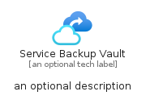

# ServiceBackupVault


```text
azure-11/Item/Other/ServiceBackupVault
```

```text
include('azure-11/Item/Other/ServiceBackupVault')
```


| Illustration | ServiceBackupVault | ServiceBackupVaultCard | ServiceBackupVaultGroup |
| :---: | :---: | :---: | :---: |
|  |  |  |  |


## ServiceBackupVault

### Load remotely
```plantuml
@startuml
' configures the library
!global $LIB_BASE_LOCATION="https://raw.githubusercontent.com/tmorin/plantuml-libs/master/distribution"

' loads the library's bootstrap
!include $LIB_BASE_LOCATION/bootstrap.puml

' loads the package bootstrap
include('azure-11/bootstrap')

' loads the Item which embeds the element ServiceBackupVault
include('azure-11/Item/Other/ServiceBackupVault')

' renders the element
ServiceBackupVault('ServiceBackupVault', 'Service Backup Vault', 'an optional tech label', 'an optional description')
@enduml
```

### Load locally
```plantuml
@startuml
' configures the library
!global $INCLUSION_MODE="local"
!global $LIB_BASE_LOCATION="../../.."

' loads the library's bootstrap
!include $LIB_BASE_LOCATION/bootstrap.puml

' loads the package bootstrap
include('azure-11/bootstrap')

' loads the Item which embeds the element ServiceBackupVault
include('azure-11/Item/Other/ServiceBackupVault')

' renders the element
ServiceBackupVault('ServiceBackupVault', 'Service Backup Vault', 'an optional tech label', 'an optional description')
@enduml
```

## ServiceBackupVaultCard

### Load remotely
```plantuml
@startuml
' configures the library
!global $LIB_BASE_LOCATION="https://raw.githubusercontent.com/tmorin/plantuml-libs/master/distribution"

' loads the library's bootstrap
!include $LIB_BASE_LOCATION/bootstrap.puml

' loads the package bootstrap
include('azure-11/bootstrap')

' loads the Item which embeds the element ServiceBackupVaultCard
include('azure-11/Item/Other/ServiceBackupVault')

' renders the element
ServiceBackupVaultCard('ServiceBackupVaultCard', 'Service Backup Vault Card', 'an optional description')
@enduml
```

### Load locally
```plantuml
@startuml
' configures the library
!global $INCLUSION_MODE="local"
!global $LIB_BASE_LOCATION="../../.."

' loads the library's bootstrap
!include $LIB_BASE_LOCATION/bootstrap.puml

' loads the package bootstrap
include('azure-11/bootstrap')

' loads the Item which embeds the element ServiceBackupVaultCard
include('azure-11/Item/Other/ServiceBackupVault')

' renders the element
ServiceBackupVaultCard('ServiceBackupVaultCard', 'Service Backup Vault Card', 'an optional description')
@enduml
```

## ServiceBackupVaultGroup

### Load remotely
```plantuml
@startuml
' configures the library
!global $LIB_BASE_LOCATION="https://raw.githubusercontent.com/tmorin/plantuml-libs/master/distribution"

' loads the library's bootstrap
!include $LIB_BASE_LOCATION/bootstrap.puml

' loads the package bootstrap
include('azure-11/bootstrap')

' loads the Item which embeds the element ServiceBackupVaultGroup
include('azure-11/Item/Other/ServiceBackupVault')

' renders the element
ServiceBackupVaultGroup('ServiceBackupVaultGroup', 'Service Backup Vault Group', 'an optional tech label') {
    note as note
        the content of the group
    end note
}
@enduml
```

### Load locally
```plantuml
@startuml
' configures the library
!global $INCLUSION_MODE="local"
!global $LIB_BASE_LOCATION="../../.."

' loads the library's bootstrap
!include $LIB_BASE_LOCATION/bootstrap.puml

' loads the package bootstrap
include('azure-11/bootstrap')

' loads the Item which embeds the element ServiceBackupVaultGroup
include('azure-11/Item/Other/ServiceBackupVault')

' renders the element
ServiceBackupVaultGroup('ServiceBackupVaultGroup', 'Service Backup Vault Group', 'an optional tech label') {
    note as note
        the content of the group
    end note
}
@enduml
```

