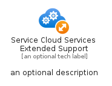
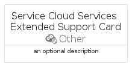
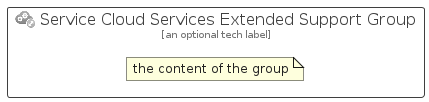

# ServiceCloudServicesExtendedSupport


```text
azure-11/Item/Other/ServiceCloudServicesExtendedSupport
```

```text
include('azure-11/Item/Other/ServiceCloudServicesExtendedSupport')
```


| Illustration | ServiceCloudServicesExtendedSupport | ServiceCloudServicesExtendedSupportCard | ServiceCloudServicesExtendedSupportGroup |
| :---: | :---: | :---: | :---: |
|  |  |  |  |


## Sprites
The item provides the following sriptes:

- `<$ServiceCloudServicesExtendedSupportXs>`
- `<$ServiceCloudServicesExtendedSupportSm>`
- `<$ServiceCloudServicesExtendedSupportMd>`
- `<$ServiceCloudServicesExtendedSupportLg>`


## ServiceCloudServicesExtendedSupport

### Load remotely
```plantuml
@startuml
' configures the library
!global $LIB_BASE_LOCATION="https://raw.githubusercontent.com/tmorin/plantuml-libs/master/distribution"

' loads the library's bootstrap
!include $LIB_BASE_LOCATION/bootstrap.puml

' loads the package bootstrap
include('azure-11/bootstrap')

' loads the Item which embeds the element ServiceCloudServicesExtendedSupport
include('azure-11/Item/Other/ServiceCloudServicesExtendedSupport')

' renders the element
ServiceCloudServicesExtendedSupport('ServiceCloudServicesExtendedSupport', 'Service Cloud Services Extended Support', 'an optional tech label', 'an optional description')
@enduml
```

### Load locally
```plantuml
@startuml
' configures the library
!global $INCLUSION_MODE="local"
!global $LIB_BASE_LOCATION="../../.."

' loads the library's bootstrap
!include $LIB_BASE_LOCATION/bootstrap.puml

' loads the package bootstrap
include('azure-11/bootstrap')

' loads the Item which embeds the element ServiceCloudServicesExtendedSupport
include('azure-11/Item/Other/ServiceCloudServicesExtendedSupport')

' renders the element
ServiceCloudServicesExtendedSupport('ServiceCloudServicesExtendedSupport', 'Service Cloud Services Extended Support', 'an optional tech label', 'an optional description')
@enduml
```

## ServiceCloudServicesExtendedSupportCard

### Load remotely
```plantuml
@startuml
' configures the library
!global $LIB_BASE_LOCATION="https://raw.githubusercontent.com/tmorin/plantuml-libs/master/distribution"

' loads the library's bootstrap
!include $LIB_BASE_LOCATION/bootstrap.puml

' loads the package bootstrap
include('azure-11/bootstrap')

' loads the Item which embeds the element ServiceCloudServicesExtendedSupportCard
include('azure-11/Item/Other/ServiceCloudServicesExtendedSupport')

' renders the element
ServiceCloudServicesExtendedSupportCard('ServiceCloudServicesExtendedSupportCard', 'Service Cloud Services Extended Support Card', 'an optional description')
@enduml
```

### Load locally
```plantuml
@startuml
' configures the library
!global $INCLUSION_MODE="local"
!global $LIB_BASE_LOCATION="../../.."

' loads the library's bootstrap
!include $LIB_BASE_LOCATION/bootstrap.puml

' loads the package bootstrap
include('azure-11/bootstrap')

' loads the Item which embeds the element ServiceCloudServicesExtendedSupportCard
include('azure-11/Item/Other/ServiceCloudServicesExtendedSupport')

' renders the element
ServiceCloudServicesExtendedSupportCard('ServiceCloudServicesExtendedSupportCard', 'Service Cloud Services Extended Support Card', 'an optional description')
@enduml
```

## ServiceCloudServicesExtendedSupportGroup

### Load remotely
```plantuml
@startuml
' configures the library
!global $LIB_BASE_LOCATION="https://raw.githubusercontent.com/tmorin/plantuml-libs/master/distribution"

' loads the library's bootstrap
!include $LIB_BASE_LOCATION/bootstrap.puml

' loads the package bootstrap
include('azure-11/bootstrap')

' loads the Item which embeds the element ServiceCloudServicesExtendedSupportGroup
include('azure-11/Item/Other/ServiceCloudServicesExtendedSupport')

' renders the element
ServiceCloudServicesExtendedSupportGroup('ServiceCloudServicesExtendedSupportGroup', 'Service Cloud Services Extended Support Group', 'an optional tech label') {
    note as note
        the content of the group
    end note
}
@enduml
```

### Load locally
```plantuml
@startuml
' configures the library
!global $INCLUSION_MODE="local"
!global $LIB_BASE_LOCATION="../../.."

' loads the library's bootstrap
!include $LIB_BASE_LOCATION/bootstrap.puml

' loads the package bootstrap
include('azure-11/bootstrap')

' loads the Item which embeds the element ServiceCloudServicesExtendedSupportGroup
include('azure-11/Item/Other/ServiceCloudServicesExtendedSupport')

' renders the element
ServiceCloudServicesExtendedSupportGroup('ServiceCloudServicesExtendedSupportGroup', 'Service Cloud Services Extended Support Group', 'an optional tech label') {
    note as note
        the content of the group
    end note
}
@enduml
```

