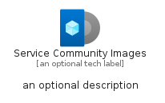
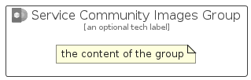

# ServiceCommunityImages


```text
azure-11/Item/Other/ServiceCommunityImages
```

```text
include('azure-11/Item/Other/ServiceCommunityImages')
```


| Illustration | ServiceCommunityImages | ServiceCommunityImagesCard | ServiceCommunityImagesGroup |
| :---: | :---: | :---: | :---: |
|  |  |  |  |


## Sprites
The item provides the following sriptes:

- `<$ServiceCommunityImagesXs>`
- `<$ServiceCommunityImagesSm>`
- `<$ServiceCommunityImagesMd>`
- `<$ServiceCommunityImagesLg>`


## ServiceCommunityImages

### Load remotely
```plantuml
@startuml
' configures the library
!global $LIB_BASE_LOCATION="https://raw.githubusercontent.com/tmorin/plantuml-libs/master/distribution"

' loads the library's bootstrap
!include $LIB_BASE_LOCATION/bootstrap.puml

' loads the package bootstrap
include('azure-11/bootstrap')

' loads the Item which embeds the element ServiceCommunityImages
include('azure-11/Item/Other/ServiceCommunityImages')

' renders the element
ServiceCommunityImages('ServiceCommunityImages', 'Service Community Images', 'an optional tech label', 'an optional description')
@enduml
```

### Load locally
```plantuml
@startuml
' configures the library
!global $INCLUSION_MODE="local"
!global $LIB_BASE_LOCATION="../../.."

' loads the library's bootstrap
!include $LIB_BASE_LOCATION/bootstrap.puml

' loads the package bootstrap
include('azure-11/bootstrap')

' loads the Item which embeds the element ServiceCommunityImages
include('azure-11/Item/Other/ServiceCommunityImages')

' renders the element
ServiceCommunityImages('ServiceCommunityImages', 'Service Community Images', 'an optional tech label', 'an optional description')
@enduml
```

## ServiceCommunityImagesCard

### Load remotely
```plantuml
@startuml
' configures the library
!global $LIB_BASE_LOCATION="https://raw.githubusercontent.com/tmorin/plantuml-libs/master/distribution"

' loads the library's bootstrap
!include $LIB_BASE_LOCATION/bootstrap.puml

' loads the package bootstrap
include('azure-11/bootstrap')

' loads the Item which embeds the element ServiceCommunityImagesCard
include('azure-11/Item/Other/ServiceCommunityImages')

' renders the element
ServiceCommunityImagesCard('ServiceCommunityImagesCard', 'Service Community Images Card', 'an optional description')
@enduml
```

### Load locally
```plantuml
@startuml
' configures the library
!global $INCLUSION_MODE="local"
!global $LIB_BASE_LOCATION="../../.."

' loads the library's bootstrap
!include $LIB_BASE_LOCATION/bootstrap.puml

' loads the package bootstrap
include('azure-11/bootstrap')

' loads the Item which embeds the element ServiceCommunityImagesCard
include('azure-11/Item/Other/ServiceCommunityImages')

' renders the element
ServiceCommunityImagesCard('ServiceCommunityImagesCard', 'Service Community Images Card', 'an optional description')
@enduml
```

## ServiceCommunityImagesGroup

### Load remotely
```plantuml
@startuml
' configures the library
!global $LIB_BASE_LOCATION="https://raw.githubusercontent.com/tmorin/plantuml-libs/master/distribution"

' loads the library's bootstrap
!include $LIB_BASE_LOCATION/bootstrap.puml

' loads the package bootstrap
include('azure-11/bootstrap')

' loads the Item which embeds the element ServiceCommunityImagesGroup
include('azure-11/Item/Other/ServiceCommunityImages')

' renders the element
ServiceCommunityImagesGroup('ServiceCommunityImagesGroup', 'Service Community Images Group', 'an optional tech label') {
    note as note
        the content of the group
    end note
}
@enduml
```

### Load locally
```plantuml
@startuml
' configures the library
!global $INCLUSION_MODE="local"
!global $LIB_BASE_LOCATION="../../.."

' loads the library's bootstrap
!include $LIB_BASE_LOCATION/bootstrap.puml

' loads the package bootstrap
include('azure-11/bootstrap')

' loads the Item which embeds the element ServiceCommunityImagesGroup
include('azure-11/Item/Other/ServiceCommunityImages')

' renders the element
ServiceCommunityImagesGroup('ServiceCommunityImagesGroup', 'Service Community Images Group', 'an optional tech label') {
    note as note
        the content of the group
    end note
}
@enduml
```

