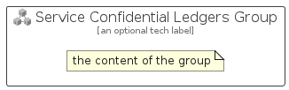

# ServiceConfidentialLedgers


```text
azure-11/Item/Other/ServiceConfidentialLedgers
```

```text
include('azure-11/Item/Other/ServiceConfidentialLedgers')
```


| Illustration | ServiceConfidentialLedgers | ServiceConfidentialLedgersCard | ServiceConfidentialLedgersGroup |
| :---: | :---: | :---: | :---: |
|  |  |  |  |


## Sprites
The item provides the following sriptes:

- `<$ServiceConfidentialLedgersXs>`
- `<$ServiceConfidentialLedgersSm>`
- `<$ServiceConfidentialLedgersMd>`
- `<$ServiceConfidentialLedgersLg>`


## ServiceConfidentialLedgers

### Load remotely
```plantuml
@startuml
' configures the library
!global $LIB_BASE_LOCATION="https://raw.githubusercontent.com/tmorin/plantuml-libs/master/distribution"

' loads the library's bootstrap
!include $LIB_BASE_LOCATION/bootstrap.puml

' loads the package bootstrap
include('azure-11/bootstrap')

' loads the Item which embeds the element ServiceConfidentialLedgers
include('azure-11/Item/Other/ServiceConfidentialLedgers')

' renders the element
ServiceConfidentialLedgers('ServiceConfidentialLedgers', 'Service Confidential Ledgers', 'an optional tech label', 'an optional description')
@enduml
```

### Load locally
```plantuml
@startuml
' configures the library
!global $INCLUSION_MODE="local"
!global $LIB_BASE_LOCATION="../../.."

' loads the library's bootstrap
!include $LIB_BASE_LOCATION/bootstrap.puml

' loads the package bootstrap
include('azure-11/bootstrap')

' loads the Item which embeds the element ServiceConfidentialLedgers
include('azure-11/Item/Other/ServiceConfidentialLedgers')

' renders the element
ServiceConfidentialLedgers('ServiceConfidentialLedgers', 'Service Confidential Ledgers', 'an optional tech label', 'an optional description')
@enduml
```

## ServiceConfidentialLedgersCard

### Load remotely
```plantuml
@startuml
' configures the library
!global $LIB_BASE_LOCATION="https://raw.githubusercontent.com/tmorin/plantuml-libs/master/distribution"

' loads the library's bootstrap
!include $LIB_BASE_LOCATION/bootstrap.puml

' loads the package bootstrap
include('azure-11/bootstrap')

' loads the Item which embeds the element ServiceConfidentialLedgersCard
include('azure-11/Item/Other/ServiceConfidentialLedgers')

' renders the element
ServiceConfidentialLedgersCard('ServiceConfidentialLedgersCard', 'Service Confidential Ledgers Card', 'an optional description')
@enduml
```

### Load locally
```plantuml
@startuml
' configures the library
!global $INCLUSION_MODE="local"
!global $LIB_BASE_LOCATION="../../.."

' loads the library's bootstrap
!include $LIB_BASE_LOCATION/bootstrap.puml

' loads the package bootstrap
include('azure-11/bootstrap')

' loads the Item which embeds the element ServiceConfidentialLedgersCard
include('azure-11/Item/Other/ServiceConfidentialLedgers')

' renders the element
ServiceConfidentialLedgersCard('ServiceConfidentialLedgersCard', 'Service Confidential Ledgers Card', 'an optional description')
@enduml
```

## ServiceConfidentialLedgersGroup

### Load remotely
```plantuml
@startuml
' configures the library
!global $LIB_BASE_LOCATION="https://raw.githubusercontent.com/tmorin/plantuml-libs/master/distribution"

' loads the library's bootstrap
!include $LIB_BASE_LOCATION/bootstrap.puml

' loads the package bootstrap
include('azure-11/bootstrap')

' loads the Item which embeds the element ServiceConfidentialLedgersGroup
include('azure-11/Item/Other/ServiceConfidentialLedgers')

' renders the element
ServiceConfidentialLedgersGroup('ServiceConfidentialLedgersGroup', 'Service Confidential Ledgers Group', 'an optional tech label') {
    note as note
        the content of the group
    end note
}
@enduml
```

### Load locally
```plantuml
@startuml
' configures the library
!global $INCLUSION_MODE="local"
!global $LIB_BASE_LOCATION="../../.."

' loads the library's bootstrap
!include $LIB_BASE_LOCATION/bootstrap.puml

' loads the package bootstrap
include('azure-11/bootstrap')

' loads the Item which embeds the element ServiceConfidentialLedgersGroup
include('azure-11/Item/Other/ServiceConfidentialLedgers')

' renders the element
ServiceConfidentialLedgersGroup('ServiceConfidentialLedgersGroup', 'Service Confidential Ledgers Group', 'an optional tech label') {
    note as note
        the content of the group
    end note
}
@enduml
```

