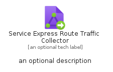
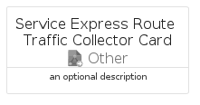

# ServiceExpressRouteTrafficCollector


```text
azure-11/Item/Other/ServiceExpressRouteTrafficCollector
```

```text
include('azure-11/Item/Other/ServiceExpressRouteTrafficCollector')
```


| Illustration | ServiceExpressRouteTrafficCollector | ServiceExpressRouteTrafficCollectorCard | ServiceExpressRouteTrafficCollectorGroup |
| :---: | :---: | :---: | :---: |
|  |  |  |  |


## Sprites
The item provides the following sriptes:

- `<$ServiceExpressRouteTrafficCollectorXs>`
- `<$ServiceExpressRouteTrafficCollectorSm>`
- `<$ServiceExpressRouteTrafficCollectorMd>`
- `<$ServiceExpressRouteTrafficCollectorLg>`


## ServiceExpressRouteTrafficCollector

### Load remotely
```plantuml
@startuml
' configures the library
!global $LIB_BASE_LOCATION="https://raw.githubusercontent.com/tmorin/plantuml-libs/master/distribution"

' loads the library's bootstrap
!include $LIB_BASE_LOCATION/bootstrap.puml

' loads the package bootstrap
include('azure-11/bootstrap')

' loads the Item which embeds the element ServiceExpressRouteTrafficCollector
include('azure-11/Item/Other/ServiceExpressRouteTrafficCollector')

' renders the element
ServiceExpressRouteTrafficCollector('ServiceExpressRouteTrafficCollector', 'Service Express Route Traffic Collector', 'an optional tech label', 'an optional description')
@enduml
```

### Load locally
```plantuml
@startuml
' configures the library
!global $INCLUSION_MODE="local"
!global $LIB_BASE_LOCATION="../../.."

' loads the library's bootstrap
!include $LIB_BASE_LOCATION/bootstrap.puml

' loads the package bootstrap
include('azure-11/bootstrap')

' loads the Item which embeds the element ServiceExpressRouteTrafficCollector
include('azure-11/Item/Other/ServiceExpressRouteTrafficCollector')

' renders the element
ServiceExpressRouteTrafficCollector('ServiceExpressRouteTrafficCollector', 'Service Express Route Traffic Collector', 'an optional tech label', 'an optional description')
@enduml
```

## ServiceExpressRouteTrafficCollectorCard

### Load remotely
```plantuml
@startuml
' configures the library
!global $LIB_BASE_LOCATION="https://raw.githubusercontent.com/tmorin/plantuml-libs/master/distribution"

' loads the library's bootstrap
!include $LIB_BASE_LOCATION/bootstrap.puml

' loads the package bootstrap
include('azure-11/bootstrap')

' loads the Item which embeds the element ServiceExpressRouteTrafficCollectorCard
include('azure-11/Item/Other/ServiceExpressRouteTrafficCollector')

' renders the element
ServiceExpressRouteTrafficCollectorCard('ServiceExpressRouteTrafficCollectorCard', 'Service Express Route Traffic Collector Card', 'an optional description')
@enduml
```

### Load locally
```plantuml
@startuml
' configures the library
!global $INCLUSION_MODE="local"
!global $LIB_BASE_LOCATION="../../.."

' loads the library's bootstrap
!include $LIB_BASE_LOCATION/bootstrap.puml

' loads the package bootstrap
include('azure-11/bootstrap')

' loads the Item which embeds the element ServiceExpressRouteTrafficCollectorCard
include('azure-11/Item/Other/ServiceExpressRouteTrafficCollector')

' renders the element
ServiceExpressRouteTrafficCollectorCard('ServiceExpressRouteTrafficCollectorCard', 'Service Express Route Traffic Collector Card', 'an optional description')
@enduml
```

## ServiceExpressRouteTrafficCollectorGroup

### Load remotely
```plantuml
@startuml
' configures the library
!global $LIB_BASE_LOCATION="https://raw.githubusercontent.com/tmorin/plantuml-libs/master/distribution"

' loads the library's bootstrap
!include $LIB_BASE_LOCATION/bootstrap.puml

' loads the package bootstrap
include('azure-11/bootstrap')

' loads the Item which embeds the element ServiceExpressRouteTrafficCollectorGroup
include('azure-11/Item/Other/ServiceExpressRouteTrafficCollector')

' renders the element
ServiceExpressRouteTrafficCollectorGroup('ServiceExpressRouteTrafficCollectorGroup', 'Service Express Route Traffic Collector Group', 'an optional tech label') {
    note as note
        the content of the group
    end note
}
@enduml
```

### Load locally
```plantuml
@startuml
' configures the library
!global $INCLUSION_MODE="local"
!global $LIB_BASE_LOCATION="../../.."

' loads the library's bootstrap
!include $LIB_BASE_LOCATION/bootstrap.puml

' loads the package bootstrap
include('azure-11/bootstrap')

' loads the Item which embeds the element ServiceExpressRouteTrafficCollectorGroup
include('azure-11/Item/Other/ServiceExpressRouteTrafficCollector')

' renders the element
ServiceExpressRouteTrafficCollectorGroup('ServiceExpressRouteTrafficCollectorGroup', 'Service Express Route Traffic Collector Group', 'an optional tech label') {
    note as note
        the content of the group
    end note
}
@enduml
```

