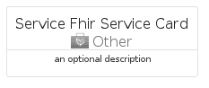
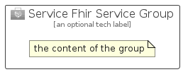

# ServiceFhirService


```text
azure-11/Item/Other/ServiceFhirService
```

```text
include('azure-11/Item/Other/ServiceFhirService')
```


| Illustration | ServiceFhirService | ServiceFhirServiceCard | ServiceFhirServiceGroup |
| :---: | :---: | :---: | :---: |
|  |  |  |  |


## Sprites
The item provides the following sriptes:

- `<$ServiceFhirServiceXs>`
- `<$ServiceFhirServiceSm>`
- `<$ServiceFhirServiceMd>`
- `<$ServiceFhirServiceLg>`


## ServiceFhirService

### Load remotely
```plantuml
@startuml
' configures the library
!global $LIB_BASE_LOCATION="https://raw.githubusercontent.com/tmorin/plantuml-libs/master/distribution"

' loads the library's bootstrap
!include $LIB_BASE_LOCATION/bootstrap.puml

' loads the package bootstrap
include('azure-11/bootstrap')

' loads the Item which embeds the element ServiceFhirService
include('azure-11/Item/Other/ServiceFhirService')

' renders the element
ServiceFhirService('ServiceFhirService', 'Service Fhir Service', 'an optional tech label', 'an optional description')
@enduml
```

### Load locally
```plantuml
@startuml
' configures the library
!global $INCLUSION_MODE="local"
!global $LIB_BASE_LOCATION="../../.."

' loads the library's bootstrap
!include $LIB_BASE_LOCATION/bootstrap.puml

' loads the package bootstrap
include('azure-11/bootstrap')

' loads the Item which embeds the element ServiceFhirService
include('azure-11/Item/Other/ServiceFhirService')

' renders the element
ServiceFhirService('ServiceFhirService', 'Service Fhir Service', 'an optional tech label', 'an optional description')
@enduml
```

## ServiceFhirServiceCard

### Load remotely
```plantuml
@startuml
' configures the library
!global $LIB_BASE_LOCATION="https://raw.githubusercontent.com/tmorin/plantuml-libs/master/distribution"

' loads the library's bootstrap
!include $LIB_BASE_LOCATION/bootstrap.puml

' loads the package bootstrap
include('azure-11/bootstrap')

' loads the Item which embeds the element ServiceFhirServiceCard
include('azure-11/Item/Other/ServiceFhirService')

' renders the element
ServiceFhirServiceCard('ServiceFhirServiceCard', 'Service Fhir Service Card', 'an optional description')
@enduml
```

### Load locally
```plantuml
@startuml
' configures the library
!global $INCLUSION_MODE="local"
!global $LIB_BASE_LOCATION="../../.."

' loads the library's bootstrap
!include $LIB_BASE_LOCATION/bootstrap.puml

' loads the package bootstrap
include('azure-11/bootstrap')

' loads the Item which embeds the element ServiceFhirServiceCard
include('azure-11/Item/Other/ServiceFhirService')

' renders the element
ServiceFhirServiceCard('ServiceFhirServiceCard', 'Service Fhir Service Card', 'an optional description')
@enduml
```

## ServiceFhirServiceGroup

### Load remotely
```plantuml
@startuml
' configures the library
!global $LIB_BASE_LOCATION="https://raw.githubusercontent.com/tmorin/plantuml-libs/master/distribution"

' loads the library's bootstrap
!include $LIB_BASE_LOCATION/bootstrap.puml

' loads the package bootstrap
include('azure-11/bootstrap')

' loads the Item which embeds the element ServiceFhirServiceGroup
include('azure-11/Item/Other/ServiceFhirService')

' renders the element
ServiceFhirServiceGroup('ServiceFhirServiceGroup', 'Service Fhir Service Group', 'an optional tech label') {
    note as note
        the content of the group
    end note
}
@enduml
```

### Load locally
```plantuml
@startuml
' configures the library
!global $INCLUSION_MODE="local"
!global $LIB_BASE_LOCATION="../../.."

' loads the library's bootstrap
!include $LIB_BASE_LOCATION/bootstrap.puml

' loads the package bootstrap
include('azure-11/bootstrap')

' loads the Item which embeds the element ServiceFhirServiceGroup
include('azure-11/Item/Other/ServiceFhirService')

' renders the element
ServiceFhirServiceGroup('ServiceFhirServiceGroup', 'Service Fhir Service Group', 'an optional tech label') {
    note as note
        the content of the group
    end note
}
@enduml
```

