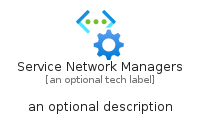

# ServiceNetworkManagers


```text
azure-11/Item/Other/ServiceNetworkManagers
```

```text
include('azure-11/Item/Other/ServiceNetworkManagers')
```


| Illustration | ServiceNetworkManagers | ServiceNetworkManagersCard | ServiceNetworkManagersGroup |
| :---: | :---: | :---: | :---: |
|  |  |  |  |


## ServiceNetworkManagers

### Load remotely
```plantuml
@startuml
' configures the library
!global $LIB_BASE_LOCATION="https://raw.githubusercontent.com/tmorin/plantuml-libs/master/distribution"

' loads the library's bootstrap
!include $LIB_BASE_LOCATION/bootstrap.puml

' loads the package bootstrap
include('azure-11/bootstrap')

' loads the Item which embeds the element ServiceNetworkManagers
include('azure-11/Item/Other/ServiceNetworkManagers')

' renders the element
ServiceNetworkManagers('ServiceNetworkManagers', 'Service Network Managers', 'an optional tech label', 'an optional description')
@enduml
```

### Load locally
```plantuml
@startuml
' configures the library
!global $INCLUSION_MODE="local"
!global $LIB_BASE_LOCATION="../../.."

' loads the library's bootstrap
!include $LIB_BASE_LOCATION/bootstrap.puml

' loads the package bootstrap
include('azure-11/bootstrap')

' loads the Item which embeds the element ServiceNetworkManagers
include('azure-11/Item/Other/ServiceNetworkManagers')

' renders the element
ServiceNetworkManagers('ServiceNetworkManagers', 'Service Network Managers', 'an optional tech label', 'an optional description')
@enduml
```

## ServiceNetworkManagersCard

### Load remotely
```plantuml
@startuml
' configures the library
!global $LIB_BASE_LOCATION="https://raw.githubusercontent.com/tmorin/plantuml-libs/master/distribution"

' loads the library's bootstrap
!include $LIB_BASE_LOCATION/bootstrap.puml

' loads the package bootstrap
include('azure-11/bootstrap')

' loads the Item which embeds the element ServiceNetworkManagersCard
include('azure-11/Item/Other/ServiceNetworkManagers')

' renders the element
ServiceNetworkManagersCard('ServiceNetworkManagersCard', 'Service Network Managers Card', 'an optional description')
@enduml
```

### Load locally
```plantuml
@startuml
' configures the library
!global $INCLUSION_MODE="local"
!global $LIB_BASE_LOCATION="../../.."

' loads the library's bootstrap
!include $LIB_BASE_LOCATION/bootstrap.puml

' loads the package bootstrap
include('azure-11/bootstrap')

' loads the Item which embeds the element ServiceNetworkManagersCard
include('azure-11/Item/Other/ServiceNetworkManagers')

' renders the element
ServiceNetworkManagersCard('ServiceNetworkManagersCard', 'Service Network Managers Card', 'an optional description')
@enduml
```

## ServiceNetworkManagersGroup

### Load remotely
```plantuml
@startuml
' configures the library
!global $LIB_BASE_LOCATION="https://raw.githubusercontent.com/tmorin/plantuml-libs/master/distribution"

' loads the library's bootstrap
!include $LIB_BASE_LOCATION/bootstrap.puml

' loads the package bootstrap
include('azure-11/bootstrap')

' loads the Item which embeds the element ServiceNetworkManagersGroup
include('azure-11/Item/Other/ServiceNetworkManagers')

' renders the element
ServiceNetworkManagersGroup('ServiceNetworkManagersGroup', 'Service Network Managers Group', 'an optional tech label') {
    note as note
        the content of the group
    end note
}
@enduml
```

### Load locally
```plantuml
@startuml
' configures the library
!global $INCLUSION_MODE="local"
!global $LIB_BASE_LOCATION="../../.."

' loads the library's bootstrap
!include $LIB_BASE_LOCATION/bootstrap.puml

' loads the package bootstrap
include('azure-11/bootstrap')

' loads the Item which embeds the element ServiceNetworkManagersGroup
include('azure-11/Item/Other/ServiceNetworkManagers')

' renders the element
ServiceNetworkManagersGroup('ServiceNetworkManagersGroup', 'Service Network Managers Group', 'an optional tech label') {
    note as note
        the content of the group
    end note
}
@enduml
```

