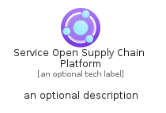
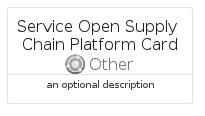
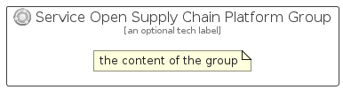

# ServiceOpenSupplyChainPlatform


```text
azure-11/Item/Other/ServiceOpenSupplyChainPlatform
```

```text
include('azure-11/Item/Other/ServiceOpenSupplyChainPlatform')
```


| Illustration | ServiceOpenSupplyChainPlatform | ServiceOpenSupplyChainPlatformCard | ServiceOpenSupplyChainPlatformGroup |
| :---: | :---: | :---: | :---: |
|  |  |  |  |


## ServiceOpenSupplyChainPlatform

### Load remotely
```plantuml
@startuml
' configures the library
!global $LIB_BASE_LOCATION="https://raw.githubusercontent.com/tmorin/plantuml-libs/master/distribution"

' loads the library's bootstrap
!include $LIB_BASE_LOCATION/bootstrap.puml

' loads the package bootstrap
include('azure-11/bootstrap')

' loads the Item which embeds the element ServiceOpenSupplyChainPlatform
include('azure-11/Item/Other/ServiceOpenSupplyChainPlatform')

' renders the element
ServiceOpenSupplyChainPlatform('ServiceOpenSupplyChainPlatform', 'Service Open Supply Chain Platform', 'an optional tech label', 'an optional description')
@enduml
```

### Load locally
```plantuml
@startuml
' configures the library
!global $INCLUSION_MODE="local"
!global $LIB_BASE_LOCATION="../../.."

' loads the library's bootstrap
!include $LIB_BASE_LOCATION/bootstrap.puml

' loads the package bootstrap
include('azure-11/bootstrap')

' loads the Item which embeds the element ServiceOpenSupplyChainPlatform
include('azure-11/Item/Other/ServiceOpenSupplyChainPlatform')

' renders the element
ServiceOpenSupplyChainPlatform('ServiceOpenSupplyChainPlatform', 'Service Open Supply Chain Platform', 'an optional tech label', 'an optional description')
@enduml
```

## ServiceOpenSupplyChainPlatformCard

### Load remotely
```plantuml
@startuml
' configures the library
!global $LIB_BASE_LOCATION="https://raw.githubusercontent.com/tmorin/plantuml-libs/master/distribution"

' loads the library's bootstrap
!include $LIB_BASE_LOCATION/bootstrap.puml

' loads the package bootstrap
include('azure-11/bootstrap')

' loads the Item which embeds the element ServiceOpenSupplyChainPlatformCard
include('azure-11/Item/Other/ServiceOpenSupplyChainPlatform')

' renders the element
ServiceOpenSupplyChainPlatformCard('ServiceOpenSupplyChainPlatformCard', 'Service Open Supply Chain Platform Card', 'an optional description')
@enduml
```

### Load locally
```plantuml
@startuml
' configures the library
!global $INCLUSION_MODE="local"
!global $LIB_BASE_LOCATION="../../.."

' loads the library's bootstrap
!include $LIB_BASE_LOCATION/bootstrap.puml

' loads the package bootstrap
include('azure-11/bootstrap')

' loads the Item which embeds the element ServiceOpenSupplyChainPlatformCard
include('azure-11/Item/Other/ServiceOpenSupplyChainPlatform')

' renders the element
ServiceOpenSupplyChainPlatformCard('ServiceOpenSupplyChainPlatformCard', 'Service Open Supply Chain Platform Card', 'an optional description')
@enduml
```

## ServiceOpenSupplyChainPlatformGroup

### Load remotely
```plantuml
@startuml
' configures the library
!global $LIB_BASE_LOCATION="https://raw.githubusercontent.com/tmorin/plantuml-libs/master/distribution"

' loads the library's bootstrap
!include $LIB_BASE_LOCATION/bootstrap.puml

' loads the package bootstrap
include('azure-11/bootstrap')

' loads the Item which embeds the element ServiceOpenSupplyChainPlatformGroup
include('azure-11/Item/Other/ServiceOpenSupplyChainPlatform')

' renders the element
ServiceOpenSupplyChainPlatformGroup('ServiceOpenSupplyChainPlatformGroup', 'Service Open Supply Chain Platform Group', 'an optional tech label') {
    note as note
        the content of the group
    end note
}
@enduml
```

### Load locally
```plantuml
@startuml
' configures the library
!global $INCLUSION_MODE="local"
!global $LIB_BASE_LOCATION="../../.."

' loads the library's bootstrap
!include $LIB_BASE_LOCATION/bootstrap.puml

' loads the package bootstrap
include('azure-11/bootstrap')

' loads the Item which embeds the element ServiceOpenSupplyChainPlatformGroup
include('azure-11/Item/Other/ServiceOpenSupplyChainPlatform')

' renders the element
ServiceOpenSupplyChainPlatformGroup('ServiceOpenSupplyChainPlatformGroup', 'Service Open Supply Chain Platform Group', 'an optional tech label') {
    note as note
        the content of the group
    end note
}
@enduml
```

