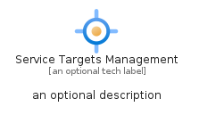
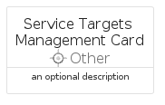

# ServiceTargetsManagement


```text
azure-11/Item/Other/ServiceTargetsManagement
```

```text
include('azure-11/Item/Other/ServiceTargetsManagement')
```


| Illustration | ServiceTargetsManagement | ServiceTargetsManagementCard | ServiceTargetsManagementGroup |
| :---: | :---: | :---: | :---: |
|  |  |  |  |


## Sprites
The item provides the following sriptes:

- `<$ServiceTargetsManagementXs>`
- `<$ServiceTargetsManagementSm>`
- `<$ServiceTargetsManagementMd>`
- `<$ServiceTargetsManagementLg>`


## ServiceTargetsManagement

### Load remotely
```plantuml
@startuml
' configures the library
!global $LIB_BASE_LOCATION="https://raw.githubusercontent.com/tmorin/plantuml-libs/master/distribution"

' loads the library's bootstrap
!include $LIB_BASE_LOCATION/bootstrap.puml

' loads the package bootstrap
include('azure-11/bootstrap')

' loads the Item which embeds the element ServiceTargetsManagement
include('azure-11/Item/Other/ServiceTargetsManagement')

' renders the element
ServiceTargetsManagement('ServiceTargetsManagement', 'Service Targets Management', 'an optional tech label', 'an optional description')
@enduml
```

### Load locally
```plantuml
@startuml
' configures the library
!global $INCLUSION_MODE="local"
!global $LIB_BASE_LOCATION="../../.."

' loads the library's bootstrap
!include $LIB_BASE_LOCATION/bootstrap.puml

' loads the package bootstrap
include('azure-11/bootstrap')

' loads the Item which embeds the element ServiceTargetsManagement
include('azure-11/Item/Other/ServiceTargetsManagement')

' renders the element
ServiceTargetsManagement('ServiceTargetsManagement', 'Service Targets Management', 'an optional tech label', 'an optional description')
@enduml
```

## ServiceTargetsManagementCard

### Load remotely
```plantuml
@startuml
' configures the library
!global $LIB_BASE_LOCATION="https://raw.githubusercontent.com/tmorin/plantuml-libs/master/distribution"

' loads the library's bootstrap
!include $LIB_BASE_LOCATION/bootstrap.puml

' loads the package bootstrap
include('azure-11/bootstrap')

' loads the Item which embeds the element ServiceTargetsManagementCard
include('azure-11/Item/Other/ServiceTargetsManagement')

' renders the element
ServiceTargetsManagementCard('ServiceTargetsManagementCard', 'Service Targets Management Card', 'an optional description')
@enduml
```

### Load locally
```plantuml
@startuml
' configures the library
!global $INCLUSION_MODE="local"
!global $LIB_BASE_LOCATION="../../.."

' loads the library's bootstrap
!include $LIB_BASE_LOCATION/bootstrap.puml

' loads the package bootstrap
include('azure-11/bootstrap')

' loads the Item which embeds the element ServiceTargetsManagementCard
include('azure-11/Item/Other/ServiceTargetsManagement')

' renders the element
ServiceTargetsManagementCard('ServiceTargetsManagementCard', 'Service Targets Management Card', 'an optional description')
@enduml
```

## ServiceTargetsManagementGroup

### Load remotely
```plantuml
@startuml
' configures the library
!global $LIB_BASE_LOCATION="https://raw.githubusercontent.com/tmorin/plantuml-libs/master/distribution"

' loads the library's bootstrap
!include $LIB_BASE_LOCATION/bootstrap.puml

' loads the package bootstrap
include('azure-11/bootstrap')

' loads the Item which embeds the element ServiceTargetsManagementGroup
include('azure-11/Item/Other/ServiceTargetsManagement')

' renders the element
ServiceTargetsManagementGroup('ServiceTargetsManagementGroup', 'Service Targets Management Group', 'an optional tech label') {
    note as note
        the content of the group
    end note
}
@enduml
```

### Load locally
```plantuml
@startuml
' configures the library
!global $INCLUSION_MODE="local"
!global $LIB_BASE_LOCATION="../../.."

' loads the library's bootstrap
!include $LIB_BASE_LOCATION/bootstrap.puml

' loads the package bootstrap
include('azure-11/bootstrap')

' loads the Item which embeds the element ServiceTargetsManagementGroup
include('azure-11/Item/Other/ServiceTargetsManagement')

' renders the element
ServiceTargetsManagementGroup('ServiceTargetsManagementGroup', 'Service Targets Management Group', 'an optional tech label') {
    note as note
        the content of the group
    end note
}
@enduml
```

