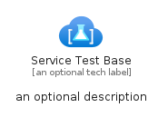

# ServiceTestBase


```text
azure-11/Item/Other/ServiceTestBase
```

```text
include('azure-11/Item/Other/ServiceTestBase')
```


| Illustration | ServiceTestBase | ServiceTestBaseCard | ServiceTestBaseGroup |
| :---: | :---: | :---: | :---: |
|  |  |  |  |


## Sprites
The item provides the following sriptes:

- `<$ServiceTestBaseXs>`
- `<$ServiceTestBaseSm>`
- `<$ServiceTestBaseMd>`
- `<$ServiceTestBaseLg>`


## ServiceTestBase

### Load remotely
```plantuml
@startuml
' configures the library
!global $LIB_BASE_LOCATION="https://raw.githubusercontent.com/tmorin/plantuml-libs/master/distribution"

' loads the library's bootstrap
!include $LIB_BASE_LOCATION/bootstrap.puml

' loads the package bootstrap
include('azure-11/bootstrap')

' loads the Item which embeds the element ServiceTestBase
include('azure-11/Item/Other/ServiceTestBase')

' renders the element
ServiceTestBase('ServiceTestBase', 'Service Test Base', 'an optional tech label', 'an optional description')
@enduml
```

### Load locally
```plantuml
@startuml
' configures the library
!global $INCLUSION_MODE="local"
!global $LIB_BASE_LOCATION="../../.."

' loads the library's bootstrap
!include $LIB_BASE_LOCATION/bootstrap.puml

' loads the package bootstrap
include('azure-11/bootstrap')

' loads the Item which embeds the element ServiceTestBase
include('azure-11/Item/Other/ServiceTestBase')

' renders the element
ServiceTestBase('ServiceTestBase', 'Service Test Base', 'an optional tech label', 'an optional description')
@enduml
```

## ServiceTestBaseCard

### Load remotely
```plantuml
@startuml
' configures the library
!global $LIB_BASE_LOCATION="https://raw.githubusercontent.com/tmorin/plantuml-libs/master/distribution"

' loads the library's bootstrap
!include $LIB_BASE_LOCATION/bootstrap.puml

' loads the package bootstrap
include('azure-11/bootstrap')

' loads the Item which embeds the element ServiceTestBaseCard
include('azure-11/Item/Other/ServiceTestBase')

' renders the element
ServiceTestBaseCard('ServiceTestBaseCard', 'Service Test Base Card', 'an optional description')
@enduml
```

### Load locally
```plantuml
@startuml
' configures the library
!global $INCLUSION_MODE="local"
!global $LIB_BASE_LOCATION="../../.."

' loads the library's bootstrap
!include $LIB_BASE_LOCATION/bootstrap.puml

' loads the package bootstrap
include('azure-11/bootstrap')

' loads the Item which embeds the element ServiceTestBaseCard
include('azure-11/Item/Other/ServiceTestBase')

' renders the element
ServiceTestBaseCard('ServiceTestBaseCard', 'Service Test Base Card', 'an optional description')
@enduml
```

## ServiceTestBaseGroup

### Load remotely
```plantuml
@startuml
' configures the library
!global $LIB_BASE_LOCATION="https://raw.githubusercontent.com/tmorin/plantuml-libs/master/distribution"

' loads the library's bootstrap
!include $LIB_BASE_LOCATION/bootstrap.puml

' loads the package bootstrap
include('azure-11/bootstrap')

' loads the Item which embeds the element ServiceTestBaseGroup
include('azure-11/Item/Other/ServiceTestBase')

' renders the element
ServiceTestBaseGroup('ServiceTestBaseGroup', 'Service Test Base Group', 'an optional tech label') {
    note as note
        the content of the group
    end note
}
@enduml
```

### Load locally
```plantuml
@startuml
' configures the library
!global $INCLUSION_MODE="local"
!global $LIB_BASE_LOCATION="../../.."

' loads the library's bootstrap
!include $LIB_BASE_LOCATION/bootstrap.puml

' loads the package bootstrap
include('azure-11/bootstrap')

' loads the Item which embeds the element ServiceTestBaseGroup
include('azure-11/Item/Other/ServiceTestBase')

' renders the element
ServiceTestBaseGroup('ServiceTestBaseGroup', 'Service Test Base Group', 'an optional tech label') {
    note as note
        the content of the group
    end note
}
@enduml
```

