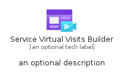

# ServiceVirtualVisitsBuilder


```text
azure-11/Item/Other/ServiceVirtualVisitsBuilder
```

```text
include('azure-11/Item/Other/ServiceVirtualVisitsBuilder')
```


| Illustration | ServiceVirtualVisitsBuilder | ServiceVirtualVisitsBuilderCard | ServiceVirtualVisitsBuilderGroup |
| :---: | :---: | :---: | :---: |
|  |  |  |  |


## ServiceVirtualVisitsBuilder

### Load remotely
```plantuml
@startuml
' configures the library
!global $LIB_BASE_LOCATION="https://raw.githubusercontent.com/tmorin/plantuml-libs/master/distribution"

' loads the library's bootstrap
!include $LIB_BASE_LOCATION/bootstrap.puml

' loads the package bootstrap
include('azure-11/bootstrap')

' loads the Item which embeds the element ServiceVirtualVisitsBuilder
include('azure-11/Item/Other/ServiceVirtualVisitsBuilder')

' renders the element
ServiceVirtualVisitsBuilder('ServiceVirtualVisitsBuilder', 'Service Virtual Visits Builder', 'an optional tech label', 'an optional description')
@enduml
```

### Load locally
```plantuml
@startuml
' configures the library
!global $INCLUSION_MODE="local"
!global $LIB_BASE_LOCATION="../../.."

' loads the library's bootstrap
!include $LIB_BASE_LOCATION/bootstrap.puml

' loads the package bootstrap
include('azure-11/bootstrap')

' loads the Item which embeds the element ServiceVirtualVisitsBuilder
include('azure-11/Item/Other/ServiceVirtualVisitsBuilder')

' renders the element
ServiceVirtualVisitsBuilder('ServiceVirtualVisitsBuilder', 'Service Virtual Visits Builder', 'an optional tech label', 'an optional description')
@enduml
```

## ServiceVirtualVisitsBuilderCard

### Load remotely
```plantuml
@startuml
' configures the library
!global $LIB_BASE_LOCATION="https://raw.githubusercontent.com/tmorin/plantuml-libs/master/distribution"

' loads the library's bootstrap
!include $LIB_BASE_LOCATION/bootstrap.puml

' loads the package bootstrap
include('azure-11/bootstrap')

' loads the Item which embeds the element ServiceVirtualVisitsBuilderCard
include('azure-11/Item/Other/ServiceVirtualVisitsBuilder')

' renders the element
ServiceVirtualVisitsBuilderCard('ServiceVirtualVisitsBuilderCard', 'Service Virtual Visits Builder Card', 'an optional description')
@enduml
```

### Load locally
```plantuml
@startuml
' configures the library
!global $INCLUSION_MODE="local"
!global $LIB_BASE_LOCATION="../../.."

' loads the library's bootstrap
!include $LIB_BASE_LOCATION/bootstrap.puml

' loads the package bootstrap
include('azure-11/bootstrap')

' loads the Item which embeds the element ServiceVirtualVisitsBuilderCard
include('azure-11/Item/Other/ServiceVirtualVisitsBuilder')

' renders the element
ServiceVirtualVisitsBuilderCard('ServiceVirtualVisitsBuilderCard', 'Service Virtual Visits Builder Card', 'an optional description')
@enduml
```

## ServiceVirtualVisitsBuilderGroup

### Load remotely
```plantuml
@startuml
' configures the library
!global $LIB_BASE_LOCATION="https://raw.githubusercontent.com/tmorin/plantuml-libs/master/distribution"

' loads the library's bootstrap
!include $LIB_BASE_LOCATION/bootstrap.puml

' loads the package bootstrap
include('azure-11/bootstrap')

' loads the Item which embeds the element ServiceVirtualVisitsBuilderGroup
include('azure-11/Item/Other/ServiceVirtualVisitsBuilder')

' renders the element
ServiceVirtualVisitsBuilderGroup('ServiceVirtualVisitsBuilderGroup', 'Service Virtual Visits Builder Group', 'an optional tech label') {
    note as note
        the content of the group
    end note
}
@enduml
```

### Load locally
```plantuml
@startuml
' configures the library
!global $INCLUSION_MODE="local"
!global $LIB_BASE_LOCATION="../../.."

' loads the library's bootstrap
!include $LIB_BASE_LOCATION/bootstrap.puml

' loads the package bootstrap
include('azure-11/bootstrap')

' loads the Item which embeds the element ServiceVirtualVisitsBuilderGroup
include('azure-11/Item/Other/ServiceVirtualVisitsBuilder')

' renders the element
ServiceVirtualVisitsBuilderGroup('ServiceVirtualVisitsBuilderGroup', 'Service Virtual Visits Builder Group', 'an optional tech label') {
    note as note
        the content of the group
    end note
}
@enduml
```

