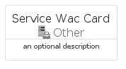

# ServiceWac


```text
azure-11/Item/Other/ServiceWac
```

```text
include('azure-11/Item/Other/ServiceWac')
```


| Illustration | ServiceWac | ServiceWacCard | ServiceWacGroup |
| :---: | :---: | :---: | :---: |
|  |  |  |  |


## Sprites
The item provides the following sriptes:

- `<$ServiceWacXs>`
- `<$ServiceWacSm>`
- `<$ServiceWacMd>`
- `<$ServiceWacLg>`


## ServiceWac

### Load remotely
```plantuml
@startuml
' configures the library
!global $LIB_BASE_LOCATION="https://raw.githubusercontent.com/tmorin/plantuml-libs/master/distribution"

' loads the library's bootstrap
!include $LIB_BASE_LOCATION/bootstrap.puml

' loads the package bootstrap
include('azure-11/bootstrap')

' loads the Item which embeds the element ServiceWac
include('azure-11/Item/Other/ServiceWac')

' renders the element
ServiceWac('ServiceWac', 'Service Wac', 'an optional tech label', 'an optional description')
@enduml
```

### Load locally
```plantuml
@startuml
' configures the library
!global $INCLUSION_MODE="local"
!global $LIB_BASE_LOCATION="../../.."

' loads the library's bootstrap
!include $LIB_BASE_LOCATION/bootstrap.puml

' loads the package bootstrap
include('azure-11/bootstrap')

' loads the Item which embeds the element ServiceWac
include('azure-11/Item/Other/ServiceWac')

' renders the element
ServiceWac('ServiceWac', 'Service Wac', 'an optional tech label', 'an optional description')
@enduml
```

## ServiceWacCard

### Load remotely
```plantuml
@startuml
' configures the library
!global $LIB_BASE_LOCATION="https://raw.githubusercontent.com/tmorin/plantuml-libs/master/distribution"

' loads the library's bootstrap
!include $LIB_BASE_LOCATION/bootstrap.puml

' loads the package bootstrap
include('azure-11/bootstrap')

' loads the Item which embeds the element ServiceWacCard
include('azure-11/Item/Other/ServiceWac')

' renders the element
ServiceWacCard('ServiceWacCard', 'Service Wac Card', 'an optional description')
@enduml
```

### Load locally
```plantuml
@startuml
' configures the library
!global $INCLUSION_MODE="local"
!global $LIB_BASE_LOCATION="../../.."

' loads the library's bootstrap
!include $LIB_BASE_LOCATION/bootstrap.puml

' loads the package bootstrap
include('azure-11/bootstrap')

' loads the Item which embeds the element ServiceWacCard
include('azure-11/Item/Other/ServiceWac')

' renders the element
ServiceWacCard('ServiceWacCard', 'Service Wac Card', 'an optional description')
@enduml
```

## ServiceWacGroup

### Load remotely
```plantuml
@startuml
' configures the library
!global $LIB_BASE_LOCATION="https://raw.githubusercontent.com/tmorin/plantuml-libs/master/distribution"

' loads the library's bootstrap
!include $LIB_BASE_LOCATION/bootstrap.puml

' loads the package bootstrap
include('azure-11/bootstrap')

' loads the Item which embeds the element ServiceWacGroup
include('azure-11/Item/Other/ServiceWac')

' renders the element
ServiceWacGroup('ServiceWacGroup', 'Service Wac Group', 'an optional tech label') {
    note as note
        the content of the group
    end note
}
@enduml
```

### Load locally
```plantuml
@startuml
' configures the library
!global $INCLUSION_MODE="local"
!global $LIB_BASE_LOCATION="../../.."

' loads the library's bootstrap
!include $LIB_BASE_LOCATION/bootstrap.puml

' loads the package bootstrap
include('azure-11/bootstrap')

' loads the Item which embeds the element ServiceWacGroup
include('azure-11/Item/Other/ServiceWac')

' renders the element
ServiceWacGroup('ServiceWacGroup', 'Service Wac Group', 'an optional tech label') {
    note as note
        the content of the group
    end note
}
@enduml
```

