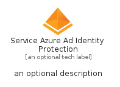
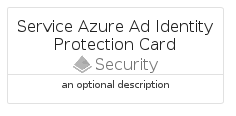
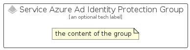

# ServiceAzureAdIdentityProtection


```text
azure-11/Item/Security/ServiceAzureAdIdentityProtection
```

```text
include('azure-11/Item/Security/ServiceAzureAdIdentityProtection')
```


| Illustration | ServiceAzureAdIdentityProtection | ServiceAzureAdIdentityProtectionCard | ServiceAzureAdIdentityProtectionGroup |
| :---: | :---: | :---: | :---: |
|  |  |  |  |


## ServiceAzureAdIdentityProtection

### Load remotely
```plantuml
@startuml
' configures the library
!global $LIB_BASE_LOCATION="https://raw.githubusercontent.com/tmorin/plantuml-libs/master/distribution"

' loads the library's bootstrap
!include $LIB_BASE_LOCATION/bootstrap.puml

' loads the package bootstrap
include('azure-11/bootstrap')

' loads the Item which embeds the element ServiceAzureAdIdentityProtection
include('azure-11/Item/Security/ServiceAzureAdIdentityProtection')

' renders the element
ServiceAzureAdIdentityProtection('ServiceAzureAdIdentityProtection', 'Service Azure Ad Identity Protection', 'an optional tech label', 'an optional description')
@enduml
```

### Load locally
```plantuml
@startuml
' configures the library
!global $INCLUSION_MODE="local"
!global $LIB_BASE_LOCATION="../../.."

' loads the library's bootstrap
!include $LIB_BASE_LOCATION/bootstrap.puml

' loads the package bootstrap
include('azure-11/bootstrap')

' loads the Item which embeds the element ServiceAzureAdIdentityProtection
include('azure-11/Item/Security/ServiceAzureAdIdentityProtection')

' renders the element
ServiceAzureAdIdentityProtection('ServiceAzureAdIdentityProtection', 'Service Azure Ad Identity Protection', 'an optional tech label', 'an optional description')
@enduml
```

## ServiceAzureAdIdentityProtectionCard

### Load remotely
```plantuml
@startuml
' configures the library
!global $LIB_BASE_LOCATION="https://raw.githubusercontent.com/tmorin/plantuml-libs/master/distribution"

' loads the library's bootstrap
!include $LIB_BASE_LOCATION/bootstrap.puml

' loads the package bootstrap
include('azure-11/bootstrap')

' loads the Item which embeds the element ServiceAzureAdIdentityProtectionCard
include('azure-11/Item/Security/ServiceAzureAdIdentityProtection')

' renders the element
ServiceAzureAdIdentityProtectionCard('ServiceAzureAdIdentityProtectionCard', 'Service Azure Ad Identity Protection Card', 'an optional description')
@enduml
```

### Load locally
```plantuml
@startuml
' configures the library
!global $INCLUSION_MODE="local"
!global $LIB_BASE_LOCATION="../../.."

' loads the library's bootstrap
!include $LIB_BASE_LOCATION/bootstrap.puml

' loads the package bootstrap
include('azure-11/bootstrap')

' loads the Item which embeds the element ServiceAzureAdIdentityProtectionCard
include('azure-11/Item/Security/ServiceAzureAdIdentityProtection')

' renders the element
ServiceAzureAdIdentityProtectionCard('ServiceAzureAdIdentityProtectionCard', 'Service Azure Ad Identity Protection Card', 'an optional description')
@enduml
```

## ServiceAzureAdIdentityProtectionGroup

### Load remotely
```plantuml
@startuml
' configures the library
!global $LIB_BASE_LOCATION="https://raw.githubusercontent.com/tmorin/plantuml-libs/master/distribution"

' loads the library's bootstrap
!include $LIB_BASE_LOCATION/bootstrap.puml

' loads the package bootstrap
include('azure-11/bootstrap')

' loads the Item which embeds the element ServiceAzureAdIdentityProtectionGroup
include('azure-11/Item/Security/ServiceAzureAdIdentityProtection')

' renders the element
ServiceAzureAdIdentityProtectionGroup('ServiceAzureAdIdentityProtectionGroup', 'Service Azure Ad Identity Protection Group', 'an optional tech label') {
    note as note
        the content of the group
    end note
}
@enduml
```

### Load locally
```plantuml
@startuml
' configures the library
!global $INCLUSION_MODE="local"
!global $LIB_BASE_LOCATION="../../.."

' loads the library's bootstrap
!include $LIB_BASE_LOCATION/bootstrap.puml

' loads the package bootstrap
include('azure-11/bootstrap')

' loads the Item which embeds the element ServiceAzureAdIdentityProtectionGroup
include('azure-11/Item/Security/ServiceAzureAdIdentityProtection')

' renders the element
ServiceAzureAdIdentityProtectionGroup('ServiceAzureAdIdentityProtectionGroup', 'Service Azure Ad Identity Protection Group', 'an optional tech label') {
    note as note
        the content of the group
    end note
}
@enduml
```

