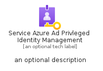
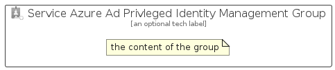

# ServiceAzureAdPrivlegedIdentityManagement


```text
azure-11/Item/Security/ServiceAzureAdPrivlegedIdentityManagement
```

```text
include('azure-11/Item/Security/ServiceAzureAdPrivlegedIdentityManagement')
```


| Illustration | ServiceAzureAdPrivlegedIdentityManagement | ServiceAzureAdPrivlegedIdentityManagementCard | ServiceAzureAdPrivlegedIdentityManagementGroup |
| :---: | :---: | :---: | :---: |
|  |  |  |  |


## Sprites
The item provides the following sriptes:

- `<$ServiceAzureAdPrivlegedIdentityManagementXs>`
- `<$ServiceAzureAdPrivlegedIdentityManagementSm>`
- `<$ServiceAzureAdPrivlegedIdentityManagementMd>`
- `<$ServiceAzureAdPrivlegedIdentityManagementLg>`


## ServiceAzureAdPrivlegedIdentityManagement

### Load remotely
```plantuml
@startuml
' configures the library
!global $LIB_BASE_LOCATION="https://raw.githubusercontent.com/tmorin/plantuml-libs/master/distribution"

' loads the library's bootstrap
!include $LIB_BASE_LOCATION/bootstrap.puml

' loads the package bootstrap
include('azure-11/bootstrap')

' loads the Item which embeds the element ServiceAzureAdPrivlegedIdentityManagement
include('azure-11/Item/Security/ServiceAzureAdPrivlegedIdentityManagement')

' renders the element
ServiceAzureAdPrivlegedIdentityManagement('ServiceAzureAdPrivlegedIdentityManagement', 'Service Azure Ad Privleged Identity Management', 'an optional tech label', 'an optional description')
@enduml
```

### Load locally
```plantuml
@startuml
' configures the library
!global $INCLUSION_MODE="local"
!global $LIB_BASE_LOCATION="../../.."

' loads the library's bootstrap
!include $LIB_BASE_LOCATION/bootstrap.puml

' loads the package bootstrap
include('azure-11/bootstrap')

' loads the Item which embeds the element ServiceAzureAdPrivlegedIdentityManagement
include('azure-11/Item/Security/ServiceAzureAdPrivlegedIdentityManagement')

' renders the element
ServiceAzureAdPrivlegedIdentityManagement('ServiceAzureAdPrivlegedIdentityManagement', 'Service Azure Ad Privleged Identity Management', 'an optional tech label', 'an optional description')
@enduml
```

## ServiceAzureAdPrivlegedIdentityManagementCard

### Load remotely
```plantuml
@startuml
' configures the library
!global $LIB_BASE_LOCATION="https://raw.githubusercontent.com/tmorin/plantuml-libs/master/distribution"

' loads the library's bootstrap
!include $LIB_BASE_LOCATION/bootstrap.puml

' loads the package bootstrap
include('azure-11/bootstrap')

' loads the Item which embeds the element ServiceAzureAdPrivlegedIdentityManagementCard
include('azure-11/Item/Security/ServiceAzureAdPrivlegedIdentityManagement')

' renders the element
ServiceAzureAdPrivlegedIdentityManagementCard('ServiceAzureAdPrivlegedIdentityManagementCard', 'Service Azure Ad Privleged Identity Management Card', 'an optional description')
@enduml
```

### Load locally
```plantuml
@startuml
' configures the library
!global $INCLUSION_MODE="local"
!global $LIB_BASE_LOCATION="../../.."

' loads the library's bootstrap
!include $LIB_BASE_LOCATION/bootstrap.puml

' loads the package bootstrap
include('azure-11/bootstrap')

' loads the Item which embeds the element ServiceAzureAdPrivlegedIdentityManagementCard
include('azure-11/Item/Security/ServiceAzureAdPrivlegedIdentityManagement')

' renders the element
ServiceAzureAdPrivlegedIdentityManagementCard('ServiceAzureAdPrivlegedIdentityManagementCard', 'Service Azure Ad Privleged Identity Management Card', 'an optional description')
@enduml
```

## ServiceAzureAdPrivlegedIdentityManagementGroup

### Load remotely
```plantuml
@startuml
' configures the library
!global $LIB_BASE_LOCATION="https://raw.githubusercontent.com/tmorin/plantuml-libs/master/distribution"

' loads the library's bootstrap
!include $LIB_BASE_LOCATION/bootstrap.puml

' loads the package bootstrap
include('azure-11/bootstrap')

' loads the Item which embeds the element ServiceAzureAdPrivlegedIdentityManagementGroup
include('azure-11/Item/Security/ServiceAzureAdPrivlegedIdentityManagement')

' renders the element
ServiceAzureAdPrivlegedIdentityManagementGroup('ServiceAzureAdPrivlegedIdentityManagementGroup', 'Service Azure Ad Privleged Identity Management Group', 'an optional tech label') {
    note as note
        the content of the group
    end note
}
@enduml
```

### Load locally
```plantuml
@startuml
' configures the library
!global $INCLUSION_MODE="local"
!global $LIB_BASE_LOCATION="../../.."

' loads the library's bootstrap
!include $LIB_BASE_LOCATION/bootstrap.puml

' loads the package bootstrap
include('azure-11/bootstrap')

' loads the Item which embeds the element ServiceAzureAdPrivlegedIdentityManagementGroup
include('azure-11/Item/Security/ServiceAzureAdPrivlegedIdentityManagement')

' renders the element
ServiceAzureAdPrivlegedIdentityManagementGroup('ServiceAzureAdPrivlegedIdentityManagementGroup', 'Service Azure Ad Privleged Identity Management Group', 'an optional tech label') {
    note as note
        the content of the group
    end note
}
@enduml
```

