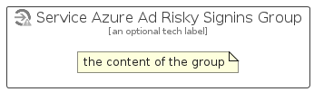

# ServiceAzureAdRiskySignins


```text
azure-11/Item/Security/ServiceAzureAdRiskySignins
```

```text
include('azure-11/Item/Security/ServiceAzureAdRiskySignins')
```


| Illustration | ServiceAzureAdRiskySignins | ServiceAzureAdRiskySigninsCard | ServiceAzureAdRiskySigninsGroup |
| :---: | :---: | :---: | :---: |
|  |  |  |  |


## Sprites
The item provides the following sriptes:

- `<$ServiceAzureAdRiskySigninsXs>`
- `<$ServiceAzureAdRiskySigninsSm>`
- `<$ServiceAzureAdRiskySigninsMd>`
- `<$ServiceAzureAdRiskySigninsLg>`


## ServiceAzureAdRiskySignins

### Load remotely
```plantuml
@startuml
' configures the library
!global $LIB_BASE_LOCATION="https://raw.githubusercontent.com/tmorin/plantuml-libs/master/distribution"

' loads the library's bootstrap
!include $LIB_BASE_LOCATION/bootstrap.puml

' loads the package bootstrap
include('azure-11/bootstrap')

' loads the Item which embeds the element ServiceAzureAdRiskySignins
include('azure-11/Item/Security/ServiceAzureAdRiskySignins')

' renders the element
ServiceAzureAdRiskySignins('ServiceAzureAdRiskySignins', 'Service Azure Ad Risky Signins', 'an optional tech label', 'an optional description')
@enduml
```

### Load locally
```plantuml
@startuml
' configures the library
!global $INCLUSION_MODE="local"
!global $LIB_BASE_LOCATION="../../.."

' loads the library's bootstrap
!include $LIB_BASE_LOCATION/bootstrap.puml

' loads the package bootstrap
include('azure-11/bootstrap')

' loads the Item which embeds the element ServiceAzureAdRiskySignins
include('azure-11/Item/Security/ServiceAzureAdRiskySignins')

' renders the element
ServiceAzureAdRiskySignins('ServiceAzureAdRiskySignins', 'Service Azure Ad Risky Signins', 'an optional tech label', 'an optional description')
@enduml
```

## ServiceAzureAdRiskySigninsCard

### Load remotely
```plantuml
@startuml
' configures the library
!global $LIB_BASE_LOCATION="https://raw.githubusercontent.com/tmorin/plantuml-libs/master/distribution"

' loads the library's bootstrap
!include $LIB_BASE_LOCATION/bootstrap.puml

' loads the package bootstrap
include('azure-11/bootstrap')

' loads the Item which embeds the element ServiceAzureAdRiskySigninsCard
include('azure-11/Item/Security/ServiceAzureAdRiskySignins')

' renders the element
ServiceAzureAdRiskySigninsCard('ServiceAzureAdRiskySigninsCard', 'Service Azure Ad Risky Signins Card', 'an optional description')
@enduml
```

### Load locally
```plantuml
@startuml
' configures the library
!global $INCLUSION_MODE="local"
!global $LIB_BASE_LOCATION="../../.."

' loads the library's bootstrap
!include $LIB_BASE_LOCATION/bootstrap.puml

' loads the package bootstrap
include('azure-11/bootstrap')

' loads the Item which embeds the element ServiceAzureAdRiskySigninsCard
include('azure-11/Item/Security/ServiceAzureAdRiskySignins')

' renders the element
ServiceAzureAdRiskySigninsCard('ServiceAzureAdRiskySigninsCard', 'Service Azure Ad Risky Signins Card', 'an optional description')
@enduml
```

## ServiceAzureAdRiskySigninsGroup

### Load remotely
```plantuml
@startuml
' configures the library
!global $LIB_BASE_LOCATION="https://raw.githubusercontent.com/tmorin/plantuml-libs/master/distribution"

' loads the library's bootstrap
!include $LIB_BASE_LOCATION/bootstrap.puml

' loads the package bootstrap
include('azure-11/bootstrap')

' loads the Item which embeds the element ServiceAzureAdRiskySigninsGroup
include('azure-11/Item/Security/ServiceAzureAdRiskySignins')

' renders the element
ServiceAzureAdRiskySigninsGroup('ServiceAzureAdRiskySigninsGroup', 'Service Azure Ad Risky Signins Group', 'an optional tech label') {
    note as note
        the content of the group
    end note
}
@enduml
```

### Load locally
```plantuml
@startuml
' configures the library
!global $INCLUSION_MODE="local"
!global $LIB_BASE_LOCATION="../../.."

' loads the library's bootstrap
!include $LIB_BASE_LOCATION/bootstrap.puml

' loads the package bootstrap
include('azure-11/bootstrap')

' loads the Item which embeds the element ServiceAzureAdRiskySigninsGroup
include('azure-11/Item/Security/ServiceAzureAdRiskySignins')

' renders the element
ServiceAzureAdRiskySigninsGroup('ServiceAzureAdRiskySigninsGroup', 'Service Azure Ad Risky Signins Group', 'an optional tech label') {
    note as note
        the content of the group
    end note
}
@enduml
```

