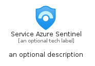
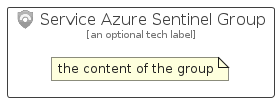

# ServiceAzureSentinel


```text
azure-11/Item/Security/ServiceAzureSentinel
```

```text
include('azure-11/Item/Security/ServiceAzureSentinel')
```


| Illustration | ServiceAzureSentinel | ServiceAzureSentinelCard | ServiceAzureSentinelGroup |
| :---: | :---: | :---: | :---: |
|  |  |  |  |


## ServiceAzureSentinel

### Load remotely
```plantuml
@startuml
' configures the library
!global $LIB_BASE_LOCATION="https://raw.githubusercontent.com/tmorin/plantuml-libs/master/distribution"

' loads the library's bootstrap
!include $LIB_BASE_LOCATION/bootstrap.puml

' loads the package bootstrap
include('azure-11/bootstrap')

' loads the Item which embeds the element ServiceAzureSentinel
include('azure-11/Item/Security/ServiceAzureSentinel')

' renders the element
ServiceAzureSentinel('ServiceAzureSentinel', 'Service Azure Sentinel', 'an optional tech label', 'an optional description')
@enduml
```

### Load locally
```plantuml
@startuml
' configures the library
!global $INCLUSION_MODE="local"
!global $LIB_BASE_LOCATION="../../.."

' loads the library's bootstrap
!include $LIB_BASE_LOCATION/bootstrap.puml

' loads the package bootstrap
include('azure-11/bootstrap')

' loads the Item which embeds the element ServiceAzureSentinel
include('azure-11/Item/Security/ServiceAzureSentinel')

' renders the element
ServiceAzureSentinel('ServiceAzureSentinel', 'Service Azure Sentinel', 'an optional tech label', 'an optional description')
@enduml
```

## ServiceAzureSentinelCard

### Load remotely
```plantuml
@startuml
' configures the library
!global $LIB_BASE_LOCATION="https://raw.githubusercontent.com/tmorin/plantuml-libs/master/distribution"

' loads the library's bootstrap
!include $LIB_BASE_LOCATION/bootstrap.puml

' loads the package bootstrap
include('azure-11/bootstrap')

' loads the Item which embeds the element ServiceAzureSentinelCard
include('azure-11/Item/Security/ServiceAzureSentinel')

' renders the element
ServiceAzureSentinelCard('ServiceAzureSentinelCard', 'Service Azure Sentinel Card', 'an optional description')
@enduml
```

### Load locally
```plantuml
@startuml
' configures the library
!global $INCLUSION_MODE="local"
!global $LIB_BASE_LOCATION="../../.."

' loads the library's bootstrap
!include $LIB_BASE_LOCATION/bootstrap.puml

' loads the package bootstrap
include('azure-11/bootstrap')

' loads the Item which embeds the element ServiceAzureSentinelCard
include('azure-11/Item/Security/ServiceAzureSentinel')

' renders the element
ServiceAzureSentinelCard('ServiceAzureSentinelCard', 'Service Azure Sentinel Card', 'an optional description')
@enduml
```

## ServiceAzureSentinelGroup

### Load remotely
```plantuml
@startuml
' configures the library
!global $LIB_BASE_LOCATION="https://raw.githubusercontent.com/tmorin/plantuml-libs/master/distribution"

' loads the library's bootstrap
!include $LIB_BASE_LOCATION/bootstrap.puml

' loads the package bootstrap
include('azure-11/bootstrap')

' loads the Item which embeds the element ServiceAzureSentinelGroup
include('azure-11/Item/Security/ServiceAzureSentinel')

' renders the element
ServiceAzureSentinelGroup('ServiceAzureSentinelGroup', 'Service Azure Sentinel Group', 'an optional tech label') {
    note as note
        the content of the group
    end note
}
@enduml
```

### Load locally
```plantuml
@startuml
' configures the library
!global $INCLUSION_MODE="local"
!global $LIB_BASE_LOCATION="../../.."

' loads the library's bootstrap
!include $LIB_BASE_LOCATION/bootstrap.puml

' loads the package bootstrap
include('azure-11/bootstrap')

' loads the Item which embeds the element ServiceAzureSentinelGroup
include('azure-11/Item/Security/ServiceAzureSentinel')

' renders the element
ServiceAzureSentinelGroup('ServiceAzureSentinelGroup', 'Service Azure Sentinel Group', 'an optional tech label') {
    note as note
        the content of the group
    end note
}
@enduml
```

