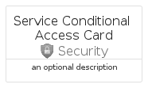

# ServiceConditionalAccess


```text
azure-11/Item/Security/ServiceConditionalAccess
```

```text
include('azure-11/Item/Security/ServiceConditionalAccess')
```


| Illustration | ServiceConditionalAccess | ServiceConditionalAccessCard | ServiceConditionalAccessGroup |
| :---: | :---: | :---: | :---: |
|  |  |  |  |


## ServiceConditionalAccess

### Load remotely
```plantuml
@startuml
' configures the library
!global $LIB_BASE_LOCATION="https://raw.githubusercontent.com/tmorin/plantuml-libs/master/distribution"

' loads the library's bootstrap
!include $LIB_BASE_LOCATION/bootstrap.puml

' loads the package bootstrap
include('azure-11/bootstrap')

' loads the Item which embeds the element ServiceConditionalAccess
include('azure-11/Item/Security/ServiceConditionalAccess')

' renders the element
ServiceConditionalAccess('ServiceConditionalAccess', 'Service Conditional Access', 'an optional tech label', 'an optional description')
@enduml
```

### Load locally
```plantuml
@startuml
' configures the library
!global $INCLUSION_MODE="local"
!global $LIB_BASE_LOCATION="../../.."

' loads the library's bootstrap
!include $LIB_BASE_LOCATION/bootstrap.puml

' loads the package bootstrap
include('azure-11/bootstrap')

' loads the Item which embeds the element ServiceConditionalAccess
include('azure-11/Item/Security/ServiceConditionalAccess')

' renders the element
ServiceConditionalAccess('ServiceConditionalAccess', 'Service Conditional Access', 'an optional tech label', 'an optional description')
@enduml
```

## ServiceConditionalAccessCard

### Load remotely
```plantuml
@startuml
' configures the library
!global $LIB_BASE_LOCATION="https://raw.githubusercontent.com/tmorin/plantuml-libs/master/distribution"

' loads the library's bootstrap
!include $LIB_BASE_LOCATION/bootstrap.puml

' loads the package bootstrap
include('azure-11/bootstrap')

' loads the Item which embeds the element ServiceConditionalAccessCard
include('azure-11/Item/Security/ServiceConditionalAccess')

' renders the element
ServiceConditionalAccessCard('ServiceConditionalAccessCard', 'Service Conditional Access Card', 'an optional description')
@enduml
```

### Load locally
```plantuml
@startuml
' configures the library
!global $INCLUSION_MODE="local"
!global $LIB_BASE_LOCATION="../../.."

' loads the library's bootstrap
!include $LIB_BASE_LOCATION/bootstrap.puml

' loads the package bootstrap
include('azure-11/bootstrap')

' loads the Item which embeds the element ServiceConditionalAccessCard
include('azure-11/Item/Security/ServiceConditionalAccess')

' renders the element
ServiceConditionalAccessCard('ServiceConditionalAccessCard', 'Service Conditional Access Card', 'an optional description')
@enduml
```

## ServiceConditionalAccessGroup

### Load remotely
```plantuml
@startuml
' configures the library
!global $LIB_BASE_LOCATION="https://raw.githubusercontent.com/tmorin/plantuml-libs/master/distribution"

' loads the library's bootstrap
!include $LIB_BASE_LOCATION/bootstrap.puml

' loads the package bootstrap
include('azure-11/bootstrap')

' loads the Item which embeds the element ServiceConditionalAccessGroup
include('azure-11/Item/Security/ServiceConditionalAccess')

' renders the element
ServiceConditionalAccessGroup('ServiceConditionalAccessGroup', 'Service Conditional Access Group', 'an optional tech label') {
    note as note
        the content of the group
    end note
}
@enduml
```

### Load locally
```plantuml
@startuml
' configures the library
!global $INCLUSION_MODE="local"
!global $LIB_BASE_LOCATION="../../.."

' loads the library's bootstrap
!include $LIB_BASE_LOCATION/bootstrap.puml

' loads the package bootstrap
include('azure-11/bootstrap')

' loads the Item which embeds the element ServiceConditionalAccessGroup
include('azure-11/Item/Security/ServiceConditionalAccess')

' renders the element
ServiceConditionalAccessGroup('ServiceConditionalAccessGroup', 'Service Conditional Access Group', 'an optional tech label') {
    note as note
        the content of the group
    end note
}
@enduml
```

