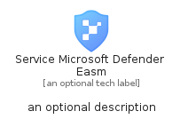

# ServiceMicrosoftDefenderEasm


```text
azure-11/Item/Security/ServiceMicrosoftDefenderEasm
```

```text
include('azure-11/Item/Security/ServiceMicrosoftDefenderEasm')
```


| Illustration | ServiceMicrosoftDefenderEasm | ServiceMicrosoftDefenderEasmCard | ServiceMicrosoftDefenderEasmGroup |
| :---: | :---: | :---: | :---: |
|  |  |  |  |


## Sprites
The item provides the following sriptes:

- `<$ServiceMicrosoftDefenderEasmXs>`
- `<$ServiceMicrosoftDefenderEasmSm>`
- `<$ServiceMicrosoftDefenderEasmMd>`
- `<$ServiceMicrosoftDefenderEasmLg>`


## ServiceMicrosoftDefenderEasm

### Load remotely
```plantuml
@startuml
' configures the library
!global $LIB_BASE_LOCATION="https://raw.githubusercontent.com/tmorin/plantuml-libs/master/distribution"

' loads the library's bootstrap
!include $LIB_BASE_LOCATION/bootstrap.puml

' loads the package bootstrap
include('azure-11/bootstrap')

' loads the Item which embeds the element ServiceMicrosoftDefenderEasm
include('azure-11/Item/Security/ServiceMicrosoftDefenderEasm')

' renders the element
ServiceMicrosoftDefenderEasm('ServiceMicrosoftDefenderEasm', 'Service Microsoft Defender Easm', 'an optional tech label', 'an optional description')
@enduml
```

### Load locally
```plantuml
@startuml
' configures the library
!global $INCLUSION_MODE="local"
!global $LIB_BASE_LOCATION="../../.."

' loads the library's bootstrap
!include $LIB_BASE_LOCATION/bootstrap.puml

' loads the package bootstrap
include('azure-11/bootstrap')

' loads the Item which embeds the element ServiceMicrosoftDefenderEasm
include('azure-11/Item/Security/ServiceMicrosoftDefenderEasm')

' renders the element
ServiceMicrosoftDefenderEasm('ServiceMicrosoftDefenderEasm', 'Service Microsoft Defender Easm', 'an optional tech label', 'an optional description')
@enduml
```

## ServiceMicrosoftDefenderEasmCard

### Load remotely
```plantuml
@startuml
' configures the library
!global $LIB_BASE_LOCATION="https://raw.githubusercontent.com/tmorin/plantuml-libs/master/distribution"

' loads the library's bootstrap
!include $LIB_BASE_LOCATION/bootstrap.puml

' loads the package bootstrap
include('azure-11/bootstrap')

' loads the Item which embeds the element ServiceMicrosoftDefenderEasmCard
include('azure-11/Item/Security/ServiceMicrosoftDefenderEasm')

' renders the element
ServiceMicrosoftDefenderEasmCard('ServiceMicrosoftDefenderEasmCard', 'Service Microsoft Defender Easm Card', 'an optional description')
@enduml
```

### Load locally
```plantuml
@startuml
' configures the library
!global $INCLUSION_MODE="local"
!global $LIB_BASE_LOCATION="../../.."

' loads the library's bootstrap
!include $LIB_BASE_LOCATION/bootstrap.puml

' loads the package bootstrap
include('azure-11/bootstrap')

' loads the Item which embeds the element ServiceMicrosoftDefenderEasmCard
include('azure-11/Item/Security/ServiceMicrosoftDefenderEasm')

' renders the element
ServiceMicrosoftDefenderEasmCard('ServiceMicrosoftDefenderEasmCard', 'Service Microsoft Defender Easm Card', 'an optional description')
@enduml
```

## ServiceMicrosoftDefenderEasmGroup

### Load remotely
```plantuml
@startuml
' configures the library
!global $LIB_BASE_LOCATION="https://raw.githubusercontent.com/tmorin/plantuml-libs/master/distribution"

' loads the library's bootstrap
!include $LIB_BASE_LOCATION/bootstrap.puml

' loads the package bootstrap
include('azure-11/bootstrap')

' loads the Item which embeds the element ServiceMicrosoftDefenderEasmGroup
include('azure-11/Item/Security/ServiceMicrosoftDefenderEasm')

' renders the element
ServiceMicrosoftDefenderEasmGroup('ServiceMicrosoftDefenderEasmGroup', 'Service Microsoft Defender Easm Group', 'an optional tech label') {
    note as note
        the content of the group
    end note
}
@enduml
```

### Load locally
```plantuml
@startuml
' configures the library
!global $INCLUSION_MODE="local"
!global $LIB_BASE_LOCATION="../../.."

' loads the library's bootstrap
!include $LIB_BASE_LOCATION/bootstrap.puml

' loads the package bootstrap
include('azure-11/bootstrap')

' loads the Item which embeds the element ServiceMicrosoftDefenderEasmGroup
include('azure-11/Item/Security/ServiceMicrosoftDefenderEasm')

' renders the element
ServiceMicrosoftDefenderEasmGroup('ServiceMicrosoftDefenderEasmGroup', 'Service Microsoft Defender Easm Group', 'an optional tech label') {
    note as note
        the content of the group
    end note
}
@enduml
```

