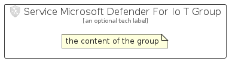

# ServiceMicrosoftDefenderForIoT


```text
azure-11/Item/Security/ServiceMicrosoftDefenderForIoT
```

```text
include('azure-11/Item/Security/ServiceMicrosoftDefenderForIoT')
```


| Illustration | ServiceMicrosoftDefenderForIoT | ServiceMicrosoftDefenderForIoTCard | ServiceMicrosoftDefenderForIoTGroup |
| :---: | :---: | :---: | :---: |
|  |  |  |  |


## ServiceMicrosoftDefenderForIoT

### Load remotely
```plantuml
@startuml
' configures the library
!global $LIB_BASE_LOCATION="https://raw.githubusercontent.com/tmorin/plantuml-libs/master/distribution"

' loads the library's bootstrap
!include $LIB_BASE_LOCATION/bootstrap.puml

' loads the package bootstrap
include('azure-11/bootstrap')

' loads the Item which embeds the element ServiceMicrosoftDefenderForIoT
include('azure-11/Item/Security/ServiceMicrosoftDefenderForIoT')

' renders the element
ServiceMicrosoftDefenderForIoT('ServiceMicrosoftDefenderForIoT', 'Service Microsoft Defender For Io T', 'an optional tech label', 'an optional description')
@enduml
```

### Load locally
```plantuml
@startuml
' configures the library
!global $INCLUSION_MODE="local"
!global $LIB_BASE_LOCATION="../../.."

' loads the library's bootstrap
!include $LIB_BASE_LOCATION/bootstrap.puml

' loads the package bootstrap
include('azure-11/bootstrap')

' loads the Item which embeds the element ServiceMicrosoftDefenderForIoT
include('azure-11/Item/Security/ServiceMicrosoftDefenderForIoT')

' renders the element
ServiceMicrosoftDefenderForIoT('ServiceMicrosoftDefenderForIoT', 'Service Microsoft Defender For Io T', 'an optional tech label', 'an optional description')
@enduml
```

## ServiceMicrosoftDefenderForIoTCard

### Load remotely
```plantuml
@startuml
' configures the library
!global $LIB_BASE_LOCATION="https://raw.githubusercontent.com/tmorin/plantuml-libs/master/distribution"

' loads the library's bootstrap
!include $LIB_BASE_LOCATION/bootstrap.puml

' loads the package bootstrap
include('azure-11/bootstrap')

' loads the Item which embeds the element ServiceMicrosoftDefenderForIoTCard
include('azure-11/Item/Security/ServiceMicrosoftDefenderForIoT')

' renders the element
ServiceMicrosoftDefenderForIoTCard('ServiceMicrosoftDefenderForIoTCard', 'Service Microsoft Defender For Io T Card', 'an optional description')
@enduml
```

### Load locally
```plantuml
@startuml
' configures the library
!global $INCLUSION_MODE="local"
!global $LIB_BASE_LOCATION="../../.."

' loads the library's bootstrap
!include $LIB_BASE_LOCATION/bootstrap.puml

' loads the package bootstrap
include('azure-11/bootstrap')

' loads the Item which embeds the element ServiceMicrosoftDefenderForIoTCard
include('azure-11/Item/Security/ServiceMicrosoftDefenderForIoT')

' renders the element
ServiceMicrosoftDefenderForIoTCard('ServiceMicrosoftDefenderForIoTCard', 'Service Microsoft Defender For Io T Card', 'an optional description')
@enduml
```

## ServiceMicrosoftDefenderForIoTGroup

### Load remotely
```plantuml
@startuml
' configures the library
!global $LIB_BASE_LOCATION="https://raw.githubusercontent.com/tmorin/plantuml-libs/master/distribution"

' loads the library's bootstrap
!include $LIB_BASE_LOCATION/bootstrap.puml

' loads the package bootstrap
include('azure-11/bootstrap')

' loads the Item which embeds the element ServiceMicrosoftDefenderForIoTGroup
include('azure-11/Item/Security/ServiceMicrosoftDefenderForIoT')

' renders the element
ServiceMicrosoftDefenderForIoTGroup('ServiceMicrosoftDefenderForIoTGroup', 'Service Microsoft Defender For Io T Group', 'an optional tech label') {
    note as note
        the content of the group
    end note
}
@enduml
```

### Load locally
```plantuml
@startuml
' configures the library
!global $INCLUSION_MODE="local"
!global $LIB_BASE_LOCATION="../../.."

' loads the library's bootstrap
!include $LIB_BASE_LOCATION/bootstrap.puml

' loads the package bootstrap
include('azure-11/bootstrap')

' loads the Item which embeds the element ServiceMicrosoftDefenderForIoTGroup
include('azure-11/Item/Security/ServiceMicrosoftDefenderForIoT')

' renders the element
ServiceMicrosoftDefenderForIoTGroup('ServiceMicrosoftDefenderForIoTGroup', 'Service Microsoft Defender For Io T Group', 'an optional tech label') {
    note as note
        the content of the group
    end note
}
@enduml
```

