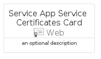
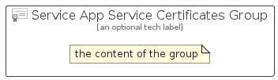

# ServiceAppServiceCertificates


```text
azure-11/Item/Web/ServiceAppServiceCertificates
```

```text
include('azure-11/Item/Web/ServiceAppServiceCertificates')
```


| Illustration | ServiceAppServiceCertificates | ServiceAppServiceCertificatesCard | ServiceAppServiceCertificatesGroup |
| :---: | :---: | :---: | :---: |
|  |  |  |  |


## ServiceAppServiceCertificates

### Load remotely
```plantuml
@startuml
' configures the library
!global $LIB_BASE_LOCATION="https://raw.githubusercontent.com/tmorin/plantuml-libs/master/distribution"

' loads the library's bootstrap
!include $LIB_BASE_LOCATION/bootstrap.puml

' loads the package bootstrap
include('azure-11/bootstrap')

' loads the Item which embeds the element ServiceAppServiceCertificates
include('azure-11/Item/Web/ServiceAppServiceCertificates')

' renders the element
ServiceAppServiceCertificates('ServiceAppServiceCertificates', 'Service App Service Certificates', 'an optional tech label', 'an optional description')
@enduml
```

### Load locally
```plantuml
@startuml
' configures the library
!global $INCLUSION_MODE="local"
!global $LIB_BASE_LOCATION="../../.."

' loads the library's bootstrap
!include $LIB_BASE_LOCATION/bootstrap.puml

' loads the package bootstrap
include('azure-11/bootstrap')

' loads the Item which embeds the element ServiceAppServiceCertificates
include('azure-11/Item/Web/ServiceAppServiceCertificates')

' renders the element
ServiceAppServiceCertificates('ServiceAppServiceCertificates', 'Service App Service Certificates', 'an optional tech label', 'an optional description')
@enduml
```

## ServiceAppServiceCertificatesCard

### Load remotely
```plantuml
@startuml
' configures the library
!global $LIB_BASE_LOCATION="https://raw.githubusercontent.com/tmorin/plantuml-libs/master/distribution"

' loads the library's bootstrap
!include $LIB_BASE_LOCATION/bootstrap.puml

' loads the package bootstrap
include('azure-11/bootstrap')

' loads the Item which embeds the element ServiceAppServiceCertificatesCard
include('azure-11/Item/Web/ServiceAppServiceCertificates')

' renders the element
ServiceAppServiceCertificatesCard('ServiceAppServiceCertificatesCard', 'Service App Service Certificates Card', 'an optional description')
@enduml
```

### Load locally
```plantuml
@startuml
' configures the library
!global $INCLUSION_MODE="local"
!global $LIB_BASE_LOCATION="../../.."

' loads the library's bootstrap
!include $LIB_BASE_LOCATION/bootstrap.puml

' loads the package bootstrap
include('azure-11/bootstrap')

' loads the Item which embeds the element ServiceAppServiceCertificatesCard
include('azure-11/Item/Web/ServiceAppServiceCertificates')

' renders the element
ServiceAppServiceCertificatesCard('ServiceAppServiceCertificatesCard', 'Service App Service Certificates Card', 'an optional description')
@enduml
```

## ServiceAppServiceCertificatesGroup

### Load remotely
```plantuml
@startuml
' configures the library
!global $LIB_BASE_LOCATION="https://raw.githubusercontent.com/tmorin/plantuml-libs/master/distribution"

' loads the library's bootstrap
!include $LIB_BASE_LOCATION/bootstrap.puml

' loads the package bootstrap
include('azure-11/bootstrap')

' loads the Item which embeds the element ServiceAppServiceCertificatesGroup
include('azure-11/Item/Web/ServiceAppServiceCertificates')

' renders the element
ServiceAppServiceCertificatesGroup('ServiceAppServiceCertificatesGroup', 'Service App Service Certificates Group', 'an optional tech label') {
    note as note
        the content of the group
    end note
}
@enduml
```

### Load locally
```plantuml
@startuml
' configures the library
!global $INCLUSION_MODE="local"
!global $LIB_BASE_LOCATION="../../.."

' loads the library's bootstrap
!include $LIB_BASE_LOCATION/bootstrap.puml

' loads the package bootstrap
include('azure-11/bootstrap')

' loads the Item which embeds the element ServiceAppServiceCertificatesGroup
include('azure-11/Item/Web/ServiceAppServiceCertificates')

' renders the element
ServiceAppServiceCertificatesGroup('ServiceAppServiceCertificatesGroup', 'Service App Service Certificates Group', 'an optional tech label') {
    note as note
        the content of the group
    end note
}
@enduml
```

