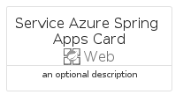
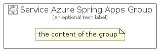

# ServiceAzureSpringApps


```text
azure-11/Item/Web/ServiceAzureSpringApps
```

```text
include('azure-11/Item/Web/ServiceAzureSpringApps')
```


| Illustration | ServiceAzureSpringApps | ServiceAzureSpringAppsCard | ServiceAzureSpringAppsGroup |
| :---: | :---: | :---: | :---: |
|  |  |  |  |


## ServiceAzureSpringApps

### Load remotely
```plantuml
@startuml
' configures the library
!global $LIB_BASE_LOCATION="https://raw.githubusercontent.com/tmorin/plantuml-libs/master/distribution"

' loads the library's bootstrap
!include $LIB_BASE_LOCATION/bootstrap.puml

' loads the package bootstrap
include('azure-11/bootstrap')

' loads the Item which embeds the element ServiceAzureSpringApps
include('azure-11/Item/Web/ServiceAzureSpringApps')

' renders the element
ServiceAzureSpringApps('ServiceAzureSpringApps', 'Service Azure Spring Apps', 'an optional tech label', 'an optional description')
@enduml
```

### Load locally
```plantuml
@startuml
' configures the library
!global $INCLUSION_MODE="local"
!global $LIB_BASE_LOCATION="../../.."

' loads the library's bootstrap
!include $LIB_BASE_LOCATION/bootstrap.puml

' loads the package bootstrap
include('azure-11/bootstrap')

' loads the Item which embeds the element ServiceAzureSpringApps
include('azure-11/Item/Web/ServiceAzureSpringApps')

' renders the element
ServiceAzureSpringApps('ServiceAzureSpringApps', 'Service Azure Spring Apps', 'an optional tech label', 'an optional description')
@enduml
```

## ServiceAzureSpringAppsCard

### Load remotely
```plantuml
@startuml
' configures the library
!global $LIB_BASE_LOCATION="https://raw.githubusercontent.com/tmorin/plantuml-libs/master/distribution"

' loads the library's bootstrap
!include $LIB_BASE_LOCATION/bootstrap.puml

' loads the package bootstrap
include('azure-11/bootstrap')

' loads the Item which embeds the element ServiceAzureSpringAppsCard
include('azure-11/Item/Web/ServiceAzureSpringApps')

' renders the element
ServiceAzureSpringAppsCard('ServiceAzureSpringAppsCard', 'Service Azure Spring Apps Card', 'an optional description')
@enduml
```

### Load locally
```plantuml
@startuml
' configures the library
!global $INCLUSION_MODE="local"
!global $LIB_BASE_LOCATION="../../.."

' loads the library's bootstrap
!include $LIB_BASE_LOCATION/bootstrap.puml

' loads the package bootstrap
include('azure-11/bootstrap')

' loads the Item which embeds the element ServiceAzureSpringAppsCard
include('azure-11/Item/Web/ServiceAzureSpringApps')

' renders the element
ServiceAzureSpringAppsCard('ServiceAzureSpringAppsCard', 'Service Azure Spring Apps Card', 'an optional description')
@enduml
```

## ServiceAzureSpringAppsGroup

### Load remotely
```plantuml
@startuml
' configures the library
!global $LIB_BASE_LOCATION="https://raw.githubusercontent.com/tmorin/plantuml-libs/master/distribution"

' loads the library's bootstrap
!include $LIB_BASE_LOCATION/bootstrap.puml

' loads the package bootstrap
include('azure-11/bootstrap')

' loads the Item which embeds the element ServiceAzureSpringAppsGroup
include('azure-11/Item/Web/ServiceAzureSpringApps')

' renders the element
ServiceAzureSpringAppsGroup('ServiceAzureSpringAppsGroup', 'Service Azure Spring Apps Group', 'an optional tech label') {
    note as note
        the content of the group
    end note
}
@enduml
```

### Load locally
```plantuml
@startuml
' configures the library
!global $INCLUSION_MODE="local"
!global $LIB_BASE_LOCATION="../../.."

' loads the library's bootstrap
!include $LIB_BASE_LOCATION/bootstrap.puml

' loads the package bootstrap
include('azure-11/bootstrap')

' loads the Item which embeds the element ServiceAzureSpringAppsGroup
include('azure-11/Item/Web/ServiceAzureSpringApps')

' renders the element
ServiceAzureSpringAppsGroup('ServiceAzureSpringAppsGroup', 'Service Azure Spring Apps Group', 'an optional tech label') {
    note as note
        the content of the group
    end note
}
@enduml
```

