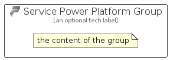

# ServicePowerPlatform


```text
azure-11/Item/Web/ServicePowerPlatform
```

```text
include('azure-11/Item/Web/ServicePowerPlatform')
```


| Illustration | ServicePowerPlatform | ServicePowerPlatformCard | ServicePowerPlatformGroup |
| :---: | :---: | :---: | :---: |
|  |  |  |  |


## Sprites
The item provides the following sriptes:

- `<$ServicePowerPlatformXs>`
- `<$ServicePowerPlatformSm>`
- `<$ServicePowerPlatformMd>`
- `<$ServicePowerPlatformLg>`


## ServicePowerPlatform

### Load remotely
```plantuml
@startuml
' configures the library
!global $LIB_BASE_LOCATION="https://raw.githubusercontent.com/tmorin/plantuml-libs/master/distribution"

' loads the library's bootstrap
!include $LIB_BASE_LOCATION/bootstrap.puml

' loads the package bootstrap
include('azure-11/bootstrap')

' loads the Item which embeds the element ServicePowerPlatform
include('azure-11/Item/Web/ServicePowerPlatform')

' renders the element
ServicePowerPlatform('ServicePowerPlatform', 'Service Power Platform', 'an optional tech label', 'an optional description')
@enduml
```

### Load locally
```plantuml
@startuml
' configures the library
!global $INCLUSION_MODE="local"
!global $LIB_BASE_LOCATION="../../.."

' loads the library's bootstrap
!include $LIB_BASE_LOCATION/bootstrap.puml

' loads the package bootstrap
include('azure-11/bootstrap')

' loads the Item which embeds the element ServicePowerPlatform
include('azure-11/Item/Web/ServicePowerPlatform')

' renders the element
ServicePowerPlatform('ServicePowerPlatform', 'Service Power Platform', 'an optional tech label', 'an optional description')
@enduml
```

## ServicePowerPlatformCard

### Load remotely
```plantuml
@startuml
' configures the library
!global $LIB_BASE_LOCATION="https://raw.githubusercontent.com/tmorin/plantuml-libs/master/distribution"

' loads the library's bootstrap
!include $LIB_BASE_LOCATION/bootstrap.puml

' loads the package bootstrap
include('azure-11/bootstrap')

' loads the Item which embeds the element ServicePowerPlatformCard
include('azure-11/Item/Web/ServicePowerPlatform')

' renders the element
ServicePowerPlatformCard('ServicePowerPlatformCard', 'Service Power Platform Card', 'an optional description')
@enduml
```

### Load locally
```plantuml
@startuml
' configures the library
!global $INCLUSION_MODE="local"
!global $LIB_BASE_LOCATION="../../.."

' loads the library's bootstrap
!include $LIB_BASE_LOCATION/bootstrap.puml

' loads the package bootstrap
include('azure-11/bootstrap')

' loads the Item which embeds the element ServicePowerPlatformCard
include('azure-11/Item/Web/ServicePowerPlatform')

' renders the element
ServicePowerPlatformCard('ServicePowerPlatformCard', 'Service Power Platform Card', 'an optional description')
@enduml
```

## ServicePowerPlatformGroup

### Load remotely
```plantuml
@startuml
' configures the library
!global $LIB_BASE_LOCATION="https://raw.githubusercontent.com/tmorin/plantuml-libs/master/distribution"

' loads the library's bootstrap
!include $LIB_BASE_LOCATION/bootstrap.puml

' loads the package bootstrap
include('azure-11/bootstrap')

' loads the Item which embeds the element ServicePowerPlatformGroup
include('azure-11/Item/Web/ServicePowerPlatform')

' renders the element
ServicePowerPlatformGroup('ServicePowerPlatformGroup', 'Service Power Platform Group', 'an optional tech label') {
    note as note
        the content of the group
    end note
}
@enduml
```

### Load locally
```plantuml
@startuml
' configures the library
!global $INCLUSION_MODE="local"
!global $LIB_BASE_LOCATION="../../.."

' loads the library's bootstrap
!include $LIB_BASE_LOCATION/bootstrap.puml

' loads the package bootstrap
include('azure-11/bootstrap')

' loads the Item which embeds the element ServicePowerPlatformGroup
include('azure-11/Item/Web/ServicePowerPlatform')

' renders the element
ServicePowerPlatformGroup('ServicePowerPlatformGroup', 'Service Power Platform Group', 'an optional tech label') {
    note as note
        the content of the group
    end note
}
@enduml
```

