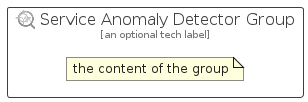

# ServiceAnomalyDetector


```text
azure-17/Item/AiMachineLearning/ServiceAnomalyDetector
```

```text
include('azure-17/Item/AiMachineLearning/ServiceAnomalyDetector')
```


| Illustration | ServiceAnomalyDetector | ServiceAnomalyDetectorCard | ServiceAnomalyDetectorGroup |
| :---: | :---: | :---: | :---: |
|  |  |  |  |


## Sprites
The item provides the following sriptes:

- `<$ServiceAnomalyDetectorXs>`
- `<$ServiceAnomalyDetectorSm>`
- `<$ServiceAnomalyDetectorMd>`
- `<$ServiceAnomalyDetectorLg>`


## ServiceAnomalyDetector

### Load remotely
```plantuml
@startuml
' configures the library
!global $LIB_BASE_LOCATION="https://raw.githubusercontent.com/tmorin/plantuml-libs/master/distribution"

' loads the library's bootstrap
!include $LIB_BASE_LOCATION/bootstrap.puml

' loads the package bootstrap
include('azure-17/bootstrap')

' loads the Item which embeds the element ServiceAnomalyDetector
include('azure-17/Item/AiMachineLearning/ServiceAnomalyDetector')

' renders the element
ServiceAnomalyDetector('ServiceAnomalyDetector', 'Service Anomaly Detector', 'an optional tech label', 'an optional description')
@enduml
```

### Load locally
```plantuml
@startuml
' configures the library
!global $INCLUSION_MODE="local"
!global $LIB_BASE_LOCATION="../../.."

' loads the library's bootstrap
!include $LIB_BASE_LOCATION/bootstrap.puml

' loads the package bootstrap
include('azure-17/bootstrap')

' loads the Item which embeds the element ServiceAnomalyDetector
include('azure-17/Item/AiMachineLearning/ServiceAnomalyDetector')

' renders the element
ServiceAnomalyDetector('ServiceAnomalyDetector', 'Service Anomaly Detector', 'an optional tech label', 'an optional description')
@enduml
```

## ServiceAnomalyDetectorCard

### Load remotely
```plantuml
@startuml
' configures the library
!global $LIB_BASE_LOCATION="https://raw.githubusercontent.com/tmorin/plantuml-libs/master/distribution"

' loads the library's bootstrap
!include $LIB_BASE_LOCATION/bootstrap.puml

' loads the package bootstrap
include('azure-17/bootstrap')

' loads the Item which embeds the element ServiceAnomalyDetectorCard
include('azure-17/Item/AiMachineLearning/ServiceAnomalyDetector')

' renders the element
ServiceAnomalyDetectorCard('ServiceAnomalyDetectorCard', 'Service Anomaly Detector Card', 'an optional description')
@enduml
```

### Load locally
```plantuml
@startuml
' configures the library
!global $INCLUSION_MODE="local"
!global $LIB_BASE_LOCATION="../../.."

' loads the library's bootstrap
!include $LIB_BASE_LOCATION/bootstrap.puml

' loads the package bootstrap
include('azure-17/bootstrap')

' loads the Item which embeds the element ServiceAnomalyDetectorCard
include('azure-17/Item/AiMachineLearning/ServiceAnomalyDetector')

' renders the element
ServiceAnomalyDetectorCard('ServiceAnomalyDetectorCard', 'Service Anomaly Detector Card', 'an optional description')
@enduml
```

## ServiceAnomalyDetectorGroup

### Load remotely
```plantuml
@startuml
' configures the library
!global $LIB_BASE_LOCATION="https://raw.githubusercontent.com/tmorin/plantuml-libs/master/distribution"

' loads the library's bootstrap
!include $LIB_BASE_LOCATION/bootstrap.puml

' loads the package bootstrap
include('azure-17/bootstrap')

' loads the Item which embeds the element ServiceAnomalyDetectorGroup
include('azure-17/Item/AiMachineLearning/ServiceAnomalyDetector')

' renders the element
ServiceAnomalyDetectorGroup('ServiceAnomalyDetectorGroup', 'Service Anomaly Detector Group', 'an optional tech label') {
    note as note
        the content of the group
    end note
}
@enduml
```

### Load locally
```plantuml
@startuml
' configures the library
!global $INCLUSION_MODE="local"
!global $LIB_BASE_LOCATION="../../.."

' loads the library's bootstrap
!include $LIB_BASE_LOCATION/bootstrap.puml

' loads the package bootstrap
include('azure-17/bootstrap')

' loads the Item which embeds the element ServiceAnomalyDetectorGroup
include('azure-17/Item/AiMachineLearning/ServiceAnomalyDetector')

' renders the element
ServiceAnomalyDetectorGroup('ServiceAnomalyDetectorGroup', 'Service Anomaly Detector Group', 'an optional tech label') {
    note as note
        the content of the group
    end note
}
@enduml
```

