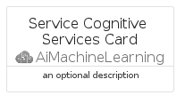
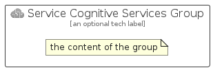

# ServiceCognitiveServices


```text
azure-17/Item/AiMachineLearning/ServiceCognitiveServices
```

```text
include('azure-17/Item/AiMachineLearning/ServiceCognitiveServices')
```


| Illustration | ServiceCognitiveServices | ServiceCognitiveServicesCard | ServiceCognitiveServicesGroup |
| :---: | :---: | :---: | :---: |
|  |  |  |  |


## Sprites
The item provides the following sriptes:

- `<$ServiceCognitiveServicesXs>`
- `<$ServiceCognitiveServicesSm>`
- `<$ServiceCognitiveServicesMd>`
- `<$ServiceCognitiveServicesLg>`


## ServiceCognitiveServices

### Load remotely
```plantuml
@startuml
' configures the library
!global $LIB_BASE_LOCATION="https://raw.githubusercontent.com/tmorin/plantuml-libs/master/distribution"

' loads the library's bootstrap
!include $LIB_BASE_LOCATION/bootstrap.puml

' loads the package bootstrap
include('azure-17/bootstrap')

' loads the Item which embeds the element ServiceCognitiveServices
include('azure-17/Item/AiMachineLearning/ServiceCognitiveServices')

' renders the element
ServiceCognitiveServices('ServiceCognitiveServices', 'Service Cognitive Services', 'an optional tech label', 'an optional description')
@enduml
```

### Load locally
```plantuml
@startuml
' configures the library
!global $INCLUSION_MODE="local"
!global $LIB_BASE_LOCATION="../../.."

' loads the library's bootstrap
!include $LIB_BASE_LOCATION/bootstrap.puml

' loads the package bootstrap
include('azure-17/bootstrap')

' loads the Item which embeds the element ServiceCognitiveServices
include('azure-17/Item/AiMachineLearning/ServiceCognitiveServices')

' renders the element
ServiceCognitiveServices('ServiceCognitiveServices', 'Service Cognitive Services', 'an optional tech label', 'an optional description')
@enduml
```

## ServiceCognitiveServicesCard

### Load remotely
```plantuml
@startuml
' configures the library
!global $LIB_BASE_LOCATION="https://raw.githubusercontent.com/tmorin/plantuml-libs/master/distribution"

' loads the library's bootstrap
!include $LIB_BASE_LOCATION/bootstrap.puml

' loads the package bootstrap
include('azure-17/bootstrap')

' loads the Item which embeds the element ServiceCognitiveServicesCard
include('azure-17/Item/AiMachineLearning/ServiceCognitiveServices')

' renders the element
ServiceCognitiveServicesCard('ServiceCognitiveServicesCard', 'Service Cognitive Services Card', 'an optional description')
@enduml
```

### Load locally
```plantuml
@startuml
' configures the library
!global $INCLUSION_MODE="local"
!global $LIB_BASE_LOCATION="../../.."

' loads the library's bootstrap
!include $LIB_BASE_LOCATION/bootstrap.puml

' loads the package bootstrap
include('azure-17/bootstrap')

' loads the Item which embeds the element ServiceCognitiveServicesCard
include('azure-17/Item/AiMachineLearning/ServiceCognitiveServices')

' renders the element
ServiceCognitiveServicesCard('ServiceCognitiveServicesCard', 'Service Cognitive Services Card', 'an optional description')
@enduml
```

## ServiceCognitiveServicesGroup

### Load remotely
```plantuml
@startuml
' configures the library
!global $LIB_BASE_LOCATION="https://raw.githubusercontent.com/tmorin/plantuml-libs/master/distribution"

' loads the library's bootstrap
!include $LIB_BASE_LOCATION/bootstrap.puml

' loads the package bootstrap
include('azure-17/bootstrap')

' loads the Item which embeds the element ServiceCognitiveServicesGroup
include('azure-17/Item/AiMachineLearning/ServiceCognitiveServices')

' renders the element
ServiceCognitiveServicesGroup('ServiceCognitiveServicesGroup', 'Service Cognitive Services Group', 'an optional tech label') {
    note as note
        the content of the group
    end note
}
@enduml
```

### Load locally
```plantuml
@startuml
' configures the library
!global $INCLUSION_MODE="local"
!global $LIB_BASE_LOCATION="../../.."

' loads the library's bootstrap
!include $LIB_BASE_LOCATION/bootstrap.puml

' loads the package bootstrap
include('azure-17/bootstrap')

' loads the Item which embeds the element ServiceCognitiveServicesGroup
include('azure-17/Item/AiMachineLearning/ServiceCognitiveServices')

' renders the element
ServiceCognitiveServicesGroup('ServiceCognitiveServicesGroup', 'Service Cognitive Services Group', 'an optional tech label') {
    note as note
        the content of the group
    end note
}
@enduml
```

