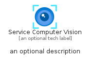

# ServiceComputerVision


```text
azure-17/Item/AiMachineLearning/ServiceComputerVision
```

```text
include('azure-17/Item/AiMachineLearning/ServiceComputerVision')
```


| Illustration | ServiceComputerVision | ServiceComputerVisionCard | ServiceComputerVisionGroup |
| :---: | :---: | :---: | :---: |
|  |  |  |  |


## Sprites
The item provides the following sriptes:

- `<$ServiceComputerVisionXs>`
- `<$ServiceComputerVisionSm>`
- `<$ServiceComputerVisionMd>`
- `<$ServiceComputerVisionLg>`


## ServiceComputerVision

### Load remotely
```plantuml
@startuml
' configures the library
!global $LIB_BASE_LOCATION="https://raw.githubusercontent.com/tmorin/plantuml-libs/master/distribution"

' loads the library's bootstrap
!include $LIB_BASE_LOCATION/bootstrap.puml

' loads the package bootstrap
include('azure-17/bootstrap')

' loads the Item which embeds the element ServiceComputerVision
include('azure-17/Item/AiMachineLearning/ServiceComputerVision')

' renders the element
ServiceComputerVision('ServiceComputerVision', 'Service Computer Vision', 'an optional tech label', 'an optional description')
@enduml
```

### Load locally
```plantuml
@startuml
' configures the library
!global $INCLUSION_MODE="local"
!global $LIB_BASE_LOCATION="../../.."

' loads the library's bootstrap
!include $LIB_BASE_LOCATION/bootstrap.puml

' loads the package bootstrap
include('azure-17/bootstrap')

' loads the Item which embeds the element ServiceComputerVision
include('azure-17/Item/AiMachineLearning/ServiceComputerVision')

' renders the element
ServiceComputerVision('ServiceComputerVision', 'Service Computer Vision', 'an optional tech label', 'an optional description')
@enduml
```

## ServiceComputerVisionCard

### Load remotely
```plantuml
@startuml
' configures the library
!global $LIB_BASE_LOCATION="https://raw.githubusercontent.com/tmorin/plantuml-libs/master/distribution"

' loads the library's bootstrap
!include $LIB_BASE_LOCATION/bootstrap.puml

' loads the package bootstrap
include('azure-17/bootstrap')

' loads the Item which embeds the element ServiceComputerVisionCard
include('azure-17/Item/AiMachineLearning/ServiceComputerVision')

' renders the element
ServiceComputerVisionCard('ServiceComputerVisionCard', 'Service Computer Vision Card', 'an optional description')
@enduml
```

### Load locally
```plantuml
@startuml
' configures the library
!global $INCLUSION_MODE="local"
!global $LIB_BASE_LOCATION="../../.."

' loads the library's bootstrap
!include $LIB_BASE_LOCATION/bootstrap.puml

' loads the package bootstrap
include('azure-17/bootstrap')

' loads the Item which embeds the element ServiceComputerVisionCard
include('azure-17/Item/AiMachineLearning/ServiceComputerVision')

' renders the element
ServiceComputerVisionCard('ServiceComputerVisionCard', 'Service Computer Vision Card', 'an optional description')
@enduml
```

## ServiceComputerVisionGroup

### Load remotely
```plantuml
@startuml
' configures the library
!global $LIB_BASE_LOCATION="https://raw.githubusercontent.com/tmorin/plantuml-libs/master/distribution"

' loads the library's bootstrap
!include $LIB_BASE_LOCATION/bootstrap.puml

' loads the package bootstrap
include('azure-17/bootstrap')

' loads the Item which embeds the element ServiceComputerVisionGroup
include('azure-17/Item/AiMachineLearning/ServiceComputerVision')

' renders the element
ServiceComputerVisionGroup('ServiceComputerVisionGroup', 'Service Computer Vision Group', 'an optional tech label') {
    note as note
        the content of the group
    end note
}
@enduml
```

### Load locally
```plantuml
@startuml
' configures the library
!global $INCLUSION_MODE="local"
!global $LIB_BASE_LOCATION="../../.."

' loads the library's bootstrap
!include $LIB_BASE_LOCATION/bootstrap.puml

' loads the package bootstrap
include('azure-17/bootstrap')

' loads the Item which embeds the element ServiceComputerVisionGroup
include('azure-17/Item/AiMachineLearning/ServiceComputerVision')

' renders the element
ServiceComputerVisionGroup('ServiceComputerVisionGroup', 'Service Computer Vision Group', 'an optional tech label') {
    note as note
        the content of the group
    end note
}
@enduml
```

