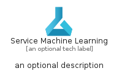
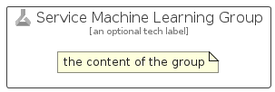

# ServiceMachineLearning


```text
azure-17/Item/AiMachineLearning/ServiceMachineLearning
```

```text
include('azure-17/Item/AiMachineLearning/ServiceMachineLearning')
```


| Illustration | ServiceMachineLearning | ServiceMachineLearningCard | ServiceMachineLearningGroup |
| :---: | :---: | :---: | :---: |
|  |  |  |  |


## Sprites
The item provides the following sriptes:

- `<$ServiceMachineLearningXs>`
- `<$ServiceMachineLearningSm>`
- `<$ServiceMachineLearningMd>`
- `<$ServiceMachineLearningLg>`


## ServiceMachineLearning

### Load remotely
```plantuml
@startuml
' configures the library
!global $LIB_BASE_LOCATION="https://raw.githubusercontent.com/tmorin/plantuml-libs/master/distribution"

' loads the library's bootstrap
!include $LIB_BASE_LOCATION/bootstrap.puml

' loads the package bootstrap
include('azure-17/bootstrap')

' loads the Item which embeds the element ServiceMachineLearning
include('azure-17/Item/AiMachineLearning/ServiceMachineLearning')

' renders the element
ServiceMachineLearning('ServiceMachineLearning', 'Service Machine Learning', 'an optional tech label', 'an optional description')
@enduml
```

### Load locally
```plantuml
@startuml
' configures the library
!global $INCLUSION_MODE="local"
!global $LIB_BASE_LOCATION="../../.."

' loads the library's bootstrap
!include $LIB_BASE_LOCATION/bootstrap.puml

' loads the package bootstrap
include('azure-17/bootstrap')

' loads the Item which embeds the element ServiceMachineLearning
include('azure-17/Item/AiMachineLearning/ServiceMachineLearning')

' renders the element
ServiceMachineLearning('ServiceMachineLearning', 'Service Machine Learning', 'an optional tech label', 'an optional description')
@enduml
```

## ServiceMachineLearningCard

### Load remotely
```plantuml
@startuml
' configures the library
!global $LIB_BASE_LOCATION="https://raw.githubusercontent.com/tmorin/plantuml-libs/master/distribution"

' loads the library's bootstrap
!include $LIB_BASE_LOCATION/bootstrap.puml

' loads the package bootstrap
include('azure-17/bootstrap')

' loads the Item which embeds the element ServiceMachineLearningCard
include('azure-17/Item/AiMachineLearning/ServiceMachineLearning')

' renders the element
ServiceMachineLearningCard('ServiceMachineLearningCard', 'Service Machine Learning Card', 'an optional description')
@enduml
```

### Load locally
```plantuml
@startuml
' configures the library
!global $INCLUSION_MODE="local"
!global $LIB_BASE_LOCATION="../../.."

' loads the library's bootstrap
!include $LIB_BASE_LOCATION/bootstrap.puml

' loads the package bootstrap
include('azure-17/bootstrap')

' loads the Item which embeds the element ServiceMachineLearningCard
include('azure-17/Item/AiMachineLearning/ServiceMachineLearning')

' renders the element
ServiceMachineLearningCard('ServiceMachineLearningCard', 'Service Machine Learning Card', 'an optional description')
@enduml
```

## ServiceMachineLearningGroup

### Load remotely
```plantuml
@startuml
' configures the library
!global $LIB_BASE_LOCATION="https://raw.githubusercontent.com/tmorin/plantuml-libs/master/distribution"

' loads the library's bootstrap
!include $LIB_BASE_LOCATION/bootstrap.puml

' loads the package bootstrap
include('azure-17/bootstrap')

' loads the Item which embeds the element ServiceMachineLearningGroup
include('azure-17/Item/AiMachineLearning/ServiceMachineLearning')

' renders the element
ServiceMachineLearningGroup('ServiceMachineLearningGroup', 'Service Machine Learning Group', 'an optional tech label') {
    note as note
        the content of the group
    end note
}
@enduml
```

### Load locally
```plantuml
@startuml
' configures the library
!global $INCLUSION_MODE="local"
!global $LIB_BASE_LOCATION="../../.."

' loads the library's bootstrap
!include $LIB_BASE_LOCATION/bootstrap.puml

' loads the package bootstrap
include('azure-17/bootstrap')

' loads the Item which embeds the element ServiceMachineLearningGroup
include('azure-17/Item/AiMachineLearning/ServiceMachineLearning')

' renders the element
ServiceMachineLearningGroup('ServiceMachineLearningGroup', 'Service Machine Learning Group', 'an optional tech label') {
    note as note
        the content of the group
    end note
}
@enduml
```

