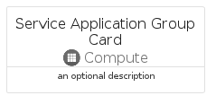

# ServiceApplicationGroup


```text
azure-17/Item/Compute/ServiceApplicationGroup
```

```text
include('azure-17/Item/Compute/ServiceApplicationGroup')
```


| Illustration | ServiceApplicationGroup | ServiceApplicationGroupCard | ServiceApplicationGroupGroup |
| :---: | :---: | :---: | :---: |
|  |  |  |  |


## Sprites
The item provides the following sriptes:

- `<$ServiceApplicationGroupXs>`
- `<$ServiceApplicationGroupSm>`
- `<$ServiceApplicationGroupMd>`
- `<$ServiceApplicationGroupLg>`


## ServiceApplicationGroup

### Load remotely
```plantuml
@startuml
' configures the library
!global $LIB_BASE_LOCATION="https://raw.githubusercontent.com/tmorin/plantuml-libs/master/distribution"

' loads the library's bootstrap
!include $LIB_BASE_LOCATION/bootstrap.puml

' loads the package bootstrap
include('azure-17/bootstrap')

' loads the Item which embeds the element ServiceApplicationGroup
include('azure-17/Item/Compute/ServiceApplicationGroup')

' renders the element
ServiceApplicationGroup('ServiceApplicationGroup', 'Service Application Group', 'an optional tech label', 'an optional description')
@enduml
```

### Load locally
```plantuml
@startuml
' configures the library
!global $INCLUSION_MODE="local"
!global $LIB_BASE_LOCATION="../../.."

' loads the library's bootstrap
!include $LIB_BASE_LOCATION/bootstrap.puml

' loads the package bootstrap
include('azure-17/bootstrap')

' loads the Item which embeds the element ServiceApplicationGroup
include('azure-17/Item/Compute/ServiceApplicationGroup')

' renders the element
ServiceApplicationGroup('ServiceApplicationGroup', 'Service Application Group', 'an optional tech label', 'an optional description')
@enduml
```

## ServiceApplicationGroupCard

### Load remotely
```plantuml
@startuml
' configures the library
!global $LIB_BASE_LOCATION="https://raw.githubusercontent.com/tmorin/plantuml-libs/master/distribution"

' loads the library's bootstrap
!include $LIB_BASE_LOCATION/bootstrap.puml

' loads the package bootstrap
include('azure-17/bootstrap')

' loads the Item which embeds the element ServiceApplicationGroupCard
include('azure-17/Item/Compute/ServiceApplicationGroup')

' renders the element
ServiceApplicationGroupCard('ServiceApplicationGroupCard', 'Service Application Group Card', 'an optional description')
@enduml
```

### Load locally
```plantuml
@startuml
' configures the library
!global $INCLUSION_MODE="local"
!global $LIB_BASE_LOCATION="../../.."

' loads the library's bootstrap
!include $LIB_BASE_LOCATION/bootstrap.puml

' loads the package bootstrap
include('azure-17/bootstrap')

' loads the Item which embeds the element ServiceApplicationGroupCard
include('azure-17/Item/Compute/ServiceApplicationGroup')

' renders the element
ServiceApplicationGroupCard('ServiceApplicationGroupCard', 'Service Application Group Card', 'an optional description')
@enduml
```

## ServiceApplicationGroupGroup

### Load remotely
```plantuml
@startuml
' configures the library
!global $LIB_BASE_LOCATION="https://raw.githubusercontent.com/tmorin/plantuml-libs/master/distribution"

' loads the library's bootstrap
!include $LIB_BASE_LOCATION/bootstrap.puml

' loads the package bootstrap
include('azure-17/bootstrap')

' loads the Item which embeds the element ServiceApplicationGroupGroup
include('azure-17/Item/Compute/ServiceApplicationGroup')

' renders the element
ServiceApplicationGroupGroup('ServiceApplicationGroupGroup', 'Service Application Group Group', 'an optional tech label') {
    note as note
        the content of the group
    end note
}
@enduml
```

### Load locally
```plantuml
@startuml
' configures the library
!global $INCLUSION_MODE="local"
!global $LIB_BASE_LOCATION="../../.."

' loads the library's bootstrap
!include $LIB_BASE_LOCATION/bootstrap.puml

' loads the package bootstrap
include('azure-17/bootstrap')

' loads the Item which embeds the element ServiceApplicationGroupGroup
include('azure-17/Item/Compute/ServiceApplicationGroup')

' renders the element
ServiceApplicationGroupGroup('ServiceApplicationGroupGroup', 'Service Application Group Group', 'an optional tech label') {
    note as note
        the content of the group
    end note
}
@enduml
```

