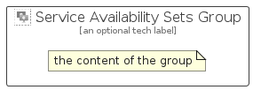

# ServiceAvailabilitySets


```text
azure-17/Item/Compute/ServiceAvailabilitySets
```

```text
include('azure-17/Item/Compute/ServiceAvailabilitySets')
```


| Illustration | ServiceAvailabilitySets | ServiceAvailabilitySetsCard | ServiceAvailabilitySetsGroup |
| :---: | :---: | :---: | :---: |
|  |  |  |  |


## Sprites
The item provides the following sriptes:

- `<$ServiceAvailabilitySetsXs>`
- `<$ServiceAvailabilitySetsSm>`
- `<$ServiceAvailabilitySetsMd>`
- `<$ServiceAvailabilitySetsLg>`


## ServiceAvailabilitySets

### Load remotely
```plantuml
@startuml
' configures the library
!global $LIB_BASE_LOCATION="https://raw.githubusercontent.com/tmorin/plantuml-libs/master/distribution"

' loads the library's bootstrap
!include $LIB_BASE_LOCATION/bootstrap.puml

' loads the package bootstrap
include('azure-17/bootstrap')

' loads the Item which embeds the element ServiceAvailabilitySets
include('azure-17/Item/Compute/ServiceAvailabilitySets')

' renders the element
ServiceAvailabilitySets('ServiceAvailabilitySets', 'Service Availability Sets', 'an optional tech label', 'an optional description')
@enduml
```

### Load locally
```plantuml
@startuml
' configures the library
!global $INCLUSION_MODE="local"
!global $LIB_BASE_LOCATION="../../.."

' loads the library's bootstrap
!include $LIB_BASE_LOCATION/bootstrap.puml

' loads the package bootstrap
include('azure-17/bootstrap')

' loads the Item which embeds the element ServiceAvailabilitySets
include('azure-17/Item/Compute/ServiceAvailabilitySets')

' renders the element
ServiceAvailabilitySets('ServiceAvailabilitySets', 'Service Availability Sets', 'an optional tech label', 'an optional description')
@enduml
```

## ServiceAvailabilitySetsCard

### Load remotely
```plantuml
@startuml
' configures the library
!global $LIB_BASE_LOCATION="https://raw.githubusercontent.com/tmorin/plantuml-libs/master/distribution"

' loads the library's bootstrap
!include $LIB_BASE_LOCATION/bootstrap.puml

' loads the package bootstrap
include('azure-17/bootstrap')

' loads the Item which embeds the element ServiceAvailabilitySetsCard
include('azure-17/Item/Compute/ServiceAvailabilitySets')

' renders the element
ServiceAvailabilitySetsCard('ServiceAvailabilitySetsCard', 'Service Availability Sets Card', 'an optional description')
@enduml
```

### Load locally
```plantuml
@startuml
' configures the library
!global $INCLUSION_MODE="local"
!global $LIB_BASE_LOCATION="../../.."

' loads the library's bootstrap
!include $LIB_BASE_LOCATION/bootstrap.puml

' loads the package bootstrap
include('azure-17/bootstrap')

' loads the Item which embeds the element ServiceAvailabilitySetsCard
include('azure-17/Item/Compute/ServiceAvailabilitySets')

' renders the element
ServiceAvailabilitySetsCard('ServiceAvailabilitySetsCard', 'Service Availability Sets Card', 'an optional description')
@enduml
```

## ServiceAvailabilitySetsGroup

### Load remotely
```plantuml
@startuml
' configures the library
!global $LIB_BASE_LOCATION="https://raw.githubusercontent.com/tmorin/plantuml-libs/master/distribution"

' loads the library's bootstrap
!include $LIB_BASE_LOCATION/bootstrap.puml

' loads the package bootstrap
include('azure-17/bootstrap')

' loads the Item which embeds the element ServiceAvailabilitySetsGroup
include('azure-17/Item/Compute/ServiceAvailabilitySets')

' renders the element
ServiceAvailabilitySetsGroup('ServiceAvailabilitySetsGroup', 'Service Availability Sets Group', 'an optional tech label') {
    note as note
        the content of the group
    end note
}
@enduml
```

### Load locally
```plantuml
@startuml
' configures the library
!global $INCLUSION_MODE="local"
!global $LIB_BASE_LOCATION="../../.."

' loads the library's bootstrap
!include $LIB_BASE_LOCATION/bootstrap.puml

' loads the package bootstrap
include('azure-17/bootstrap')

' loads the Item which embeds the element ServiceAvailabilitySetsGroup
include('azure-17/Item/Compute/ServiceAvailabilitySets')

' renders the element
ServiceAvailabilitySetsGroup('ServiceAvailabilitySetsGroup', 'Service Availability Sets Group', 'an optional tech label') {
    note as note
        the content of the group
    end note
}
@enduml
```

