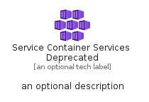
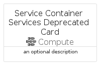

# ServiceContainerServicesDeprecated


```text
azure-17/Item/Compute/ServiceContainerServicesDeprecated
```

```text
include('azure-17/Item/Compute/ServiceContainerServicesDeprecated')
```


| Illustration | ServiceContainerServicesDeprecated | ServiceContainerServicesDeprecatedCard | ServiceContainerServicesDeprecatedGroup |
| :---: | :---: | :---: | :---: |
|  |  |  |  |


## Sprites
The item provides the following sriptes:

- `<$ServiceContainerServicesDeprecatedXs>`
- `<$ServiceContainerServicesDeprecatedSm>`
- `<$ServiceContainerServicesDeprecatedMd>`
- `<$ServiceContainerServicesDeprecatedLg>`


## ServiceContainerServicesDeprecated

### Load remotely
```plantuml
@startuml
' configures the library
!global $LIB_BASE_LOCATION="https://raw.githubusercontent.com/tmorin/plantuml-libs/master/distribution"

' loads the library's bootstrap
!include $LIB_BASE_LOCATION/bootstrap.puml

' loads the package bootstrap
include('azure-17/bootstrap')

' loads the Item which embeds the element ServiceContainerServicesDeprecated
include('azure-17/Item/Compute/ServiceContainerServicesDeprecated')

' renders the element
ServiceContainerServicesDeprecated('ServiceContainerServicesDeprecated', 'Service Container Services Deprecated', 'an optional tech label', 'an optional description')
@enduml
```

### Load locally
```plantuml
@startuml
' configures the library
!global $INCLUSION_MODE="local"
!global $LIB_BASE_LOCATION="../../.."

' loads the library's bootstrap
!include $LIB_BASE_LOCATION/bootstrap.puml

' loads the package bootstrap
include('azure-17/bootstrap')

' loads the Item which embeds the element ServiceContainerServicesDeprecated
include('azure-17/Item/Compute/ServiceContainerServicesDeprecated')

' renders the element
ServiceContainerServicesDeprecated('ServiceContainerServicesDeprecated', 'Service Container Services Deprecated', 'an optional tech label', 'an optional description')
@enduml
```

## ServiceContainerServicesDeprecatedCard

### Load remotely
```plantuml
@startuml
' configures the library
!global $LIB_BASE_LOCATION="https://raw.githubusercontent.com/tmorin/plantuml-libs/master/distribution"

' loads the library's bootstrap
!include $LIB_BASE_LOCATION/bootstrap.puml

' loads the package bootstrap
include('azure-17/bootstrap')

' loads the Item which embeds the element ServiceContainerServicesDeprecatedCard
include('azure-17/Item/Compute/ServiceContainerServicesDeprecated')

' renders the element
ServiceContainerServicesDeprecatedCard('ServiceContainerServicesDeprecatedCard', 'Service Container Services Deprecated Card', 'an optional description')
@enduml
```

### Load locally
```plantuml
@startuml
' configures the library
!global $INCLUSION_MODE="local"
!global $LIB_BASE_LOCATION="../../.."

' loads the library's bootstrap
!include $LIB_BASE_LOCATION/bootstrap.puml

' loads the package bootstrap
include('azure-17/bootstrap')

' loads the Item which embeds the element ServiceContainerServicesDeprecatedCard
include('azure-17/Item/Compute/ServiceContainerServicesDeprecated')

' renders the element
ServiceContainerServicesDeprecatedCard('ServiceContainerServicesDeprecatedCard', 'Service Container Services Deprecated Card', 'an optional description')
@enduml
```

## ServiceContainerServicesDeprecatedGroup

### Load remotely
```plantuml
@startuml
' configures the library
!global $LIB_BASE_LOCATION="https://raw.githubusercontent.com/tmorin/plantuml-libs/master/distribution"

' loads the library's bootstrap
!include $LIB_BASE_LOCATION/bootstrap.puml

' loads the package bootstrap
include('azure-17/bootstrap')

' loads the Item which embeds the element ServiceContainerServicesDeprecatedGroup
include('azure-17/Item/Compute/ServiceContainerServicesDeprecated')

' renders the element
ServiceContainerServicesDeprecatedGroup('ServiceContainerServicesDeprecatedGroup', 'Service Container Services Deprecated Group', 'an optional tech label') {
    note as note
        the content of the group
    end note
}
@enduml
```

### Load locally
```plantuml
@startuml
' configures the library
!global $INCLUSION_MODE="local"
!global $LIB_BASE_LOCATION="../../.."

' loads the library's bootstrap
!include $LIB_BASE_LOCATION/bootstrap.puml

' loads the package bootstrap
include('azure-17/bootstrap')

' loads the Item which embeds the element ServiceContainerServicesDeprecatedGroup
include('azure-17/Item/Compute/ServiceContainerServicesDeprecated')

' renders the element
ServiceContainerServicesDeprecatedGroup('ServiceContainerServicesDeprecatedGroup', 'Service Container Services Deprecated Group', 'an optional tech label') {
    note as note
        the content of the group
    end note
}
@enduml
```

