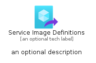

# ServiceImageDefinitions


```text
azure-17/Item/Compute/ServiceImageDefinitions
```

```text
include('azure-17/Item/Compute/ServiceImageDefinitions')
```


| Illustration | ServiceImageDefinitions | ServiceImageDefinitionsCard | ServiceImageDefinitionsGroup |
| :---: | :---: | :---: | :---: |
|  |  |  |  |


## Sprites
The item provides the following sriptes:

- `<$ServiceImageDefinitionsXs>`
- `<$ServiceImageDefinitionsSm>`
- `<$ServiceImageDefinitionsMd>`
- `<$ServiceImageDefinitionsLg>`


## ServiceImageDefinitions

### Load remotely
```plantuml
@startuml
' configures the library
!global $LIB_BASE_LOCATION="https://raw.githubusercontent.com/tmorin/plantuml-libs/master/distribution"

' loads the library's bootstrap
!include $LIB_BASE_LOCATION/bootstrap.puml

' loads the package bootstrap
include('azure-17/bootstrap')

' loads the Item which embeds the element ServiceImageDefinitions
include('azure-17/Item/Compute/ServiceImageDefinitions')

' renders the element
ServiceImageDefinitions('ServiceImageDefinitions', 'Service Image Definitions', 'an optional tech label', 'an optional description')
@enduml
```

### Load locally
```plantuml
@startuml
' configures the library
!global $INCLUSION_MODE="local"
!global $LIB_BASE_LOCATION="../../.."

' loads the library's bootstrap
!include $LIB_BASE_LOCATION/bootstrap.puml

' loads the package bootstrap
include('azure-17/bootstrap')

' loads the Item which embeds the element ServiceImageDefinitions
include('azure-17/Item/Compute/ServiceImageDefinitions')

' renders the element
ServiceImageDefinitions('ServiceImageDefinitions', 'Service Image Definitions', 'an optional tech label', 'an optional description')
@enduml
```

## ServiceImageDefinitionsCard

### Load remotely
```plantuml
@startuml
' configures the library
!global $LIB_BASE_LOCATION="https://raw.githubusercontent.com/tmorin/plantuml-libs/master/distribution"

' loads the library's bootstrap
!include $LIB_BASE_LOCATION/bootstrap.puml

' loads the package bootstrap
include('azure-17/bootstrap')

' loads the Item which embeds the element ServiceImageDefinitionsCard
include('azure-17/Item/Compute/ServiceImageDefinitions')

' renders the element
ServiceImageDefinitionsCard('ServiceImageDefinitionsCard', 'Service Image Definitions Card', 'an optional description')
@enduml
```

### Load locally
```plantuml
@startuml
' configures the library
!global $INCLUSION_MODE="local"
!global $LIB_BASE_LOCATION="../../.."

' loads the library's bootstrap
!include $LIB_BASE_LOCATION/bootstrap.puml

' loads the package bootstrap
include('azure-17/bootstrap')

' loads the Item which embeds the element ServiceImageDefinitionsCard
include('azure-17/Item/Compute/ServiceImageDefinitions')

' renders the element
ServiceImageDefinitionsCard('ServiceImageDefinitionsCard', 'Service Image Definitions Card', 'an optional description')
@enduml
```

## ServiceImageDefinitionsGroup

### Load remotely
```plantuml
@startuml
' configures the library
!global $LIB_BASE_LOCATION="https://raw.githubusercontent.com/tmorin/plantuml-libs/master/distribution"

' loads the library's bootstrap
!include $LIB_BASE_LOCATION/bootstrap.puml

' loads the package bootstrap
include('azure-17/bootstrap')

' loads the Item which embeds the element ServiceImageDefinitionsGroup
include('azure-17/Item/Compute/ServiceImageDefinitions')

' renders the element
ServiceImageDefinitionsGroup('ServiceImageDefinitionsGroup', 'Service Image Definitions Group', 'an optional tech label') {
    note as note
        the content of the group
    end note
}
@enduml
```

### Load locally
```plantuml
@startuml
' configures the library
!global $INCLUSION_MODE="local"
!global $LIB_BASE_LOCATION="../../.."

' loads the library's bootstrap
!include $LIB_BASE_LOCATION/bootstrap.puml

' loads the package bootstrap
include('azure-17/bootstrap')

' loads the Item which embeds the element ServiceImageDefinitionsGroup
include('azure-17/Item/Compute/ServiceImageDefinitions')

' renders the element
ServiceImageDefinitionsGroup('ServiceImageDefinitionsGroup', 'Service Image Definitions Group', 'an optional tech label') {
    note as note
        the content of the group
    end note
}
@enduml
```

