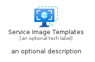
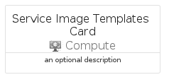

# ServiceImageTemplates


```text
azure-17/Item/Compute/ServiceImageTemplates
```

```text
include('azure-17/Item/Compute/ServiceImageTemplates')
```


| Illustration | ServiceImageTemplates | ServiceImageTemplatesCard | ServiceImageTemplatesGroup |
| :---: | :---: | :---: | :---: |
|  |  |  |  |


## Sprites
The item provides the following sriptes:

- `<$ServiceImageTemplatesXs>`
- `<$ServiceImageTemplatesSm>`
- `<$ServiceImageTemplatesMd>`
- `<$ServiceImageTemplatesLg>`


## ServiceImageTemplates

### Load remotely
```plantuml
@startuml
' configures the library
!global $LIB_BASE_LOCATION="https://raw.githubusercontent.com/tmorin/plantuml-libs/master/distribution"

' loads the library's bootstrap
!include $LIB_BASE_LOCATION/bootstrap.puml

' loads the package bootstrap
include('azure-17/bootstrap')

' loads the Item which embeds the element ServiceImageTemplates
include('azure-17/Item/Compute/ServiceImageTemplates')

' renders the element
ServiceImageTemplates('ServiceImageTemplates', 'Service Image Templates', 'an optional tech label', 'an optional description')
@enduml
```

### Load locally
```plantuml
@startuml
' configures the library
!global $INCLUSION_MODE="local"
!global $LIB_BASE_LOCATION="../../.."

' loads the library's bootstrap
!include $LIB_BASE_LOCATION/bootstrap.puml

' loads the package bootstrap
include('azure-17/bootstrap')

' loads the Item which embeds the element ServiceImageTemplates
include('azure-17/Item/Compute/ServiceImageTemplates')

' renders the element
ServiceImageTemplates('ServiceImageTemplates', 'Service Image Templates', 'an optional tech label', 'an optional description')
@enduml
```

## ServiceImageTemplatesCard

### Load remotely
```plantuml
@startuml
' configures the library
!global $LIB_BASE_LOCATION="https://raw.githubusercontent.com/tmorin/plantuml-libs/master/distribution"

' loads the library's bootstrap
!include $LIB_BASE_LOCATION/bootstrap.puml

' loads the package bootstrap
include('azure-17/bootstrap')

' loads the Item which embeds the element ServiceImageTemplatesCard
include('azure-17/Item/Compute/ServiceImageTemplates')

' renders the element
ServiceImageTemplatesCard('ServiceImageTemplatesCard', 'Service Image Templates Card', 'an optional description')
@enduml
```

### Load locally
```plantuml
@startuml
' configures the library
!global $INCLUSION_MODE="local"
!global $LIB_BASE_LOCATION="../../.."

' loads the library's bootstrap
!include $LIB_BASE_LOCATION/bootstrap.puml

' loads the package bootstrap
include('azure-17/bootstrap')

' loads the Item which embeds the element ServiceImageTemplatesCard
include('azure-17/Item/Compute/ServiceImageTemplates')

' renders the element
ServiceImageTemplatesCard('ServiceImageTemplatesCard', 'Service Image Templates Card', 'an optional description')
@enduml
```

## ServiceImageTemplatesGroup

### Load remotely
```plantuml
@startuml
' configures the library
!global $LIB_BASE_LOCATION="https://raw.githubusercontent.com/tmorin/plantuml-libs/master/distribution"

' loads the library's bootstrap
!include $LIB_BASE_LOCATION/bootstrap.puml

' loads the package bootstrap
include('azure-17/bootstrap')

' loads the Item which embeds the element ServiceImageTemplatesGroup
include('azure-17/Item/Compute/ServiceImageTemplates')

' renders the element
ServiceImageTemplatesGroup('ServiceImageTemplatesGroup', 'Service Image Templates Group', 'an optional tech label') {
    note as note
        the content of the group
    end note
}
@enduml
```

### Load locally
```plantuml
@startuml
' configures the library
!global $INCLUSION_MODE="local"
!global $LIB_BASE_LOCATION="../../.."

' loads the library's bootstrap
!include $LIB_BASE_LOCATION/bootstrap.puml

' loads the package bootstrap
include('azure-17/bootstrap')

' loads the Item which embeds the element ServiceImageTemplatesGroup
include('azure-17/Item/Compute/ServiceImageTemplates')

' renders the element
ServiceImageTemplatesGroup('ServiceImageTemplatesGroup', 'Service Image Templates Group', 'an optional tech label') {
    note as note
        the content of the group
    end note
}
@enduml
```

