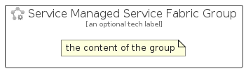

# ServiceManagedServiceFabric


```text
azure-17/Item/Compute/ServiceManagedServiceFabric
```

```text
include('azure-17/Item/Compute/ServiceManagedServiceFabric')
```


| Illustration | ServiceManagedServiceFabric | ServiceManagedServiceFabricCard | ServiceManagedServiceFabricGroup |
| :---: | :---: | :---: | :---: |
|  |  |  |  |


## Sprites
The item provides the following sriptes:

- `<$ServiceManagedServiceFabricXs>`
- `<$ServiceManagedServiceFabricSm>`
- `<$ServiceManagedServiceFabricMd>`
- `<$ServiceManagedServiceFabricLg>`


## ServiceManagedServiceFabric

### Load remotely
```plantuml
@startuml
' configures the library
!global $LIB_BASE_LOCATION="https://raw.githubusercontent.com/tmorin/plantuml-libs/master/distribution"

' loads the library's bootstrap
!include $LIB_BASE_LOCATION/bootstrap.puml

' loads the package bootstrap
include('azure-17/bootstrap')

' loads the Item which embeds the element ServiceManagedServiceFabric
include('azure-17/Item/Compute/ServiceManagedServiceFabric')

' renders the element
ServiceManagedServiceFabric('ServiceManagedServiceFabric', 'Service Managed Service Fabric', 'an optional tech label', 'an optional description')
@enduml
```

### Load locally
```plantuml
@startuml
' configures the library
!global $INCLUSION_MODE="local"
!global $LIB_BASE_LOCATION="../../.."

' loads the library's bootstrap
!include $LIB_BASE_LOCATION/bootstrap.puml

' loads the package bootstrap
include('azure-17/bootstrap')

' loads the Item which embeds the element ServiceManagedServiceFabric
include('azure-17/Item/Compute/ServiceManagedServiceFabric')

' renders the element
ServiceManagedServiceFabric('ServiceManagedServiceFabric', 'Service Managed Service Fabric', 'an optional tech label', 'an optional description')
@enduml
```

## ServiceManagedServiceFabricCard

### Load remotely
```plantuml
@startuml
' configures the library
!global $LIB_BASE_LOCATION="https://raw.githubusercontent.com/tmorin/plantuml-libs/master/distribution"

' loads the library's bootstrap
!include $LIB_BASE_LOCATION/bootstrap.puml

' loads the package bootstrap
include('azure-17/bootstrap')

' loads the Item which embeds the element ServiceManagedServiceFabricCard
include('azure-17/Item/Compute/ServiceManagedServiceFabric')

' renders the element
ServiceManagedServiceFabricCard('ServiceManagedServiceFabricCard', 'Service Managed Service Fabric Card', 'an optional description')
@enduml
```

### Load locally
```plantuml
@startuml
' configures the library
!global $INCLUSION_MODE="local"
!global $LIB_BASE_LOCATION="../../.."

' loads the library's bootstrap
!include $LIB_BASE_LOCATION/bootstrap.puml

' loads the package bootstrap
include('azure-17/bootstrap')

' loads the Item which embeds the element ServiceManagedServiceFabricCard
include('azure-17/Item/Compute/ServiceManagedServiceFabric')

' renders the element
ServiceManagedServiceFabricCard('ServiceManagedServiceFabricCard', 'Service Managed Service Fabric Card', 'an optional description')
@enduml
```

## ServiceManagedServiceFabricGroup

### Load remotely
```plantuml
@startuml
' configures the library
!global $LIB_BASE_LOCATION="https://raw.githubusercontent.com/tmorin/plantuml-libs/master/distribution"

' loads the library's bootstrap
!include $LIB_BASE_LOCATION/bootstrap.puml

' loads the package bootstrap
include('azure-17/bootstrap')

' loads the Item which embeds the element ServiceManagedServiceFabricGroup
include('azure-17/Item/Compute/ServiceManagedServiceFabric')

' renders the element
ServiceManagedServiceFabricGroup('ServiceManagedServiceFabricGroup', 'Service Managed Service Fabric Group', 'an optional tech label') {
    note as note
        the content of the group
    end note
}
@enduml
```

### Load locally
```plantuml
@startuml
' configures the library
!global $INCLUSION_MODE="local"
!global $LIB_BASE_LOCATION="../../.."

' loads the library's bootstrap
!include $LIB_BASE_LOCATION/bootstrap.puml

' loads the package bootstrap
include('azure-17/bootstrap')

' loads the Item which embeds the element ServiceManagedServiceFabricGroup
include('azure-17/Item/Compute/ServiceManagedServiceFabric')

' renders the element
ServiceManagedServiceFabricGroup('ServiceManagedServiceFabricGroup', 'Service Managed Service Fabric Group', 'an optional tech label') {
    note as note
        the content of the group
    end note
}
@enduml
```

