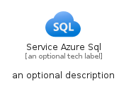
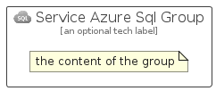

# ServiceAzureSql


```text
azure-17/Item/Databases/ServiceAzureSql
```

```text
include('azure-17/Item/Databases/ServiceAzureSql')
```


| Illustration | ServiceAzureSql | ServiceAzureSqlCard | ServiceAzureSqlGroup |
| :---: | :---: | :---: | :---: |
|  |  |  |  |


## Sprites
The item provides the following sriptes:

- `<$ServiceAzureSqlXs>`
- `<$ServiceAzureSqlSm>`
- `<$ServiceAzureSqlMd>`
- `<$ServiceAzureSqlLg>`


## ServiceAzureSql

### Load remotely
```plantuml
@startuml
' configures the library
!global $LIB_BASE_LOCATION="https://raw.githubusercontent.com/tmorin/plantuml-libs/master/distribution"

' loads the library's bootstrap
!include $LIB_BASE_LOCATION/bootstrap.puml

' loads the package bootstrap
include('azure-17/bootstrap')

' loads the Item which embeds the element ServiceAzureSql
include('azure-17/Item/Databases/ServiceAzureSql')

' renders the element
ServiceAzureSql('ServiceAzureSql', 'Service Azure Sql', 'an optional tech label', 'an optional description')
@enduml
```

### Load locally
```plantuml
@startuml
' configures the library
!global $INCLUSION_MODE="local"
!global $LIB_BASE_LOCATION="../../.."

' loads the library's bootstrap
!include $LIB_BASE_LOCATION/bootstrap.puml

' loads the package bootstrap
include('azure-17/bootstrap')

' loads the Item which embeds the element ServiceAzureSql
include('azure-17/Item/Databases/ServiceAzureSql')

' renders the element
ServiceAzureSql('ServiceAzureSql', 'Service Azure Sql', 'an optional tech label', 'an optional description')
@enduml
```

## ServiceAzureSqlCard

### Load remotely
```plantuml
@startuml
' configures the library
!global $LIB_BASE_LOCATION="https://raw.githubusercontent.com/tmorin/plantuml-libs/master/distribution"

' loads the library's bootstrap
!include $LIB_BASE_LOCATION/bootstrap.puml

' loads the package bootstrap
include('azure-17/bootstrap')

' loads the Item which embeds the element ServiceAzureSqlCard
include('azure-17/Item/Databases/ServiceAzureSql')

' renders the element
ServiceAzureSqlCard('ServiceAzureSqlCard', 'Service Azure Sql Card', 'an optional description')
@enduml
```

### Load locally
```plantuml
@startuml
' configures the library
!global $INCLUSION_MODE="local"
!global $LIB_BASE_LOCATION="../../.."

' loads the library's bootstrap
!include $LIB_BASE_LOCATION/bootstrap.puml

' loads the package bootstrap
include('azure-17/bootstrap')

' loads the Item which embeds the element ServiceAzureSqlCard
include('azure-17/Item/Databases/ServiceAzureSql')

' renders the element
ServiceAzureSqlCard('ServiceAzureSqlCard', 'Service Azure Sql Card', 'an optional description')
@enduml
```

## ServiceAzureSqlGroup

### Load remotely
```plantuml
@startuml
' configures the library
!global $LIB_BASE_LOCATION="https://raw.githubusercontent.com/tmorin/plantuml-libs/master/distribution"

' loads the library's bootstrap
!include $LIB_BASE_LOCATION/bootstrap.puml

' loads the package bootstrap
include('azure-17/bootstrap')

' loads the Item which embeds the element ServiceAzureSqlGroup
include('azure-17/Item/Databases/ServiceAzureSql')

' renders the element
ServiceAzureSqlGroup('ServiceAzureSqlGroup', 'Service Azure Sql Group', 'an optional tech label') {
    note as note
        the content of the group
    end note
}
@enduml
```

### Load locally
```plantuml
@startuml
' configures the library
!global $INCLUSION_MODE="local"
!global $LIB_BASE_LOCATION="../../.."

' loads the library's bootstrap
!include $LIB_BASE_LOCATION/bootstrap.puml

' loads the package bootstrap
include('azure-17/bootstrap')

' loads the Item which embeds the element ServiceAzureSqlGroup
include('azure-17/Item/Databases/ServiceAzureSql')

' renders the element
ServiceAzureSqlGroup('ServiceAzureSqlGroup', 'Service Azure Sql Group', 'an optional tech label') {
    note as note
        the content of the group
    end note
}
@enduml
```

