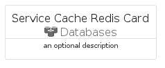

# ServiceCacheRedis


```text
azure-17/Item/Databases/ServiceCacheRedis
```

```text
include('azure-17/Item/Databases/ServiceCacheRedis')
```


| Illustration | ServiceCacheRedis | ServiceCacheRedisCard | ServiceCacheRedisGroup |
| :---: | :---: | :---: | :---: |
|  |  |  |  |


## Sprites
The item provides the following sriptes:

- `<$ServiceCacheRedisXs>`
- `<$ServiceCacheRedisSm>`
- `<$ServiceCacheRedisMd>`
- `<$ServiceCacheRedisLg>`


## ServiceCacheRedis

### Load remotely
```plantuml
@startuml
' configures the library
!global $LIB_BASE_LOCATION="https://raw.githubusercontent.com/tmorin/plantuml-libs/master/distribution"

' loads the library's bootstrap
!include $LIB_BASE_LOCATION/bootstrap.puml

' loads the package bootstrap
include('azure-17/bootstrap')

' loads the Item which embeds the element ServiceCacheRedis
include('azure-17/Item/Databases/ServiceCacheRedis')

' renders the element
ServiceCacheRedis('ServiceCacheRedis', 'Service Cache Redis', 'an optional tech label', 'an optional description')
@enduml
```

### Load locally
```plantuml
@startuml
' configures the library
!global $INCLUSION_MODE="local"
!global $LIB_BASE_LOCATION="../../.."

' loads the library's bootstrap
!include $LIB_BASE_LOCATION/bootstrap.puml

' loads the package bootstrap
include('azure-17/bootstrap')

' loads the Item which embeds the element ServiceCacheRedis
include('azure-17/Item/Databases/ServiceCacheRedis')

' renders the element
ServiceCacheRedis('ServiceCacheRedis', 'Service Cache Redis', 'an optional tech label', 'an optional description')
@enduml
```

## ServiceCacheRedisCard

### Load remotely
```plantuml
@startuml
' configures the library
!global $LIB_BASE_LOCATION="https://raw.githubusercontent.com/tmorin/plantuml-libs/master/distribution"

' loads the library's bootstrap
!include $LIB_BASE_LOCATION/bootstrap.puml

' loads the package bootstrap
include('azure-17/bootstrap')

' loads the Item which embeds the element ServiceCacheRedisCard
include('azure-17/Item/Databases/ServiceCacheRedis')

' renders the element
ServiceCacheRedisCard('ServiceCacheRedisCard', 'Service Cache Redis Card', 'an optional description')
@enduml
```

### Load locally
```plantuml
@startuml
' configures the library
!global $INCLUSION_MODE="local"
!global $LIB_BASE_LOCATION="../../.."

' loads the library's bootstrap
!include $LIB_BASE_LOCATION/bootstrap.puml

' loads the package bootstrap
include('azure-17/bootstrap')

' loads the Item which embeds the element ServiceCacheRedisCard
include('azure-17/Item/Databases/ServiceCacheRedis')

' renders the element
ServiceCacheRedisCard('ServiceCacheRedisCard', 'Service Cache Redis Card', 'an optional description')
@enduml
```

## ServiceCacheRedisGroup

### Load remotely
```plantuml
@startuml
' configures the library
!global $LIB_BASE_LOCATION="https://raw.githubusercontent.com/tmorin/plantuml-libs/master/distribution"

' loads the library's bootstrap
!include $LIB_BASE_LOCATION/bootstrap.puml

' loads the package bootstrap
include('azure-17/bootstrap')

' loads the Item which embeds the element ServiceCacheRedisGroup
include('azure-17/Item/Databases/ServiceCacheRedis')

' renders the element
ServiceCacheRedisGroup('ServiceCacheRedisGroup', 'Service Cache Redis Group', 'an optional tech label') {
    note as note
        the content of the group
    end note
}
@enduml
```

### Load locally
```plantuml
@startuml
' configures the library
!global $INCLUSION_MODE="local"
!global $LIB_BASE_LOCATION="../../.."

' loads the library's bootstrap
!include $LIB_BASE_LOCATION/bootstrap.puml

' loads the package bootstrap
include('azure-17/bootstrap')

' loads the Item which embeds the element ServiceCacheRedisGroup
include('azure-17/Item/Databases/ServiceCacheRedis')

' renders the element
ServiceCacheRedisGroup('ServiceCacheRedisGroup', 'Service Cache Redis Group', 'an optional tech label') {
    note as note
        the content of the group
    end note
}
@enduml
```

