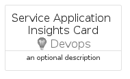

# ServiceApplicationInsights


```text
azure-17/Item/Devops/ServiceApplicationInsights
```

```text
include('azure-17/Item/Devops/ServiceApplicationInsights')
```


| Illustration | ServiceApplicationInsights | ServiceApplicationInsightsCard | ServiceApplicationInsightsGroup |
| :---: | :---: | :---: | :---: |
|  |  |  |  |


## Sprites
The item provides the following sriptes:

- `<$ServiceApplicationInsightsXs>`
- `<$ServiceApplicationInsightsSm>`
- `<$ServiceApplicationInsightsMd>`
- `<$ServiceApplicationInsightsLg>`


## ServiceApplicationInsights

### Load remotely
```plantuml
@startuml
' configures the library
!global $LIB_BASE_LOCATION="https://raw.githubusercontent.com/tmorin/plantuml-libs/master/distribution"

' loads the library's bootstrap
!include $LIB_BASE_LOCATION/bootstrap.puml

' loads the package bootstrap
include('azure-17/bootstrap')

' loads the Item which embeds the element ServiceApplicationInsights
include('azure-17/Item/Devops/ServiceApplicationInsights')

' renders the element
ServiceApplicationInsights('ServiceApplicationInsights', 'Service Application Insights', 'an optional tech label', 'an optional description')
@enduml
```

### Load locally
```plantuml
@startuml
' configures the library
!global $INCLUSION_MODE="local"
!global $LIB_BASE_LOCATION="../../.."

' loads the library's bootstrap
!include $LIB_BASE_LOCATION/bootstrap.puml

' loads the package bootstrap
include('azure-17/bootstrap')

' loads the Item which embeds the element ServiceApplicationInsights
include('azure-17/Item/Devops/ServiceApplicationInsights')

' renders the element
ServiceApplicationInsights('ServiceApplicationInsights', 'Service Application Insights', 'an optional tech label', 'an optional description')
@enduml
```

## ServiceApplicationInsightsCard

### Load remotely
```plantuml
@startuml
' configures the library
!global $LIB_BASE_LOCATION="https://raw.githubusercontent.com/tmorin/plantuml-libs/master/distribution"

' loads the library's bootstrap
!include $LIB_BASE_LOCATION/bootstrap.puml

' loads the package bootstrap
include('azure-17/bootstrap')

' loads the Item which embeds the element ServiceApplicationInsightsCard
include('azure-17/Item/Devops/ServiceApplicationInsights')

' renders the element
ServiceApplicationInsightsCard('ServiceApplicationInsightsCard', 'Service Application Insights Card', 'an optional description')
@enduml
```

### Load locally
```plantuml
@startuml
' configures the library
!global $INCLUSION_MODE="local"
!global $LIB_BASE_LOCATION="../../.."

' loads the library's bootstrap
!include $LIB_BASE_LOCATION/bootstrap.puml

' loads the package bootstrap
include('azure-17/bootstrap')

' loads the Item which embeds the element ServiceApplicationInsightsCard
include('azure-17/Item/Devops/ServiceApplicationInsights')

' renders the element
ServiceApplicationInsightsCard('ServiceApplicationInsightsCard', 'Service Application Insights Card', 'an optional description')
@enduml
```

## ServiceApplicationInsightsGroup

### Load remotely
```plantuml
@startuml
' configures the library
!global $LIB_BASE_LOCATION="https://raw.githubusercontent.com/tmorin/plantuml-libs/master/distribution"

' loads the library's bootstrap
!include $LIB_BASE_LOCATION/bootstrap.puml

' loads the package bootstrap
include('azure-17/bootstrap')

' loads the Item which embeds the element ServiceApplicationInsightsGroup
include('azure-17/Item/Devops/ServiceApplicationInsights')

' renders the element
ServiceApplicationInsightsGroup('ServiceApplicationInsightsGroup', 'Service Application Insights Group', 'an optional tech label') {
    note as note
        the content of the group
    end note
}
@enduml
```

### Load locally
```plantuml
@startuml
' configures the library
!global $INCLUSION_MODE="local"
!global $LIB_BASE_LOCATION="../../.."

' loads the library's bootstrap
!include $LIB_BASE_LOCATION/bootstrap.puml

' loads the package bootstrap
include('azure-17/bootstrap')

' loads the Item which embeds the element ServiceApplicationInsightsGroup
include('azure-17/Item/Devops/ServiceApplicationInsights')

' renders the element
ServiceApplicationInsightsGroup('ServiceApplicationInsightsGroup', 'Service Application Insights Group', 'an optional tech label') {
    note as note
        the content of the group
    end note
}
@enduml
```

